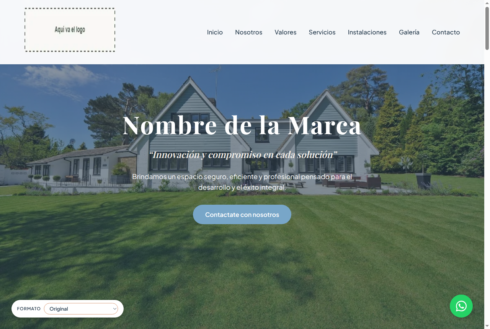
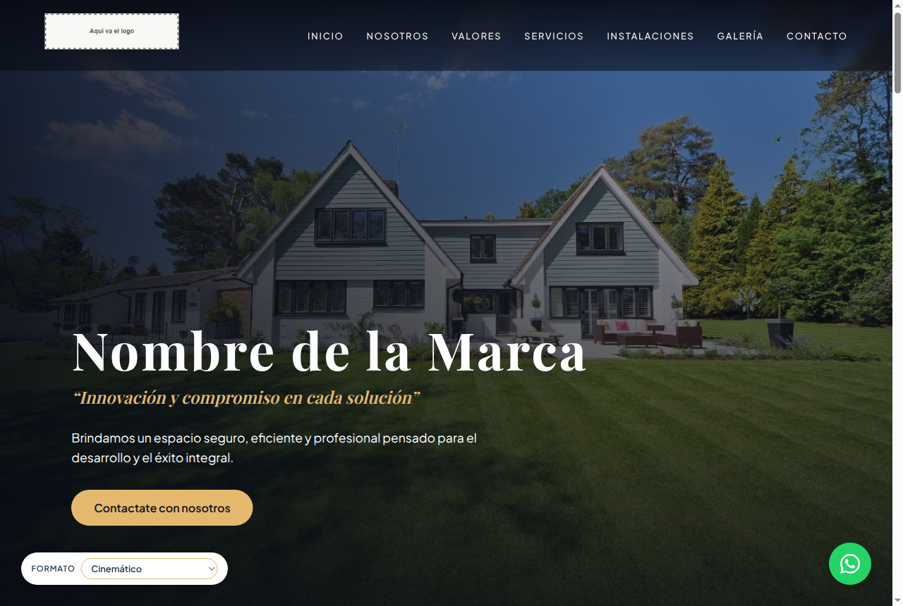
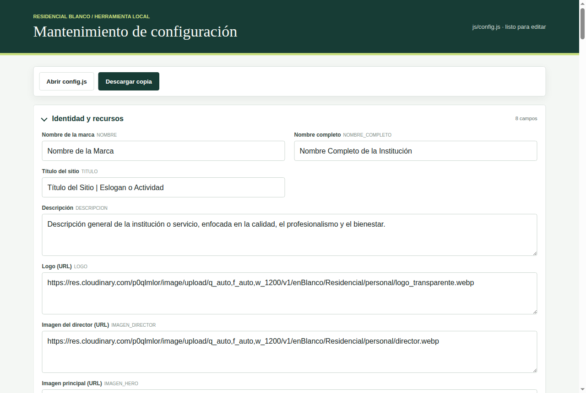
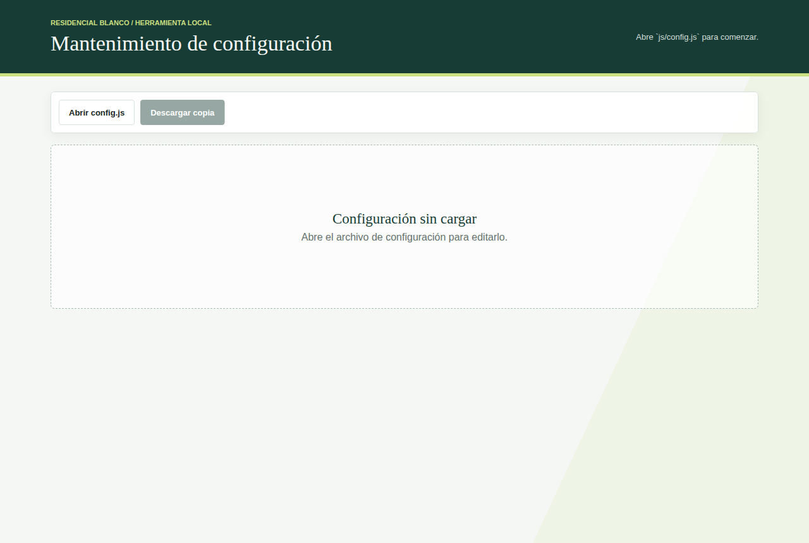
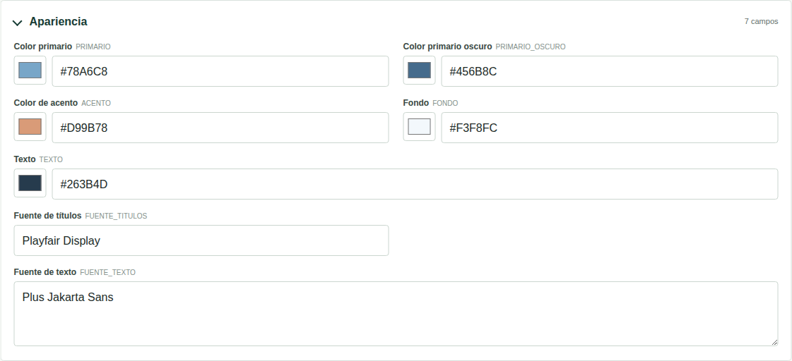
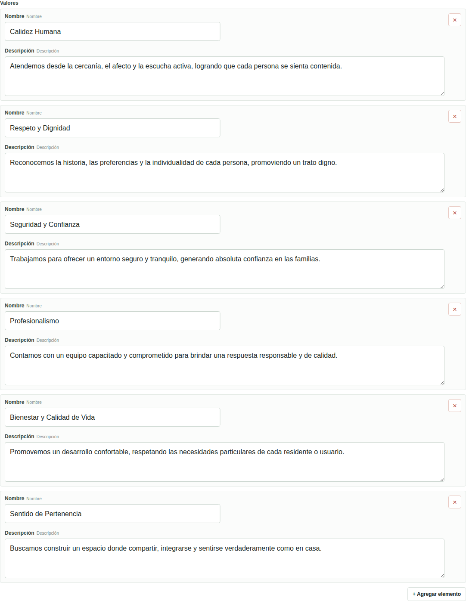
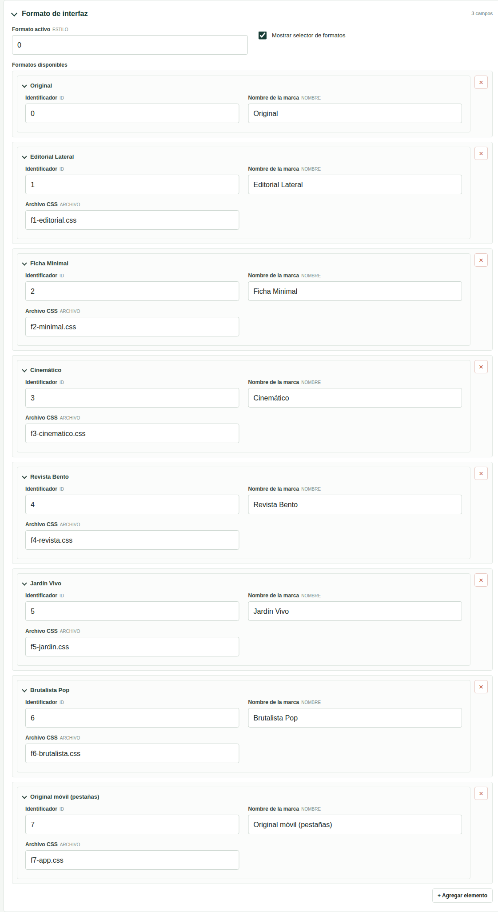
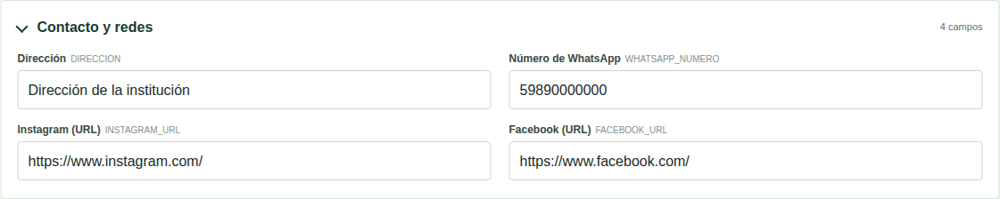
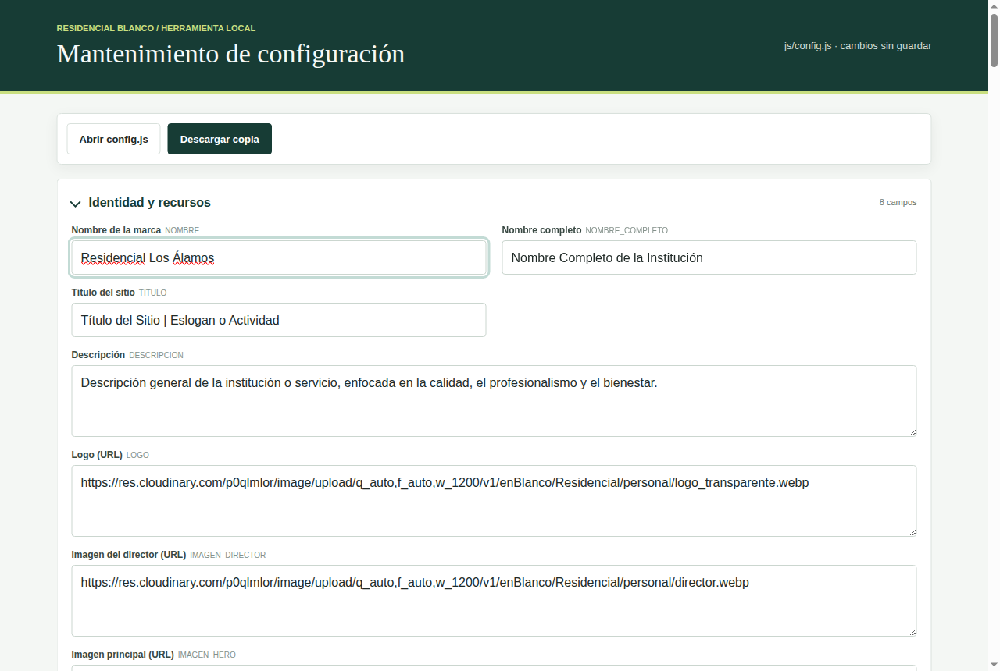
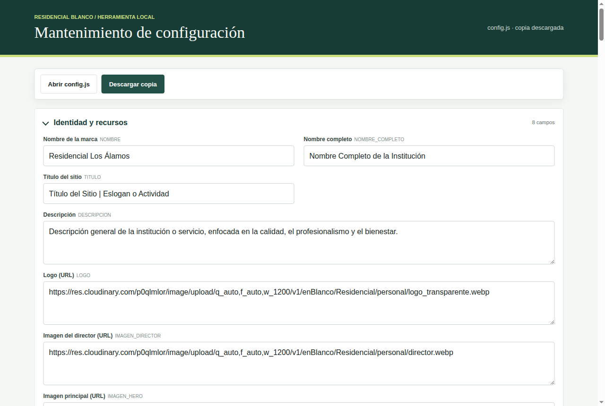

# Manual de Usuario — Sitio institucional y mantenimiento

Guía para recorrer el sitio y para cambiar sus textos, colores y datos de contacto.

---

## 1. Introducción

**Residencial Blanco** es un sitio institucional "en blanco": la misma página sirve para distintas instituciones (un residencial, una clínica, un centro educativo) cambiando el nombre, los textos, los colores, las fotos y los datos de contacto.

Este manual tiene dos partes:

- **El sitio**: lo que ve cualquier visitante.
- **La herramienta de mantenimiento**: la pantalla que usa la persona encargada de personalizar el sitio.

Los textos de las imágenes son los de ejemplo que trae la plantilla.

## 2. El sitio

### 2.1 Secciones

El menú de arriba lleva a cada sección de la página:

| Sección | Qué muestra |
|---|---|
| **Inicio** | El nombre, el lema, una frase de bienvenida y el botón **Contactate con nosotros**. |
| **Nosotros** | La misión, la visión y un mensaje de la dirección, con la foto del responsable. |
| **Valores** | Los valores de la institución, cada uno con su descripción. |
| **Servicios** | Los servicios que se ofrecen. Algunos tienen **Ver más** para leer el detalle. |
| **Instalaciones** | Fotos de las instalaciones, con botones para **filtrar por área**. |
| **Galería** | Más fotos. Si hay muchas, aparece **Ver galería completa**. |
| **Contacto** | Dirección, WhatsApp y redes sociales. |

En el celular, el menú se abre con el botón de las tres rayas.

### 2.2 Fotos

Al tocar una foto de **Instalaciones** o **Galería** se abre en grande. Para cerrarla, toque la **✕** o fuera de la foto.

### 2.3 WhatsApp

El botón verde de abajo a la derecha abre una conversación de **WhatsApp** con la institución, con un mensaje de saludo ya escrito.

### 2.4 Cambiar el formato

Abajo a la izquierda está el selector **Formato**. Cambia el diseño de toda la página sin cambiar el contenido.

Hay ocho formatos: **Original**, **Editorial Lateral**, **Ficha Minimal**, **Cinemático**, **Revista Bento**, **Jardín Vivo**, **Brutalista Pop** y **Original móvil (pestañas)**. Por ejemplo, así se ve **Cinemático**:

El navegador recuerda el formato elegido para la próxima visita. El cambio es solo para quien lo elige: los demás visitantes siguen viendo el formato que definió la institución.

## 3. La herramienta de mantenimiento

### 3.1 Abrirla

La herramienta está en la misma dirección del sitio, agregando **/mantenimiento-config.html** al final. Por ejemplo: *https://www.ejemplo.com/mantenimiento-config.html*.

- Si la abre desde el sitio publicado, carga sola la configuración actual. Arriba a la derecha dice **listo para editar**.
- Si no la carga, aparece *Configuración sin cargar*. Toque **Abrir config.js** y elija el archivo de configuración que le haya pasado quien administra el sitio.

Si el archivo elegido no es el correcto, aparece *El archivo no parece ser el config.js de este sitio.*

### 3.2 Las secciones

La configuración está dividida en secciones que se abren y se cierran tocando su título. A la derecha de cada una se ve cuántos campos tiene.

| Sección | Qué se cambia |
|---|---|
| **Identidad y recursos** | Nombre de la marca, nombre completo, título del sitio, descripción, logo, foto del responsable, imagen principal y año. |
| **Apariencia** | Colores y tipos de letra. |
| **Formato de interfaz** | El formato con el que se ve el sitio y si se muestra el selector de formatos. |
| **Textos del sitio** | Todos los textos de las secciones: misión, visión, valores, servicios, títulos y botones. |
| **Galería y Cloudinary** | Los datos de la cuenta donde están guardadas las fotos. |
| **Contacto y redes** | Dirección, número de WhatsApp, Instagram y Facebook. |

Cada campo tiene su nombre en español y, al lado y en gris, el nombre interno que usa el sitio. Las imágenes (logo, fotos) se indican con su **dirección web (URL)**.

### 3.3 Colores

Cada color tiene un cuadrito: al tocarlo se abre la paleta para elegir el color. También se puede escribir el código del color (por ejemplo **#7BA6C9**) en el campo de al lado.

### 3.4 Textos con el nombre de la institución

Algunos textos incluyen **{NOMBRE}** o **{LEMA}**, por ejemplo *Mi compromiso con {NOMBRE}*. En el sitio, esas marcas se reemplazan por el nombre de la marca y el lema. Así, si cambia el nombre, se actualiza en todos los textos. No borre las llaves.

### 3.5 Listas: valores, servicios, formatos

Algunas partes son listas de elementos, por ejemplo los **Valores**:

- **✕** (a la derecha de cada elemento): lo elimina.
- **+ Agregar elemento** (abajo de la lista): agrega uno nuevo al final, con los campos vacíos.

### 3.6 Formato del sitio

- **Formato activo**: el número (**Identificador**) del formato con el que se ve el sitio. Por ejemplo, **0** es *Original* y **3** es *Cinemático*.
- **Mostrar selector de formatos**: si se desmarca, los visitantes no ven el selector de abajo a la izquierda.
- **Formatos disponibles**: la lista de formatos. No conviene cambiarla.

### 3.7 Contacto

El **número de WhatsApp** se escribe con el código del país y sin el signo +, espacios ni guiones. Por ejemplo, para Uruguay: **59899000000**.

### 3.8 Guardar los cambios

Apenas modifica un campo, arriba a la derecha aparece **cambios sin guardar**:

1. Toque **Descargar copia**. Se descarga un archivo **config.js** con todos los cambios y arriba aparece **copia descargada**.
2. **Envíe ese archivo a quien publica el sitio.** Los cambios se ven en el sitio recién cuando se publica el archivo nuevo.

Tenga en cuenta:

- La herramienta **no cambia el sitio publicado** por sí sola: solo prepara el archivo.
- Si intenta cerrar la página con cambios sin descargar, el navegador le avisa.
- Si toca **Abrir config.js** con cambios sin guardar, pregunta *Hay cambios sin guardar. ¿Descartar y abrir otro archivo?*

## 4. Preguntas frecuentes

**Cambié un texto y en el sitio sigue igual.** Falta descargar la copia y que se publique el archivo nuevo.

**¿Puedo cambiar las fotos desde acá?** Se pueden cambiar las direcciones del logo y de las imágenes principales. Las fotos de **Instalaciones** y **Galería** se cargan en la cuenta de fotos del sitio; consulte a quien lo administra.

**¿Qué pasa si toco "Galería y Cloudinary"?** Son los datos de la cuenta de fotos. Si se cambian mal, las galerías dejan de verse. Modifíquelos solo si se lo indica quien administra el sitio.

**Me equivoqué y quiero volver atrás.** Recargue la página sin descargar: se vuelve a cargar la configuración publicada.
