# Manual de Usuario — SM Consultores (Gestión de Empresas, Llamados y Postulantes)

Guía de uso de la aplicación para el personal de la consultora.

---

## 1. Introducción

La aplicación **SM Consultores** sirve para llevar en un solo lugar:

- las **empresas** clientes de la consultora;
- los **llamados** (búsquedas de personal) de cada empresa;
- los **postulantes** que se presentan a cada llamado, con su estado y los resultados de las evaluaciones.

Este manual explica cómo usar cada pantalla. Todos los nombres, empresas y datos que aparecen en las imágenes son **inventados**.

> **Importante:** cada vez que guarda algo (una empresa, un llamado, postulantes o resultados), la aplicación muestra un aviso de "Guardando…". Espere a que termine antes de cerrar la página o pasar a otra tarea.

## 2. Ingreso a la aplicación

1. Abra la dirección de la aplicación en el navegador.
2. Escriba su **Usuario** y su **Contraseña**.
3. Presione **Ingresar**.

Si el usuario o la contraseña no son correctos, aparece un aviso en amarillo debajo de los campos y puede volver a intentarlo.

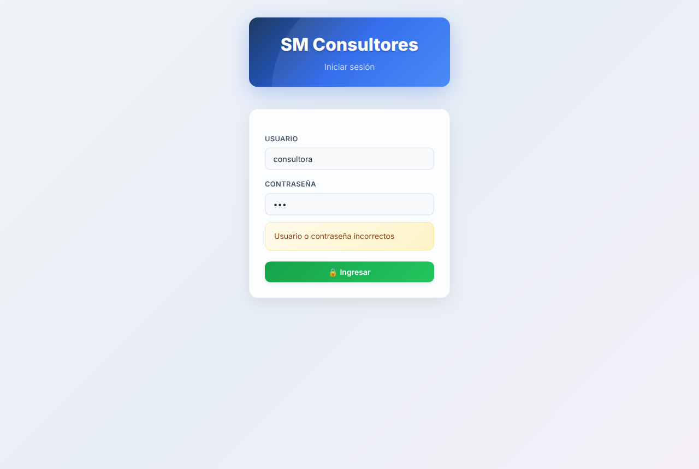

La sesión queda abierta en ese navegador. Para salir, use el botón **Salir** (arriba a la derecha).

## 3. Pantalla principal (Dashboard)

Al ingresar se ve la pestaña **Dashboard**. Arriba están las cuatro pestañas de la aplicación: **Dashboard**, **Empresas**, **Llamados** y **Postulantes**.

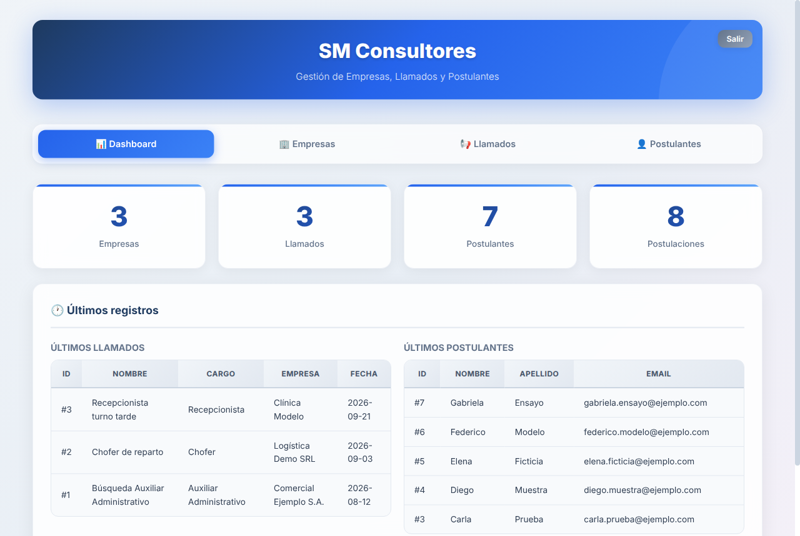

El Dashboard muestra:

- **Totales**: cantidad de empresas, llamados, postulantes y postulaciones (una postulación es un postulante asociado a un llamado; la misma persona puede estar en varios llamados).
- **Últimos registros**: los llamados y los postulantes cargados más recientemente.

## 4. Empresas

En la pestaña **Empresas** se dan de alta las empresas clientes.

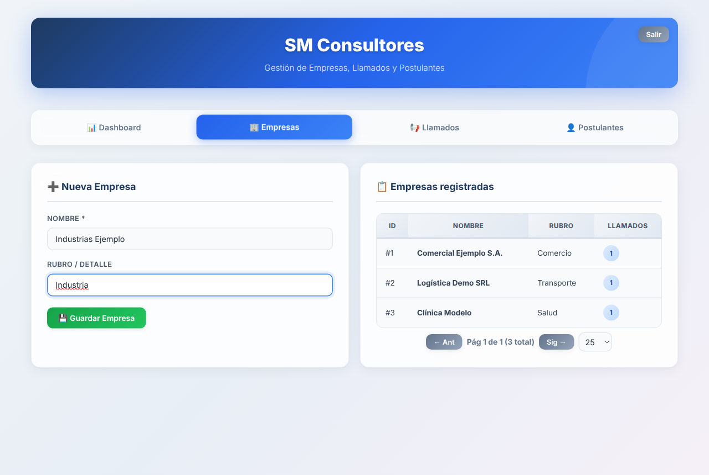

### 4.1 Agregar una empresa

1. Escriba el **Nombre** (obligatorio).
2. Opcionalmente, complete **Rubro / Detalle**.
3. Presione **Guardar Empresa**.

Si deja el nombre vacío, la aplicación avisa: *"Ingresa el nombre de la empresa."*

### 4.2 Listado de empresas

A la derecha aparece **Empresas registradas**, con el nombre, el rubro y la cantidad de llamados de cada empresa. Debajo de la tabla puede pasar de página (**Ant** / **Sig**) y elegir cuántas filas ver por página (10, 25, 50 o 100).

## 5. Llamados

En la pestaña **Llamados** se registran las búsquedas de personal.

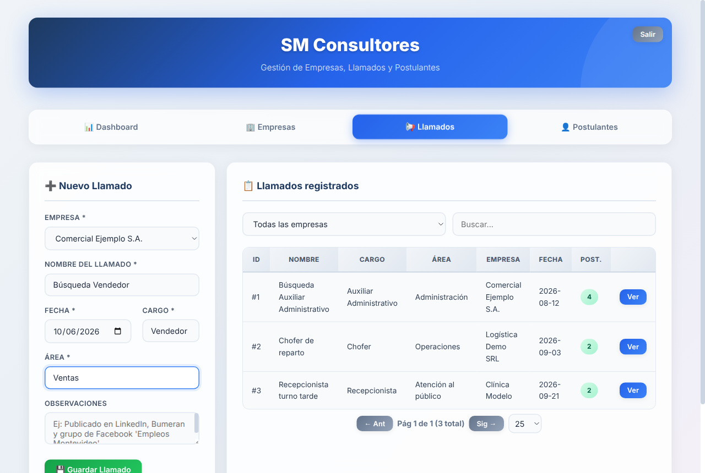

### 5.1 Crear un llamado

1. Elija la **Empresa** en la lista. Si la empresa no aparece, primero créela en la pestaña Empresas.
2. Complete **Nombre del llamado**, **Fecha**, **Cargo** y **Área** (los cuatro son obligatorios).
3. Opcionalmente, escriba **Observaciones** (por ejemplo, dónde se publicó).
4. Presione **Guardar Llamado**.

Si falta la empresa, aparece *"Selecciona una empresa."*; si falta alguno de los otros datos obligatorios, aparece *"Completa todos los campos."*

### 5.2 Buscar y consultar llamados

En **Llamados registrados** puede:

- filtrar por empresa con la lista **Todas las empresas**;
- escribir en **Buscar…** para encontrar un llamado por su texto;
- ver en la columna **Post.** cuántos postulantes tiene cada llamado.

El botón **Ver** abre el detalle del llamado: sus datos y la lista de postulantes asociados.

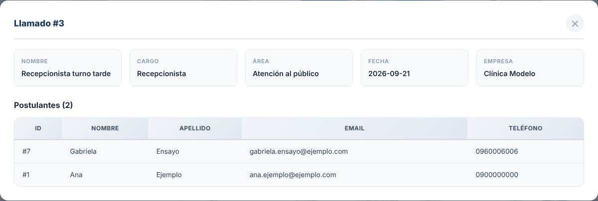

## 6. Postulantes

La pestaña **Postulantes** tiene dos partes: la carga de postulantes desde un archivo y el listado de postulantes registrados.

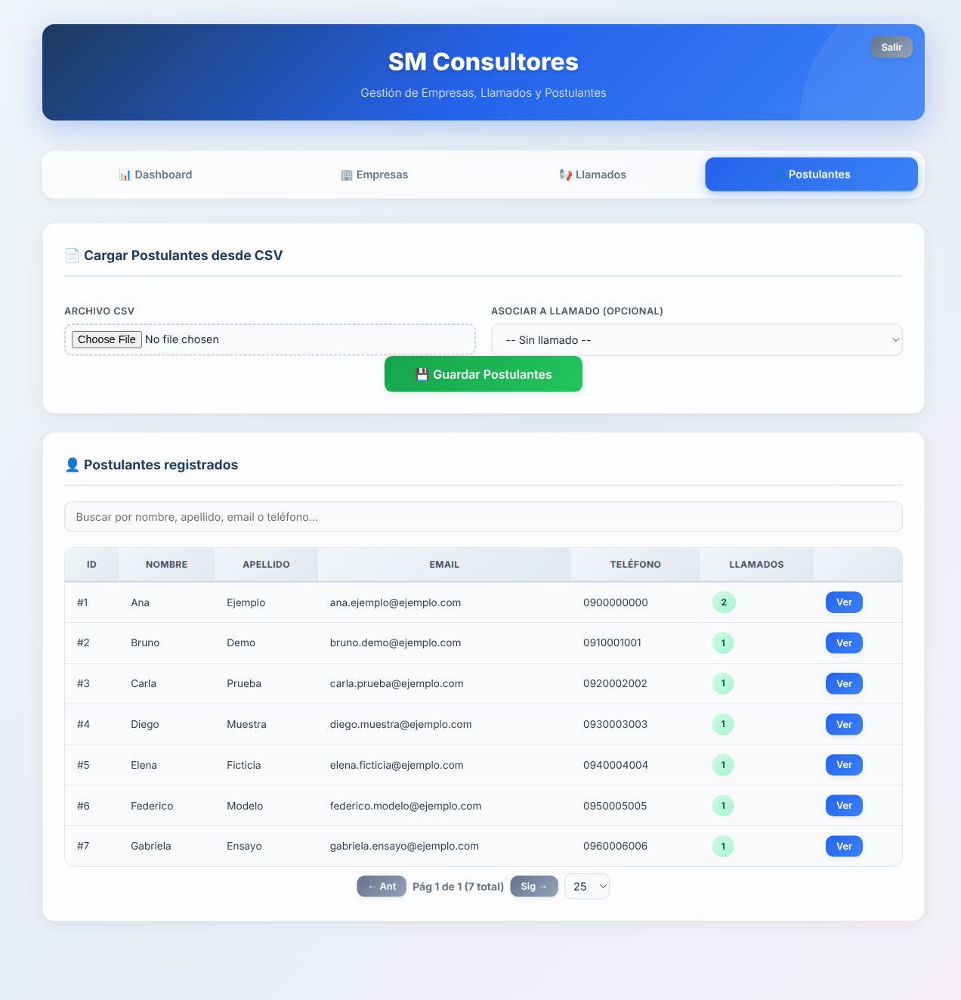

### 6.1 Preparar el archivo

Los postulantes se cargan desde un archivo **CSV** (una planilla guardada como "CSV" desde Excel o Google Sheets):

- la **primera fila** debe tener los títulos de las columnas (por ejemplo: Nombre, Apellido, Email, Teléfono);
- cada fila siguiente es un postulante;
- las columnas pueden estar separadas por punto y coma (;) o por coma (,).

### 6.2 Cargar postulantes desde el archivo

1. En **Archivo CSV**, presione el botón para elegir el archivo.
2. Opcionalmente, en **Asociar a llamado**, elija el llamado al que se presentan. Si lo deja en "Sin llamado", los postulantes se guardan sin asociarlos a ninguno.
3. Revise el **Mapeo de columnas**: para cada dato (Nombre, Apellido, Email y Teléfono) elija qué columna del archivo le corresponde. La aplicación intenta adivinarlo según los títulos.
4. Si el archivo tiene otras columnas que quiere conservar (por ejemplo, Ciudad), escriba el nombre en **Campo extra** y presione **Agregar**. El campo aparece como una etiqueta azul; con la ✕ lo quita.
5. Revise la **vista previa** (muestra hasta 5 filas).
6. Presione **Guardar Postulantes**.

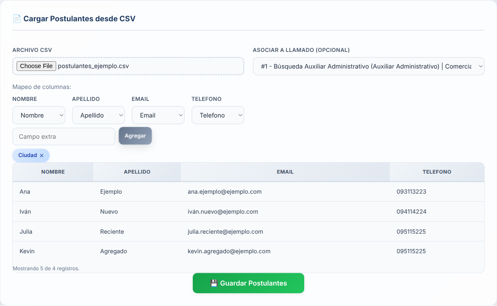

Al terminar aparece el mensaje *"Postulantes guardados correctamente."*

### 6.3 Archivo ya importado

Si elige un archivo con el mismo nombre que otro ya importado, la aplicación avisa cuándo y quién lo importó, y cuántas filas tenía. Puede elegir **Continuar igual** o **Cancelar**.

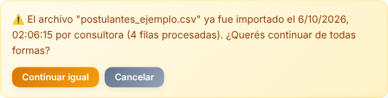

### 6.4 Postulantes repetidos

Antes de guardar, la aplicación compara cada fila con los postulantes que ya existen. Considera repetido a quien tiene **el mismo nombre y el mismo apellido** (sin importar mayúsculas ni tildes). Si encuentra repetidos, muestra la ventana **Duplicados detectados**, con los datos que ya existen y los que vienen en el archivo, uno al lado del otro.

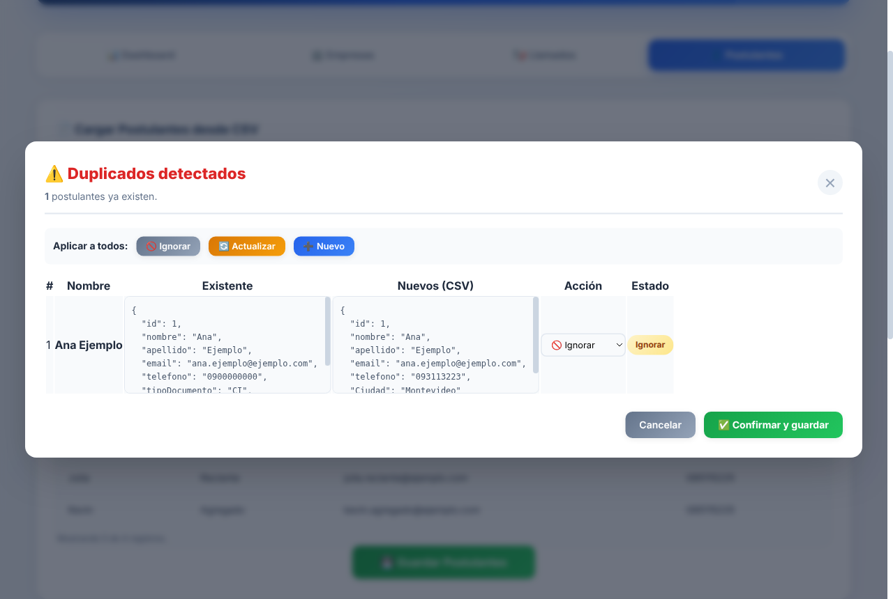

Para cada repetido elija una **Acción**:

| Acción | Qué hace |
|---|---|
| **Ignorar** | Deja al postulante existente como está. Si eligió un llamado, igual lo asocia a ese llamado. |
| **Actualizar** | Reemplaza los datos del postulante existente con los del archivo y lo asocia al llamado elegido. |
| **Nuevo** | Lo guarda como una persona distinta (por ejemplo, dos personas con el mismo nombre). |

Con los botones de **Aplicar a todos** puede elegir la misma acción para toda la lista. Después presione **Confirmar y guardar** (o **Cancelar** para no guardar nada).

### 6.5 Buscar un postulante

En **Postulantes registrados** escriba en el buscador parte del nombre, apellido, correo o teléfono. La columna **Llamados** muestra en cuántos llamados está cada persona.

### 6.6 Ficha del postulante

El botón **Ver** abre la ficha del postulante:

- sus datos (correo y teléfono);
- **Documento**: elija el tipo (por ejemplo, CI) y escriba el número; luego presione **Guardar documento**;
- **Llamados asociados**: cada llamado en el que participa, con su estado.

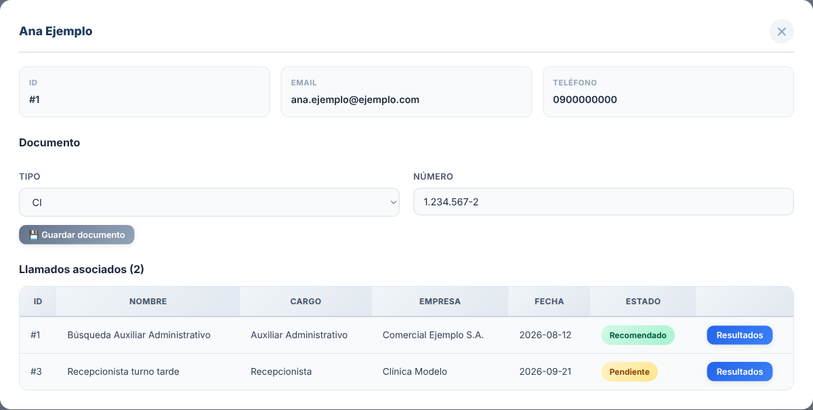

### 6.7 Registrar resultados de la evaluación

En la ficha, en la fila de un llamado, presione **Resultados**. Se abre una ventana para ese llamado:

1. **Estado**: Pendiente, Recomendado, Observado o Rechazado.
2. **Psicolaboral**: fecha y notas de la evaluación psicolaboral.
3. **Prueba de conocimiento**: fecha y resultado o notas.
4. Presione **Guardar**.

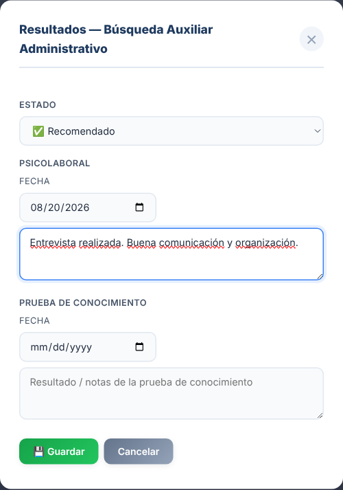

El estado queda a la vista con colores en la ficha del postulante.

## 7. Preguntas frecuentes

**¿Puedo borrar o modificar una empresa o un llamado?**
Desde la aplicación no. Las pantallas permiten crear empresas y llamados y consultarlos, pero no editarlos ni eliminarlos. Si necesita corregir uno, consulte al responsable de la aplicación.

**Cargué un archivo y algunos postulantes no aparecen en el llamado.**
Revise que haya elegido el llamado en **Asociar a llamado** antes de guardar, y que el **Mapeo de columnas** tuviera bien elegidas las columnas de Nombre y Apellido.

**¿Qué pasa si cierro la página mientras dice "Guardando…"?**
Lo que se estaba guardando puede perderse. Espere siempre a que desaparezca el aviso.

**La aplicación me devolvió a la pantalla de ingreso.**
La sesión terminó. Vuelva a ingresar con su usuario y contraseña.
