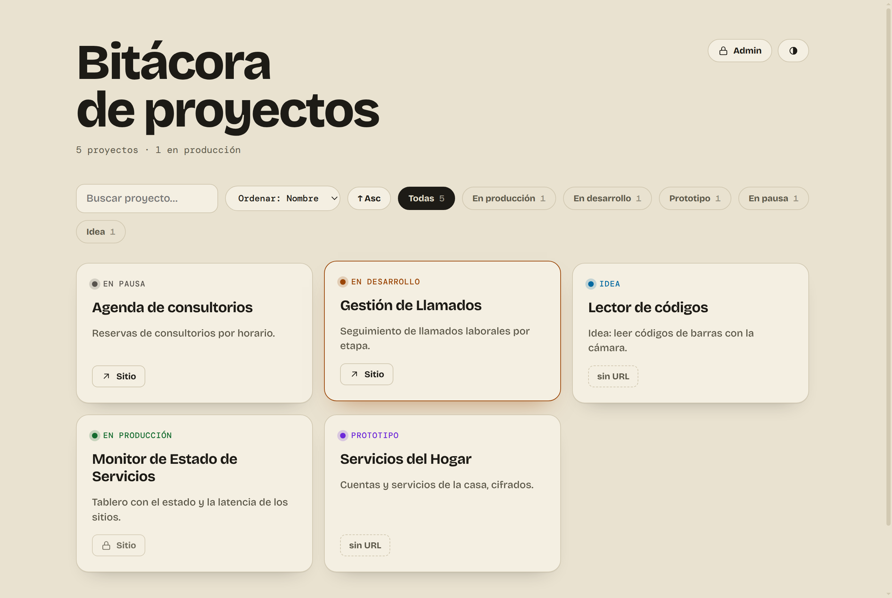
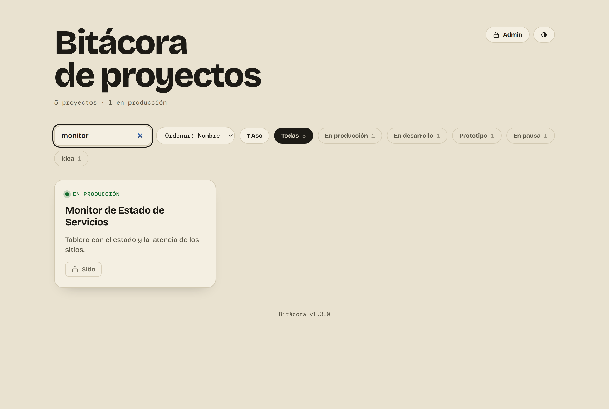
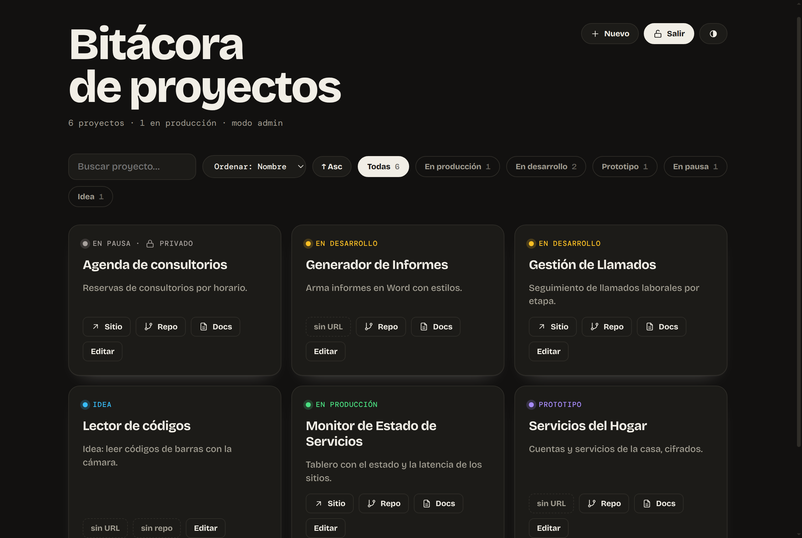
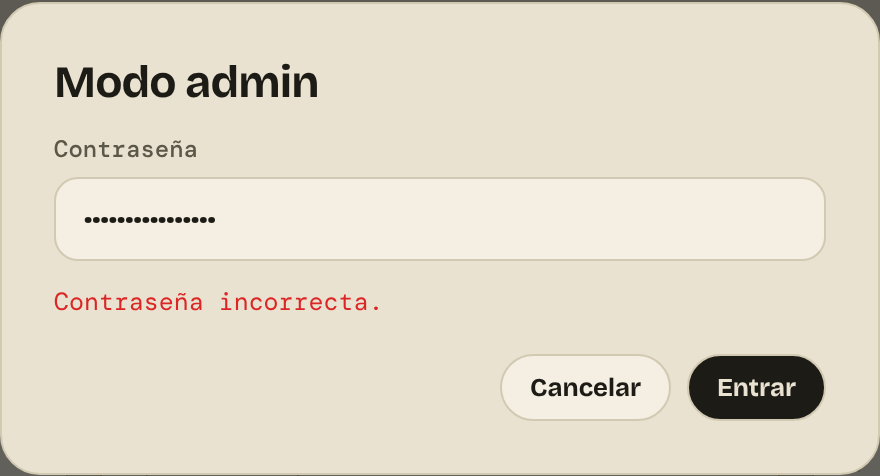
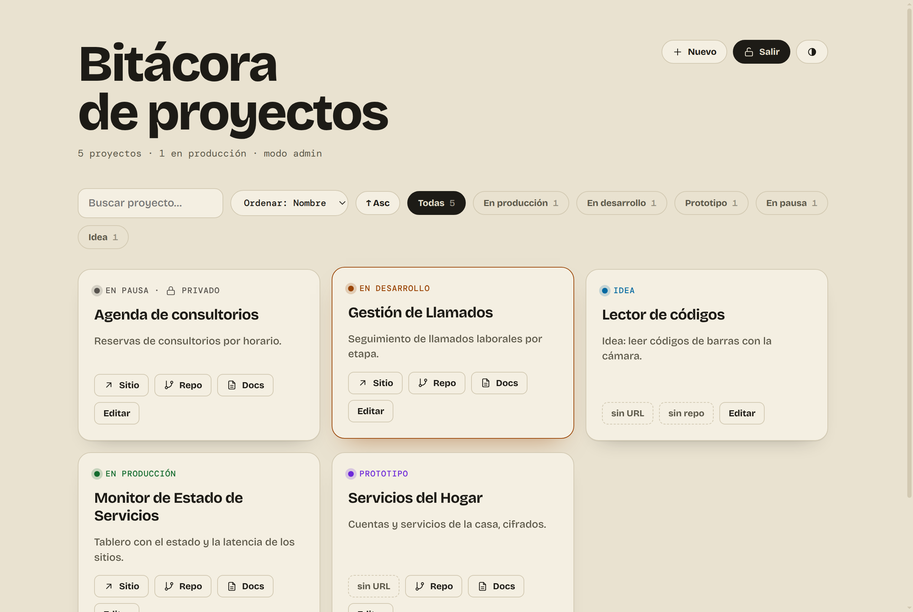
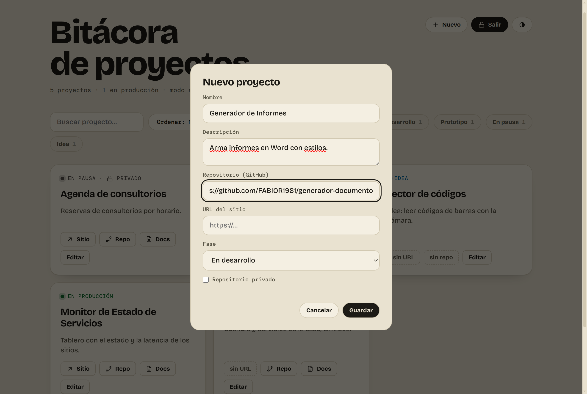
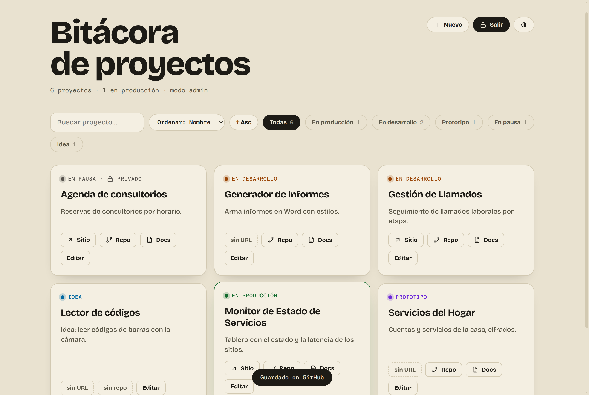
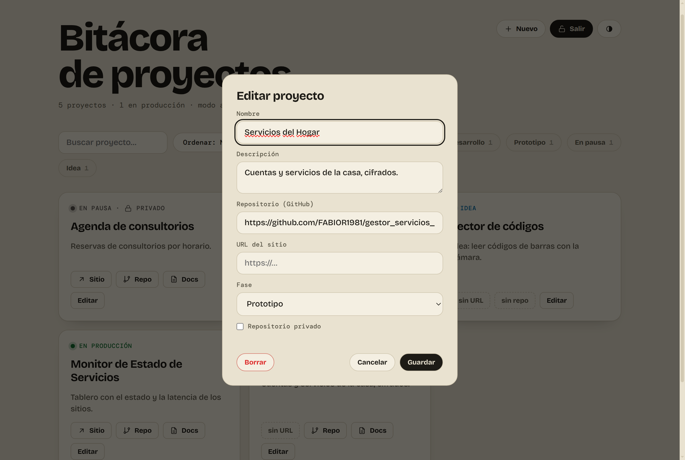
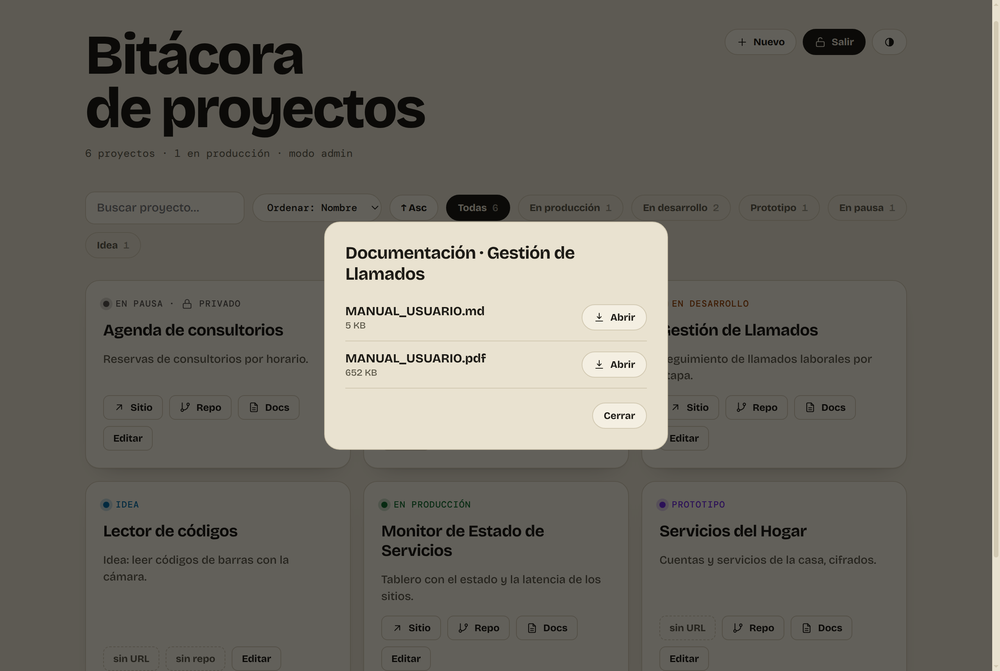
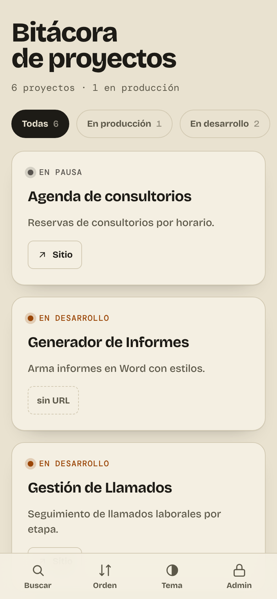

# Manual de Usuario — Bitácora de Proyectos

Guía para consultar los proyectos y, en modo administrador, cargarlos, editarlos y ver su documentación.

---

## 1. Introducción

La **Bitácora de Proyectos** es un tablero con todos los proyectos y la etapa en la que está cada uno. Tiene dos formas de uso:

- **Consulta**: cualquier persona puede ver los proyectos, buscarlos, filtrarlos por etapa y abrir los sitios públicos.
- **Modo admin**: con la contraseña, además se pueden agregar, editar y borrar proyectos, abrir sus repositorios y consultar su **documentación**.

Los proyectos de las imágenes son **de ejemplo**.

## 2. La pantalla principal

- **Arriba**, el título y un resumen: cuántos proyectos hay y cuántos están en producción.
- **Arriba a la derecha**, el botón **Admin** y el botón de **tema**, que cambia entre claro y oscuro.
- **La barra de herramientas** tiene el buscador, el orden y los filtros por etapa.
- **Las tarjetas**: una por proyecto.
- **Al pie** se muestra la versión de la bitácora.

### 2.1 Las tarjetas

Cada tarjeta muestra la **etapa** con un color, el **nombre** y una **descripción** breve del proyecto. Debajo puede tener uno de estos botones:

| Botón | Qué significa |
|---|---|
| **↗ Sitio** | Abre el sitio del proyecto en otra pestaña. |
| **🔒 Sitio** | El sitio está en producción y solo se puede abrir en modo admin. |
| **sin URL** | El proyecto todavía no tiene sitio. |

### 2.2 Etapas

| Etapa | Significado |
|---|---|
| **En producción** | En uso. |
| **En desarrollo** | En construcción. |
| **Prototipo** | Versión de prueba. |
| **En pausa** | Detenido por ahora. |
| **Idea** | Todavía no empezó. |

## 3. Buscar, filtrar y ordenar

- **Buscar proyecto…**: filtra mientras escribe. Busca tanto en el nombre como en la descripción.
- **Filtros por etapa**: botones como **Todas**, **En producción**, **En desarrollo**, etc. Cada uno muestra cuántos proyectos hay. Solo aparecen las etapas que tienen proyectos.
- **Ordenar**: por **Nombre** o por **Estado**, que sigue el orden de la tabla anterior. El botón **↑ Asc / ↓ Desc** invierte el sentido.

### 3.1 Tema claro y oscuro

El botón redondo de arriba a la derecha cambia entre el tema claro y el oscuro:

## 4. Entrar en modo admin

1. Presione **Admin**.
2. Escriba la contraseña y presione **Entrar**.

Si la contraseña no es correcta, aparece **Contraseña incorrecta.**:

En modo admin, el resumen dice *modo admin*, aparece el botón **+ Nuevo** y **Admin** pasa a llamarse **Salir**:

Las tarjetas suman:

- **Repo**: abre el repositorio del proyecto.
- **Docs**: muestra la documentación del proyecto (capítulo 7). Solo aparece si el proyecto tiene repositorio.
- **Editar**: modifica o borra el proyecto (capítulo 6).
- La marca **🔒 privado** en los proyectos con repositorio privado.

Para volver al modo de consulta, presione **Salir**.

## 5. Agregar un proyecto

1. Presione **+ Nuevo**.
2. Complete los datos:
   - **Nombre** (obligatorio);
   - **Descripción**: una o dos líneas;
   - **Repositorio (GitHub)**: la dirección del repositorio;
   - **URL del sitio**: si el proyecto ya está publicado;
   - **Fase**: la etapa del proyecto;
   - **Repositorio privado**: márquelo si el repositorio no es público.
3. Presione **Guardar**.

Mientras guarda aparece *Guardando…*. Al terminar se ve el mensaje **Guardado en GitHub**, y el proyecto aparece en la lista para todos:

Por seguridad, la dirección del repositorio, y la del sitio en los proyectos en producción, se guardan protegidas. Solo se ven en modo admin.

## 6. Editar o borrar un proyecto

Presione **Editar** en la tarjeta del proyecto. Se abre la ventana **Editar proyecto**, con los mismos campos que el alta:

- **Guardar**: guarda los cambios.
- **Cancelar**: cierra la ventana sin cambiar nada.
- **Borrar** (abajo a la izquierda, en rojo): elimina el proyecto.
  1. La aplicación pregunta **¿Borrar este proyecto?**.
  2. Al confirmar, se cierra la ventana y aparece el mensaje **Borrado**.
  3. Si no se pudo guardar el cambio, el proyecto no se borra y el error se muestra en la ventana.

**Borrar** solo aparece al editar un proyecto que ya existe, no al crear uno nuevo.

## 7. Consultar la documentación (Docs)

Presione **Docs** en la tarjeta. Se abre la lista de documentos del proyecto, con su nombre y tamaño:

- **Abrir** abre el documento en otra pestaña. Los **PDF** y los textos se ven directamente en el navegador. Otros tipos de archivo se descargan.
- Funciona igual en la computadora, en el celular y en la bitácora instalada como aplicación.
- El enlace de cada documento dura **15 minutos**. Si aparece *Enlace vencido o inválido*, cierre la pestaña, vuelva a la bitácora y presione **Docs** otra vez.
- Si el proyecto todavía no tiene documentación, se ve el aviso *Sin documentación en documentacion-central para este proyecto.*

## 8. Uso en el celular

En el celular, las tarjetas se ven una debajo de la otra y abajo aparece un **menú fijo**:

| Botón | Qué hace |
|---|---|
| **Buscar** | Muestra u oculta el buscador. |
| **Orden** | Cambia el orden en este ciclo: nombre ascendente, nombre descendente, estado ascendente y estado descendente. Cada vez muestra un aviso con el orden elegido. |
| **Tema** | Cambia entre claro y oscuro. |
| **Nuevo** | Agrega un proyecto. Solo aparece en modo admin. |
| **Admin / Salir** | Entra o sale del modo admin. |

**Instalar como aplicación:** desde el menú del navegador del celular, elija *Agregar a pantalla de inicio* o *Instalar aplicación*. La bitácora queda como un ícono más y se abre a pantalla completa.

## 9. Preguntas frecuentes

**¿Cualquiera puede ver la bitácora?**
Sí, en modo consulta: nombre, etapa, descripción y sitios públicos. Los repositorios, la documentación y los sitios en producción solo se ven en modo admin.

**No me aparece el botón Docs.**
Revise que esté en modo admin y que el proyecto tenga cargado el repositorio.

**Instalé la bitácora y no veo los últimos cambios.**
Cierre la aplicación y vuelva a abrirla: se actualiza sola cuando hay una versión nueva. La versión instalada se ve al pie de la pantalla.
