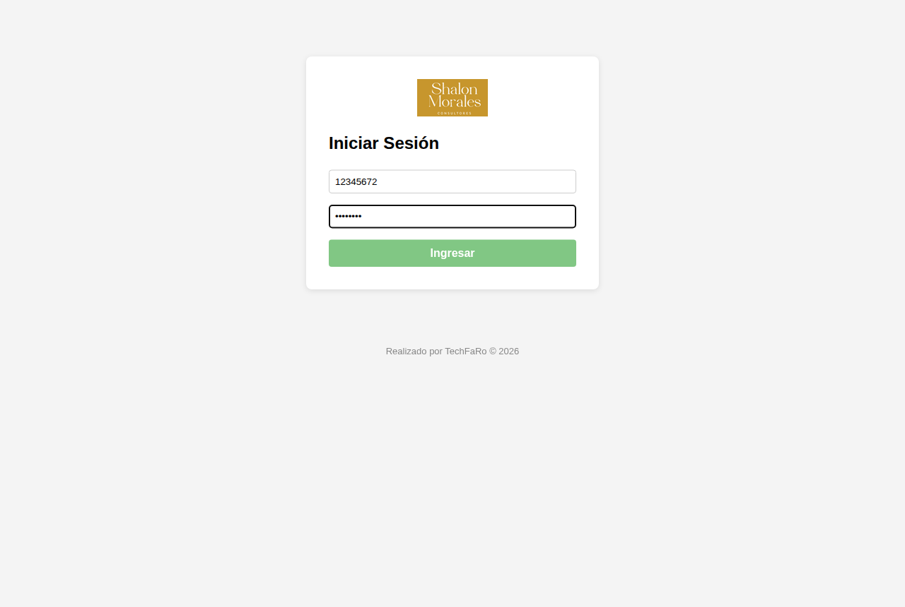
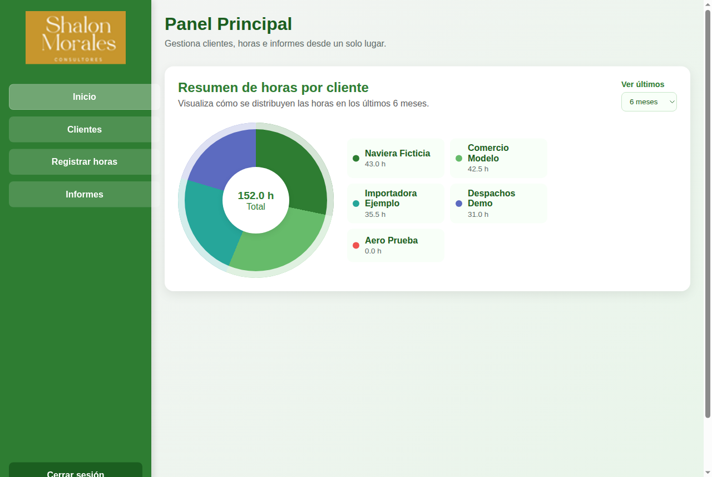
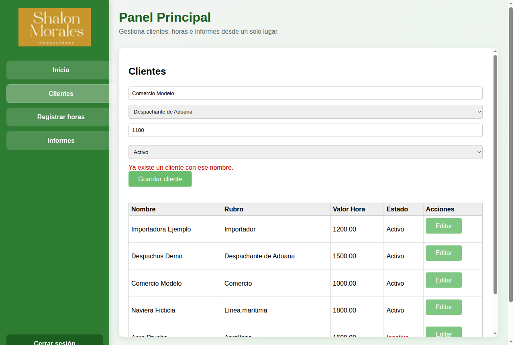
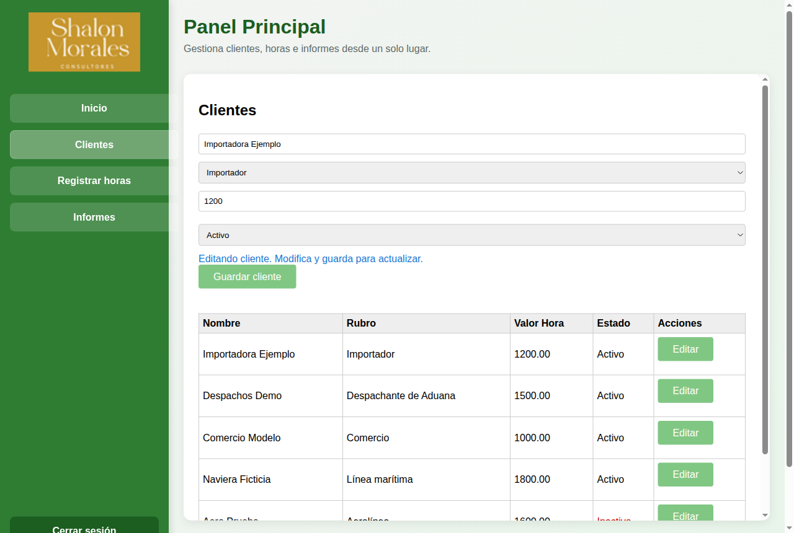
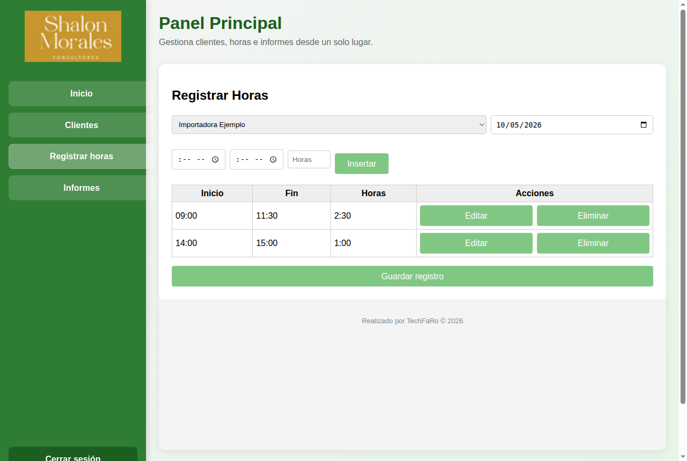
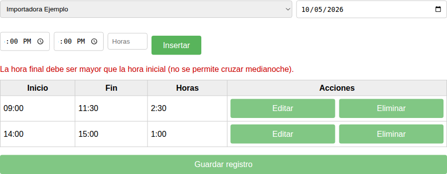
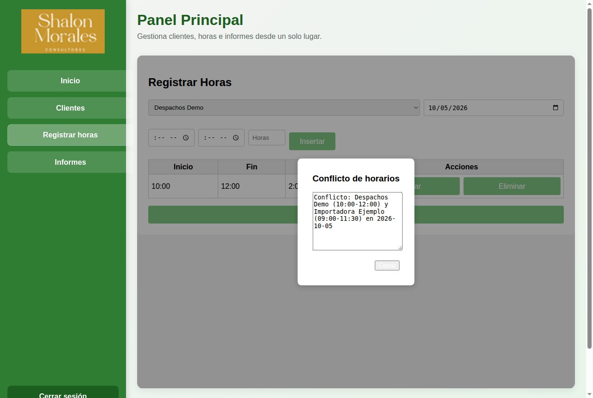
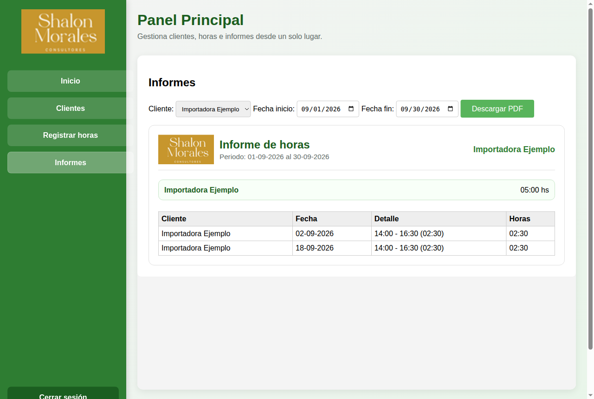

# Manual de Usuario — Control de Horas por Cliente

Guía para registrar las horas trabajadas para cada cliente y obtener informes.

---

## 1. Introducción

**Control de Horas por Cliente** sirve para:

- tener la lista de **clientes**, con su rubro y su valor hora;
- **registrar las horas** trabajadas para cada cliente, día por día, en uno o varios tramos horarios;
- ver un **resumen** de cómo se reparten las horas entre los clientes;
- descargar **informes en PDF** por cliente y período.

Los clientes, horarios y datos que aparecen en las imágenes son **inventados**.

## 2. Ingreso a la aplicación

1. Abra la dirección de la aplicación en el navegador.
2. Escriba su **Documento** (solo números) y su **Contraseña**.
3. Presione **Ingresar**.

Si los datos no son correctos, la aplicación lo indica debajo del formulario. Para salir, use **Cerrar sesión**, al pie del menú de la izquierda.

## 3. Panel principal

Después de ingresar se ve el **Panel Principal**. A la izquierda está el menú:

- **Inicio**: el resumen de horas.
- **Clientes**: alta y edición de clientes.
- **Registrar horas**: carga de las horas trabajadas.
- **Informes**: descarga de informes en PDF.

En **Inicio**, el gráfico **Resumen de horas por cliente** muestra el total de horas del período y cuántas corresponden a cada cliente. Con la lista **Ver últimos** puede cambiar el período (por ejemplo, 3, 6, 9 o 12 meses).

## 4. Clientes

### 4.1 Agregar un cliente

1. Entre a **Clientes**.
2. Escriba el **nombre del cliente**.
3. Elija el **rubro** en la lista.
4. Escriba el **valor hora** (solo números).
5. Elija si el cliente está **Activo** o **Inactivo**.
6. Presione **Guardar cliente**.

La aplicación no deja guardar si falta el nombre o el rubro, si el valor hora no es un número, o si ya existe un cliente con el mismo nombre (*"Ya existe un cliente con ese nombre."*).

### 4.2 Modificar un cliente

1. En la tabla, presione **Editar** en la fila del cliente.
2. Sus datos pasan al formulario y aparece el aviso *"Editando cliente. Modifica y guarda para actualizar."*
3. Cambie lo que necesite y presione **Guardar cliente**.

### 4.3 Clientes inactivos

Un cliente **Inactivo** sigue en la lista y sus horas anteriores se conservan, pero **ya no aparece para registrar horas nuevas**. Para volver a usarlo, edítelo y cámbielo a Activo.

## 5. Registrar horas

### 5.1 Cargar un día de trabajo

1. Entre a **Registrar horas**.
2. Elija el **cliente** y la **fecha**.
3. Cargue un **tramo**. Tiene dos formas:
   - escribir la **hora de inicio** y la **hora de fin** (la cantidad de horas se calcula sola); o
   - escribir directamente la cantidad de **Horas**.
4. Presione **Insertar**. El tramo aparece en la tabla de abajo.
5. Repita los pasos 3 y 4 si ese día trabajó en más de un horario para el mismo cliente.
6. Presione **Guardar registro**.

Al guardar aparece el mensaje *"Registro guardado correctamente."*

### 5.2 Corregir o quitar un tramo

Antes de guardar, en cada fila de la tabla puede usar:

- **Editar**: el tramo vuelve a los campos de arriba para corregirlo;
- **Eliminar**: lo quita de la lista.

### 5.3 Controles que hace la aplicación

- La **hora de fin debe ser posterior a la de inicio**. Un tramo no puede pasar de un día al otro (cruzar la medianoche): si trabajó de 22:00 a 02:00, cárguelo como dos tramos, uno en cada fecha.
- Para guardar hace falta **cliente, fecha y al menos un tramo** (*"Completa todos los campos y agrega al menos un tramo."*).

### 5.4 Conflicto con otro cliente

Si el horario que intenta guardar se superpone con horas ya registradas **para otro cliente en la misma fecha**, aparece la ventana **Conflicto de horarios**, que indica qué cliente y qué franja se cruzan. El registro no se guarda: presione **Cerrar**, corrija los horarios y vuelva a guardar.

## 6. Informes

1. Entre a **Informes**.
2. En **Cliente**, elija un cliente o la opción para incluir a todos.
3. Elija la **Fecha inicio** y la **Fecha fin** del período.
4. Presione **Descargar PDF**.

El informe se muestra en pantalla y, al mismo tiempo, se descarga como archivo PDF (el nombre del archivo incluye el cliente y las fechas). Incluye el total de horas del período y el detalle de cada día con sus tramos.

Si no hay horas cargadas en ese período, se muestra *"No hay registros para el periodo seleccionado."*

## 7. Preguntas frecuentes

**No encuentro un cliente en Registrar horas.**
Probablemente está **Inactivo**. Entre a Clientes, edítelo y póngalo como Activo.

**Guardé un cambio y no lo veo enseguida.**
Espere unos minutos y vuelva a entrar a la pantalla: algunos cambios tardan un poco en verse.

**Trabajé de noche y pasé la medianoche.**
Cargue dos tramos: uno hasta las 23:59 en el primer día y otro desde las 00:00 en el día siguiente.

**¿Puedo eliminar un cliente?**
No. Puede ponerlo como Inactivo para que deje de aparecer al registrar horas.
