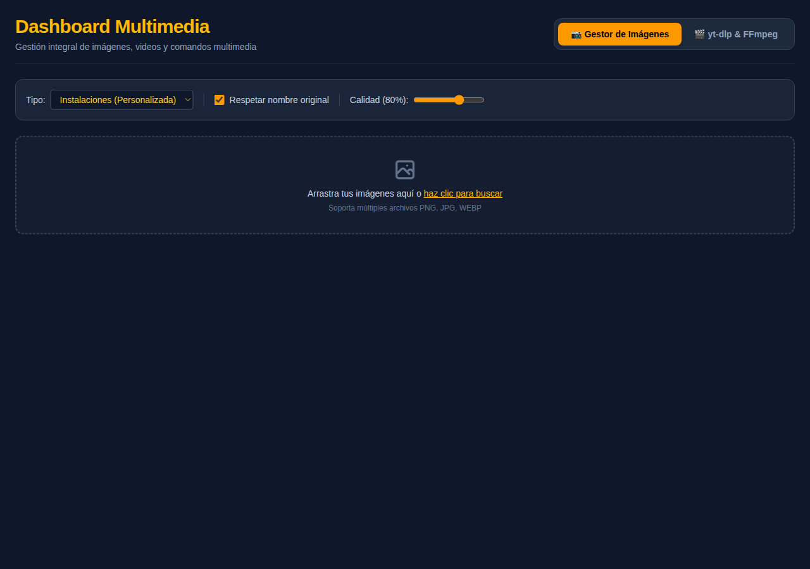
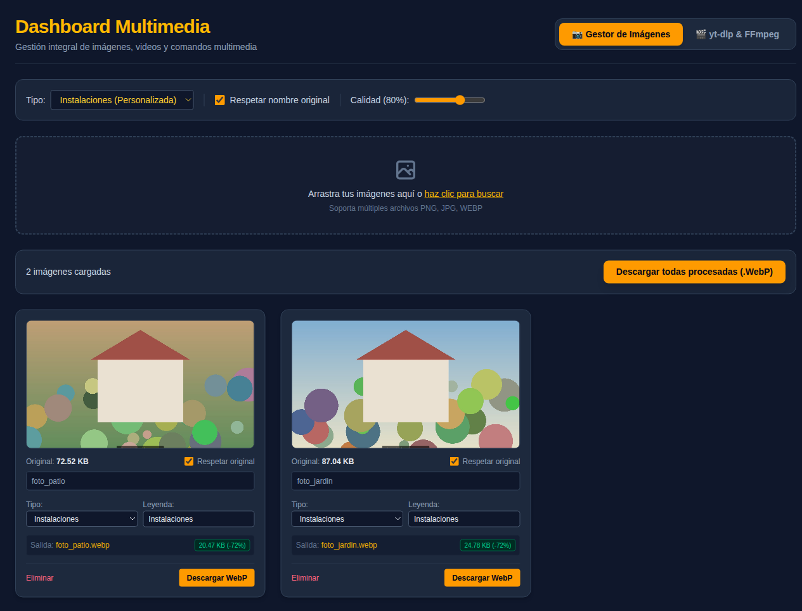
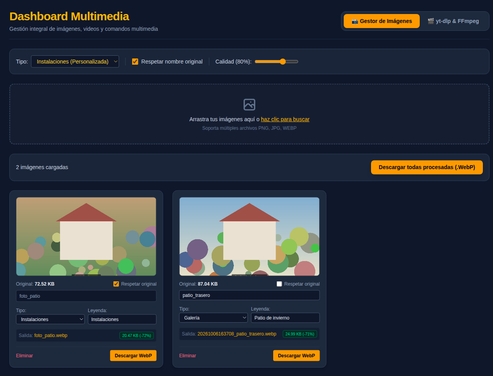
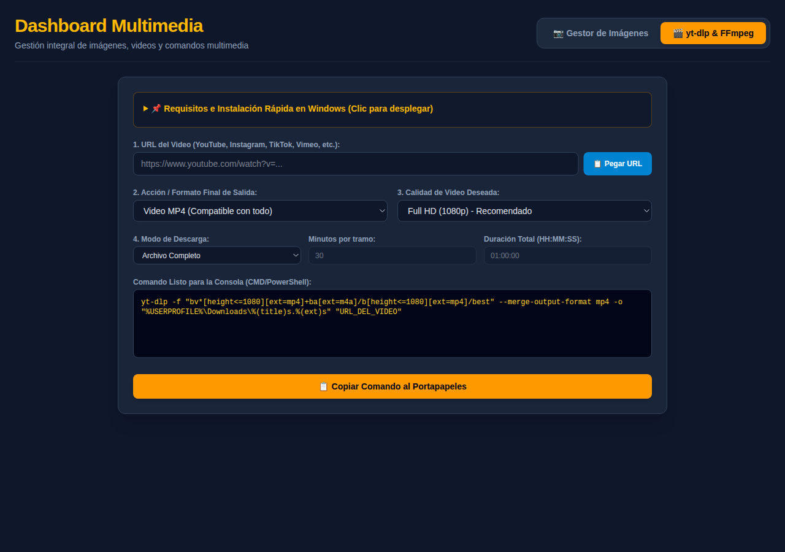
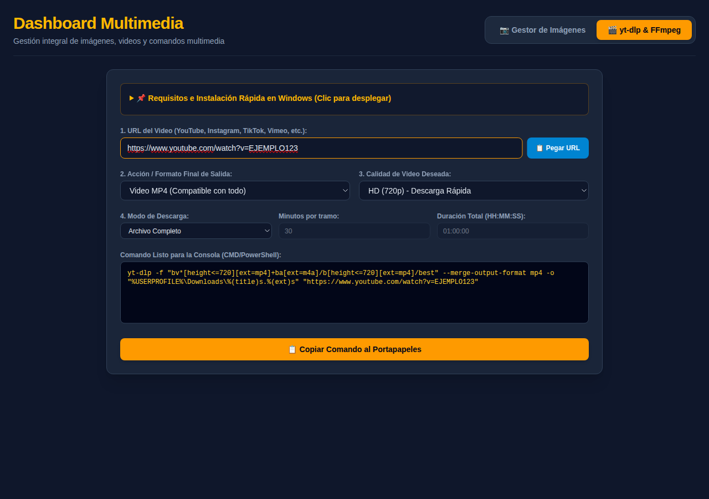
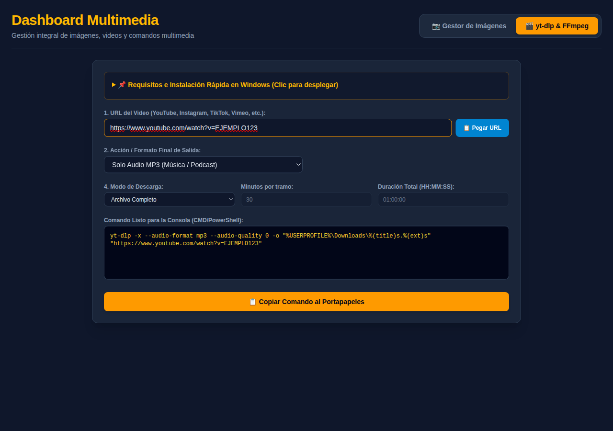
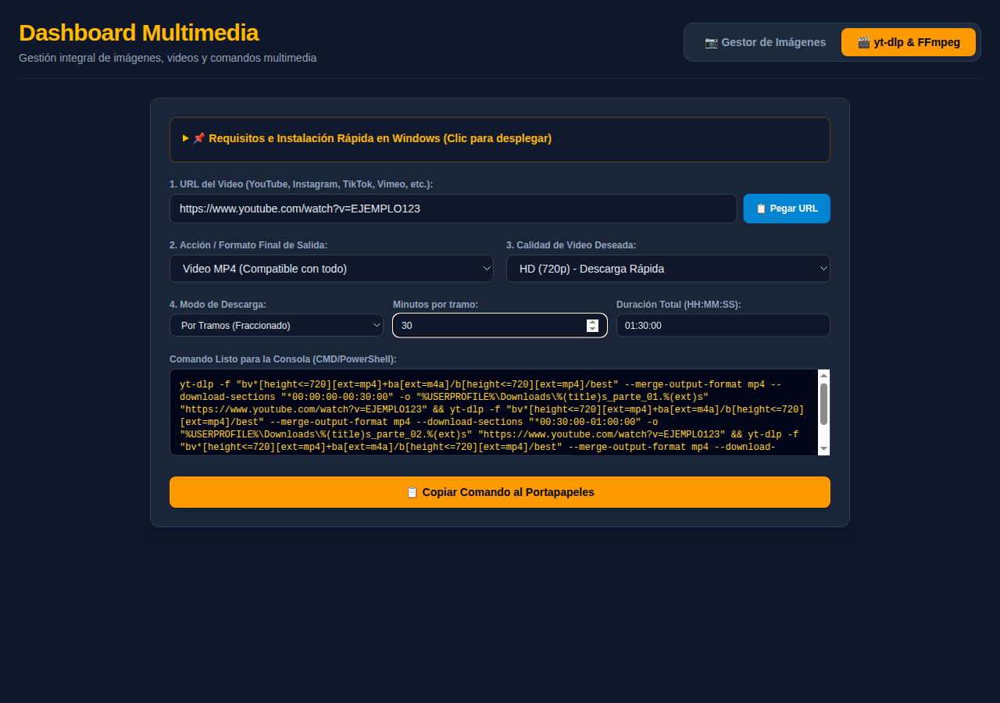
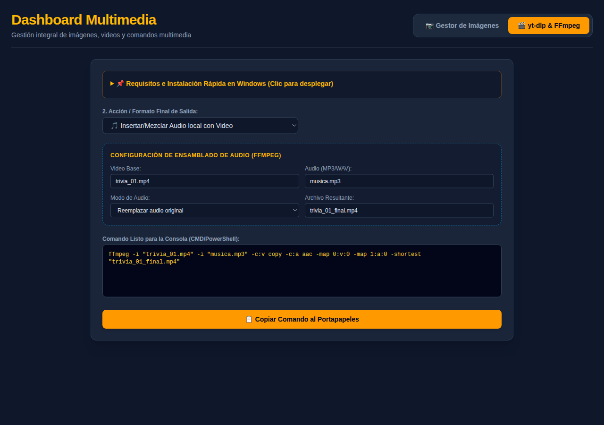

# Manual de Usuario — Dashboard Multimedia

Guía para preparar imágenes en WebP y armar los comandos de descarga de videos.

---

## 1. Introducción

El **Dashboard Multimedia** tiene dos herramientas, cada una en su pestaña:

- **📷 Gestor de Imágenes**: convierte fotos al formato **WebP** (más liviano para usar en sitios web), les cambia el nombre y les puede agregar una **leyenda** sobre la imagen.
- **🎬 yt-dlp & FFmpeg**: arma, paso a paso, el **comando** que descarga un video de internet o le cambia el audio. La página no descarga el video: el comando se copia y se pega en la consola de Windows.

Las fotos y la dirección de video de las imágenes son **de ejemplo**.

## 2. Gestor de Imágenes

### 2.1 Opciones generales

Arriba hay tres opciones que se aplican a **todas** las imágenes:

| Opción | Qué hace |
|---|---|
| **Tipo** | **Instalaciones (Personalizada)** o **Galería (Genérica)**. Pone la leyenda *Instalaciones* o *Galería* en todas las imágenes. |
| **Respetar nombre original** | Si está marcada, cada archivo conserva su nombre (por ejemplo *foto_patio.webp*). Si no, el nombre se arma con la fecha de la foto y un nombre corto (por ejemplo *20261006163708_patio_trasero.webp*). |
| **Calidad** | De 40% a 100% (80% de inicio). Menos calidad, archivo más liviano. |

Si cambia el **Tipo** general después de editar las leyendas, se reemplazan todas.

### 2.2 Cargar imágenes

**Arrastre** las imágenes al recuadro o haga clic en él para **buscarlas**. Puede cargar varias a la vez, en **PNG**, **JPG** o **WEBP**.

Las imágenes se procesan en la misma computadora: no se suben a ningún lado.

Aparece cuántas imágenes hay cargadas y una **tarjeta por imagen**.

### 2.3 La tarjeta de cada imagen

Cada tarjeta muestra:

- **La vista previa**, con la leyenda como va a quedar.
- **Original**: el peso del archivo original.
- **Respetar original**: lo mismo que la opción general, pero solo para esta imagen. Si se desmarca, aparece un campo para escribir un **nombre corto**.
- **Tipo**: *Instalaciones* o *Galería*. Al cambiarlo, la leyenda pasa a ser ese texto.
- **Leyenda**: el texto que se escribe **sobre la imagen**, abajo y al centro, en una franja oscura. Si lo deja vacío, la imagen queda sin leyenda.
- **Salida**: el nombre que va a tener el archivo descargado.
- **El nuevo peso** y cuánto cambió. En **verde** si el archivo quedó más liviano; en **amarillo** si quedó más pesado.

Botones:

- **Eliminar**: saca la imagen de la lista.
- **Descargar WebP**: descarga esa imagen convertida.

### 2.4 Descargar todas

**Descargar todas procesadas (.WebP)** descarga todas las imágenes, una detrás de otra. La primera vez, el navegador puede preguntar si permite **descargar varios archivos**: responda que sí.

## 3. Descargar videos (yt-dlp & FFmpeg)

Esta pestaña arma un comando que se pega en la consola de Windows (**CMD** o **PowerShell**). Para que funcione, la computadora tiene que tener instalados los programas **yt-dlp** y **FFmpeg**. El desplegable **📌 Requisitos e Instalación Rápida en Windows** explica cómo instalarlos; si la computadora es del trabajo, pídale ayuda a quien la administra.

Use esta herramienta solo con videos propios o que tenga permiso para descargar.

### 3.1 Paso a paso

1. **URL del Video**: pegue la dirección del video (YouTube, Instagram, TikTok, Vimeo, etc.). El botón **Pegar URL** la pega desde el portapapeles; si el navegador pide permiso, acéptelo.
2. **Acción / Formato Final de Salida**:
   - **Video MP4 (Compatible con todo)**: la opción recomendada.
   - **Video MKV (Máxima fidelidad)** o **Video WEBM (Nativo de YouTube)**.
   - **Solo Audio MP3 (Música / Podcast)** o **Solo Audio M4A (Sin pérdida / Original)**: descarga solo el sonido.
   - **🎵 Insertar/Mezclar Audio local con Video**: ver la sección 3.3.
3. **Calidad de Video Deseada**: **Máxima Calidad Disponible**, **Full HD (1080p) - Recomendado**, **HD (720p) - Descarga Rápida** o **Estándar (480p) - Poco peso**. No aparece si eligió solo audio.
4. **Modo de Descarga**: **Archivo Completo** o **Por Tramos** (ver la sección 3.2).

El comando se actualiza solo en el recuadro **Comando Listo para la Consola**. Toque **Copiar Comando al Portapapeles**: el botón muestra **¡Copiado con éxito! ✅**. Después abra la consola de Windows, pegue el comando y presione **Enter**.

El archivo se guarda en la carpeta **Descargas**, con el título del video como nombre.

### 3.2 Descargar por tramos

Sirve para videos largos que se quieren dividir en partes (por ejemplo, una transmisión de una hora y media en tres partes de media hora).

1. En **Modo de Descarga**, elija **Por Tramos (Fraccionado)**.
2. **Minutos por tramo**: el largo de cada parte (30 de inicio).
3. **Duración Total (HH:MM:SS)**: lo que dura el video entero, por ejemplo **01:30:00**. Mientras no la complete, el recuadro muestra *Ingresa la duración total del video para calcular los tramos.*

Cada parte se guarda con el título del video y el número de parte: *…_parte_01*, *…_parte_02*, etc.

### 3.3 Insertar o mezclar un audio con un video

Sirve para ponerle música o una locución a un video que ya tiene en la computadora.

1. En **Acción / Formato Final de Salida**, elija **🎵 Insertar/Mezclar Audio local con Video**.
2. **Video Base**: el nombre del archivo de video (por ejemplo *video.mp4*).
3. **Audio (MP3/WAV)**: el nombre del archivo de audio (por ejemplo *musica.mp3*).
4. **Modo de Audio**:
   - **Reemplazar audio original**: el video queda solo con el audio nuevo.
   - **Mezclar ambos audios**: se escuchan los dos a la vez.
5. **Archivo Resultante**: el nombre del video que se va a crear.

Los dos archivos tienen que estar en la carpeta desde la que abre la consola, y los nombres se escriben exactamente igual, con la extensión.

## 4. Preguntas frecuentes

**¿La página descarga el video?** No. Arma el comando; la descarga la hace la consola de Windows al pegarlo.

**Copié el comando y la consola dice que no lo reconoce.** Faltan instalar yt-dlp o FFmpeg. Revise el desplegable de **Requisitos**.

**Aparece "Primero genera un comando válido."** Falta completar la dirección del video (o los nombres de archivo, en la mezcla de audio).

**¿Se guardan las imágenes cargadas?** No. Si recarga la página, la lista se borra. Descárguelas antes.
