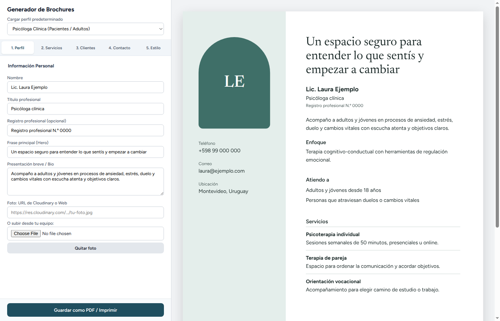
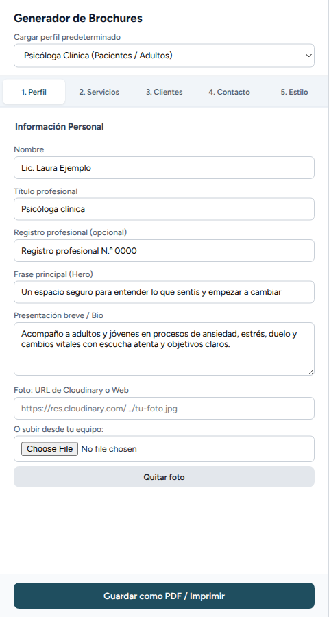
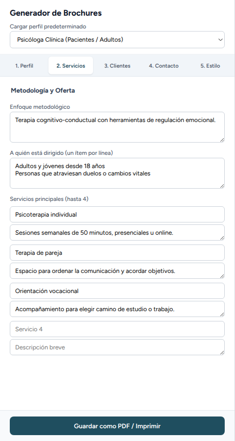
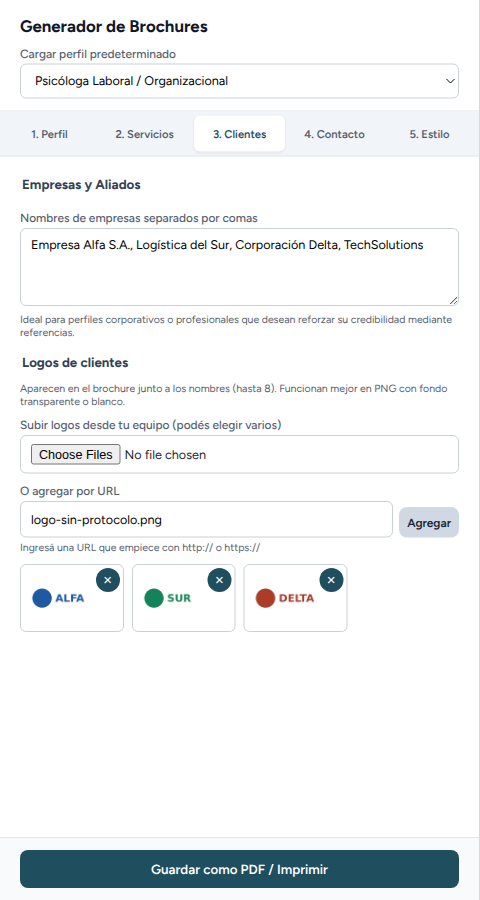
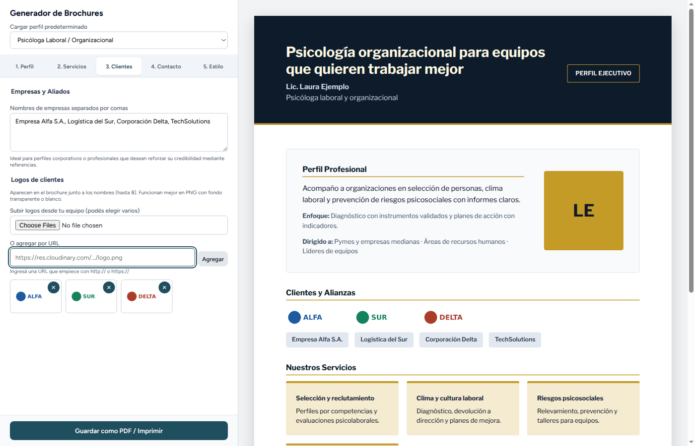
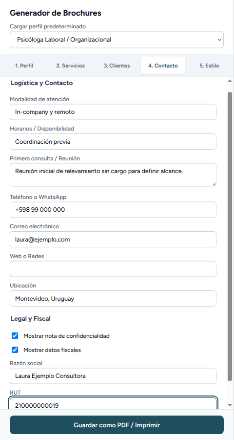
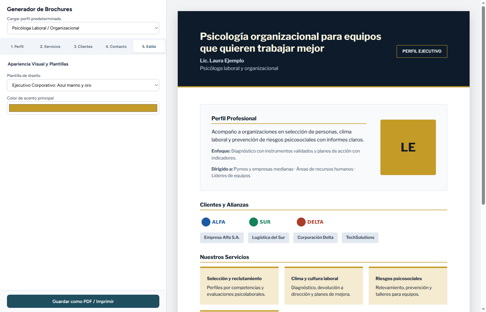

# Manual de Usuario — Generador de Brochures

Guía para preparar un brochure profesional y guardarlo como PDF o imprimirlo.

---

## 1. Introducción

El **Generador de Brochures** arma un brochure de presentación profesional en hojas A4. A medida que completa el formulario de la izquierda, a la derecha se ve el resultado. Con él puede:

- partir de un **perfil predeterminado** con textos de ejemplo;
- completar su presentación, servicios, clientes y datos de contacto;
- agregar su **foto** y los **logos** de sus clientes;
- elegir entre **seis plantillas de diseño** y cambiar el color principal;
- **guardar el brochure como PDF** o imprimirlo.

En las imágenes, el nombre, los datos de contacto, las empresas y los logos son **de ejemplo**.

## 2. La pantalla

- **A la izquierda**, el panel de edición. Arriba está el selector **Cargar perfil predeterminado**, y debajo hay cinco pestañas: **1. Perfil**, **2. Servicios**, **3. Clientes**, **4. Contacto** y **5. Estilo**.
- **A la derecha**, la vista previa del brochure, tal como se va a imprimir. Se actualiza mientras escribe.
- **Abajo del panel**, el botón **Guardar como PDF / Imprimir**.

**Lo que escribe queda guardado en este navegador.** Si cierra la página y la vuelve a abrir en el mismo equipo y navegador, el brochure aparece como lo dejó.

## 3. Elegir un perfil predeterminado

El selector **Cargar perfil predeterminado** completa todo el formulario con un ejemplo y elige la plantilla que mejor le queda:

| Perfil | Plantilla que aplica |
|---|---|
| Psicóloga Clínica (Pacientes / Adultos) | Clínica |
| Psicóloga Laboral / Organizacional | Ejecutivo Corporativo |
| Especialista en OEC y Calidad | Ejecutivo Corporativo |
| Ingeniera de Software & Tech | Corporativo Moderno |

> **Atención:** al elegir un perfil se **reemplaza todo lo que había escrito**, incluidos la foto y los logos. Elíjalo al empezar y después ajuste los textos.

## 4. Pestaña 1: Perfil

- **Nombre**: viene fijo y no se puede modificar desde la pantalla.
- **Título profesional**, **Registro profesional** (opcional), **Frase principal (Hero)**: la frase destacada del brochure.
- **Presentación breve / Bio**: dos o tres líneas sobre usted y su trabajo.
- **Foto**: puede pegar la dirección web de una imagen, o elegir un archivo de su equipo con **Elegir archivo**.
- **Quitar foto**: quita la imagen. En su lugar se muestran las iniciales del nombre.

## 5. Pestaña 2: Servicios

- **Enfoque metodológico**: cómo trabaja.
- **A quién está dirigido**: escriba **un ítem por línea**. Cada línea aparece como un punto separado.
- **Servicios principales (hasta 4)**: para cada servicio hay un nombre y una descripción breve. Los servicios sin nombre no aparecen en el brochure.

## 6. Pestaña 3: Clientes

- **Nombres de empresas**: escríbalos **separados por comas**. Cada uno aparece como una etiqueta en el brochure.
- **Logos de clientes**: puede cargar **hasta 8**.
  - **Subir logos desde tu equipo**: puede elegir varios archivos a la vez. Funcionan mejor en PNG con fondo transparente o blanco.
  - **O agregar por URL**: pegue la dirección web del logo y presione **Agregar** o Enter. Tiene que empezar con *http://* o *https://*. Si no, aparece un aviso, como en la imagen.
  - La **×** de cada logo lo quita.
  - Si llega a 8, la aplicación le avisa que tiene que quitar uno antes de agregar otro.

Así se ven los nombres y los logos en el brochure:

## 7. Pestaña 4: Contacto

- **Modalidad de atención**, **Horarios / Disponibilidad** y **Primera consulta / Reunión**.
- **Teléfono o WhatsApp** y **Correo electrónico**: vienen fijos y no se pueden modificar desde la pantalla.
- **Web o Redes** y **Ubicación**.
- **Mostrar nota de confidencialidad**: agrega al brochure una nota sobre la reserva de la información.
- **Mostrar datos fiscales**: muestra la **Razón social** y el **RUT** que escriba debajo.

## 8. Pestaña 5: Estilo

- **Plantilla de diseño**: elija entre seis:
  - Clínica (lateral con foto y tono cálido);
  - Organizacional (portada ejecutiva y área de clientes);
  - Minimal (filas limpias y aireado);
  - Ejecutivo Corporativo (azul marino y oro);
  - Corporativo Moderno (gris pizarra y estructura tech);
  - Bienestar Institucional (verde bosque y tonos neutros).
- **Color de acento principal**: cambia el color de títulos y detalles.

Al cambiar de plantilla, el color vuelve al de esa plantilla. Elija primero la plantilla y después el color.

## 9. Guardar como PDF o imprimir

1. Revise la vista previa.
2. Presione **Guardar como PDF / Imprimir**. Se abre la ventana de impresión del navegador.
3. Para obtener un PDF, en **Destino** elija **Guardar como PDF**. Para imprimirlo, elija la impresora.
4. Presione **Guardar** o **Imprimir**.

En el resultado solo sale el brochure, en hojas A4, sin el panel de edición.

Lo recomendable es que el brochure no pase de **tres hojas**. Si las supera, abajo del panel aparece el aviso *El brochure supera las tres hojas A4 recomendadas. Considerá acortar algunos textos.*

## 10. Preguntas frecuentes

**¿Puedo cambiar el nombre, el teléfono o el correo?**
No desde la pantalla. Esos tres datos vienen fijos en la aplicación.

**Volví a abrir la página y está todo lo que había escrito. ¿Cómo empiezo de cero?**
Elija un perfil predeterminado: reemplaza todo el contenido.

**Un logo no se cargó.**
La aplicación avisa si no pudo leer un archivo. Pruebe con PNG, JPG o SVG.

**¿Mis datos se envían a algún lado?**
No. Lo que escribe se guarda solo en el navegador de este equipo.
