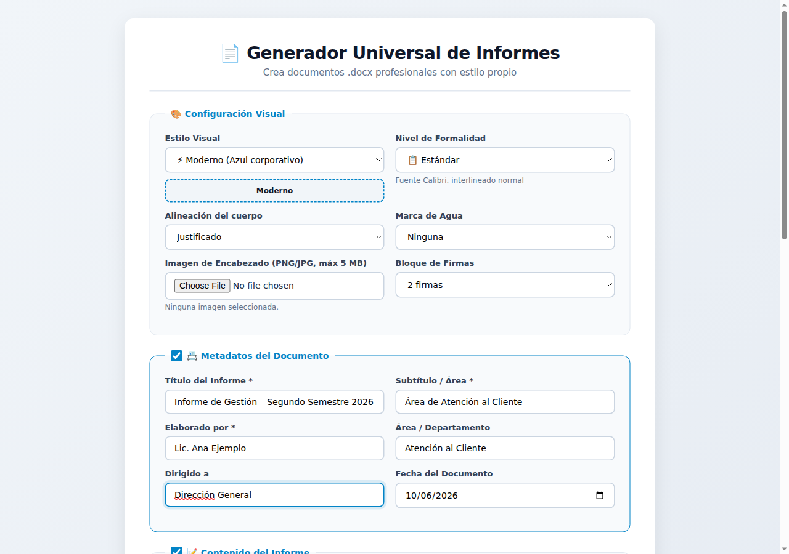
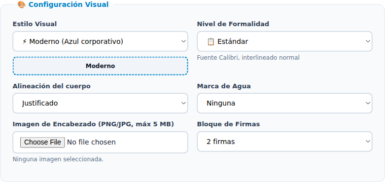
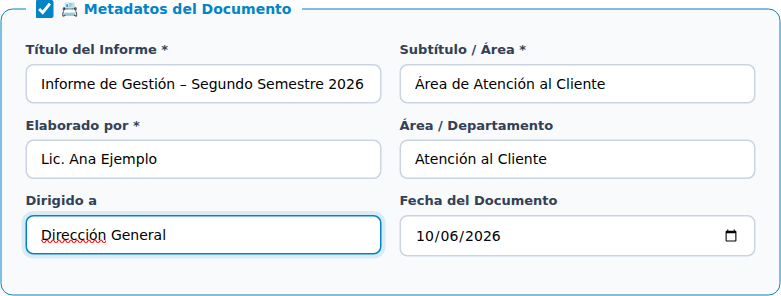
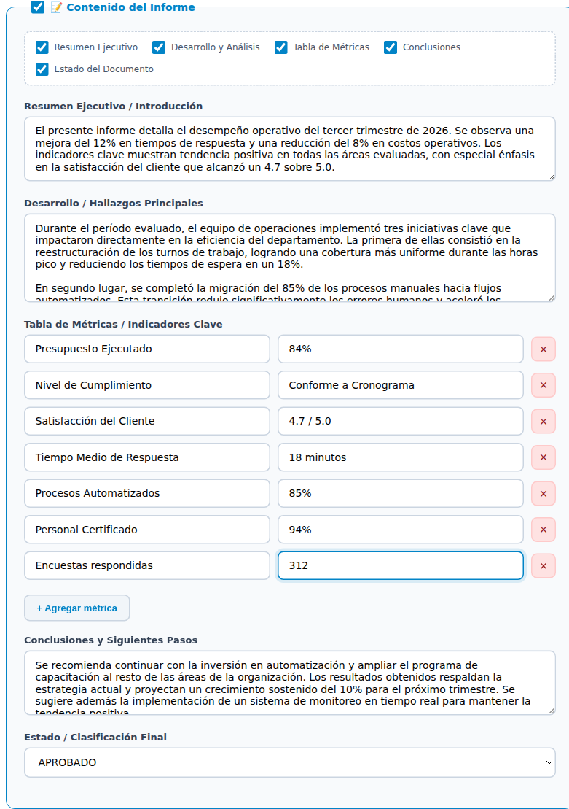
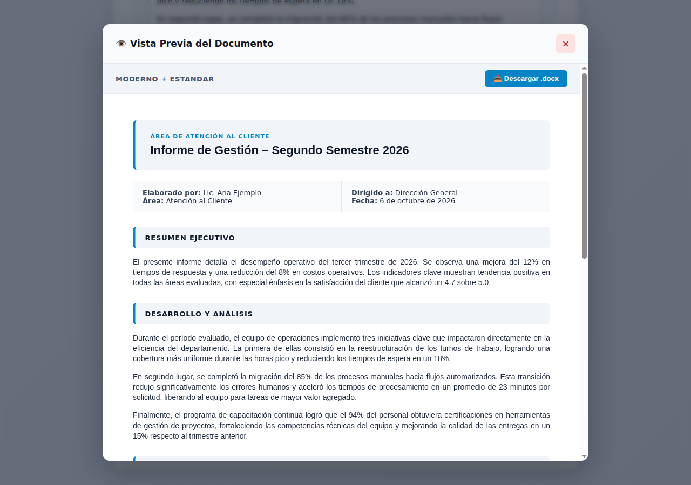
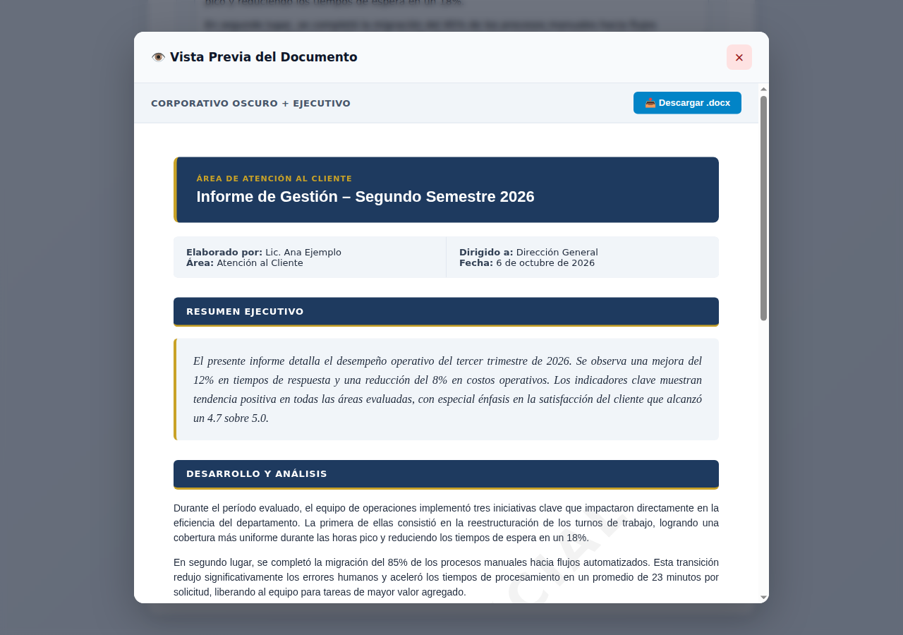
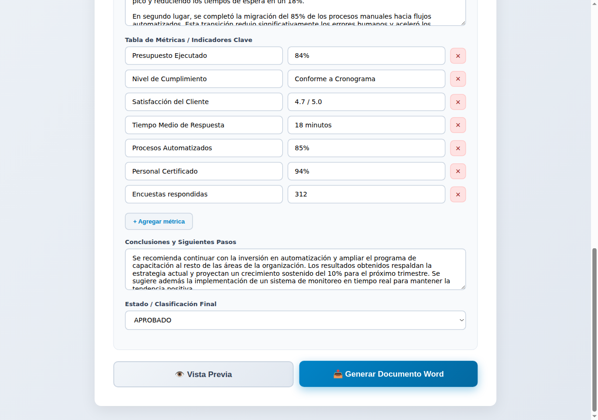

# Manual de Usuario — Generador Universal de Informes

Guía para armar informes profesionales y descargarlos como documento Word.

---

## 1. Introducción

El **Generador Universal de Informes** arma un informe con formato profesional a partir de un formulario y lo entrega como documento **Word (.docx)**, listo para abrir, revisar e imprimir. Con él puede:

- elegir el **estilo visual** (colores) y el **nivel de formalidad** (tipografía y espaciado) del documento;
- agregar una **imagen de encabezado**, una **marca de agua** y un **bloque de firmas**;
- completar los datos del informe: título, autor, destinatario y fecha;
- escribir el resumen, el desarrollo y las conclusiones, y cargar una **tabla de métricas**;
- ver una **vista previa** antes de descargar.

Los nombres y textos que aparecen en las imágenes son **de ejemplo**.

## 2. La pantalla

La aplicación es una sola página, con el formulario dividido en tres bloques. Al final están los botones **Vista Previa** y **Generar Documento Word**.

| Bloque | Para qué sirve |
|---|---|
| **Configuración Visual** | Aspecto del documento: estilo, formalidad, alineación, marca de agua, imagen y firmas. |
| **Metadatos del Documento** | Título, subtítulo, autor, área, destinatario y fecha. |
| **Contenido del Informe** | Resumen, desarrollo, métricas, conclusiones y estado. |

El formulario se abre con un ejemplo completo para que vea cómo queda. Reemplace los textos por los de su informe.

## 3. Configuración visual

| Campo | Opciones |
|---|---|
| **Estilo Visual** | Moderno (azul corporativo), Corporativo Oscuro (azul marino y dorado), Ecológico (verdes), Tecnológico (oscuro y cian) o Clásico Papel (tonos cálidos). Debajo se muestra una muestra del estilo elegido. |
| **Nivel de Formalidad** | Estándar, Interno / Operativo, Ejecutivo o Solemne / Legal. Debajo aparece una breve descripción: tipografía, espaciado y otros detalles. |
| **Alineación del cuerpo** | Izquierda o Justificado. |
| **Marca de Agua** | Ninguna, BORRADOR, CONFIDENCIAL o PRELIMINAR. |
| **Imagen de Encabezado** | Un logo o imagen en PNG o JPG (máximo recomendado: 5 MB). Al elegirla se muestra su nombre y tamaño. |
| **Bloque de Firmas** | Sin firmas, 1 firma o 2 firmas al final del documento. |

**Sobre los niveles de formalidad:**

- **Interno / Operativo** arma un documento más compacto, pensado para uso interno.
- **Ejecutivo** usa más espacio entre párrafos y destaca el resumen como una cita.
- **Solemne / Legal** usa doble espacio y numeración romana, y deja todo el documento **en blanco y negro**, sin importar el estilo visual elegido.

## 4. Datos del documento

Complete el **Título del Informe**, el **Subtítulo / Área**, **Elaborado por**, **Área / Departamento**, **Dirigido a** y la **Fecha del Documento**. La fecha se completa sola con el día de hoy, pero la puede cambiar.

Con la casilla del título del bloque decide si estos datos se muestran en el documento.

> Los campos marcados con **\*** son obligatorios. Si falta alguno, la aplicación no genera el documento y le marca el campo vacío. Esto pasa aunque haya desmarcado el bloque.

## 5. Contenido del informe

Arriba del bloque hay casillas para elegir qué partes incluir: **Resumen Ejecutivo**, **Desarrollo y Análisis**, **Tabla de Métricas**, **Conclusiones** y **Estado del Documento**. Si desmarca la casilla del título del bloque, no se incluye nada del contenido y los campos se ven atenuados.

- **Resumen Ejecutivo / Introducción**: un párrafo que resume el informe.
- **Desarrollo / Hallazgos Principales**: el cuerpo del informe. Puede escribir varios párrafos.
- **Tabla de Métricas / Indicadores Clave**: cada fila tiene un nombre (por ejemplo, *Satisfacción del Cliente*) y un valor (por ejemplo, *4.7 / 5.0*).
  - **+ Agregar métrica** suma una fila nueva.
  - **×** elimina una fila. Siempre queda al menos una.
  - Ninguna fila puede quedar a medio completar: escriba el nombre y el valor, o elimínela.
- **Conclusiones y Siguientes Pasos**: cierre y recomendaciones.
- **Estado / Clasificación Final**: BORRADOR, APROBADO, REQUIERE ACCIÓN o CONFIDENCIAL.

## 6. Vista previa

Presione **Vista Previa** para ver cómo quedará el documento sin descargarlo.

Arriba se indican el estilo y la formalidad elegidos. Si cambia la configuración, vuelva a abrir la vista previa para ver el resultado:

- **Descargar .docx** genera el documento desde la misma ventana.
- Para cerrar la vista previa, presione **×**, haga clic fuera de la ventana o pulse **Esc**.

La vista previa es una aproximación. El documento final puede variar levemente según la versión de Word con que lo abra.

## 7. Generar el documento Word

1. Revise que los campos obligatorios estén completos.
2. Presione **Generar Documento Word**. Mientras se arma, el botón dice *Generando documento…*.
3. Al terminar aparece el mensaje **Documento generado correctamente.** y el archivo se descarga en la carpeta de descargas de su equipo.

El nombre del archivo incluye el título, el estilo y la formalidad. Por ejemplo: *Informe_Informe_de_Gestión_corporativo_ejecutivo.docx*.

El documento incluye encabezado, numeración de páginas y, si los eligió, la imagen, la marca de agua y las firmas.

## 8. Preguntas frecuentes

**¿Se guarda lo que escribí?**
No. Si cierra o recarga la página, el formulario vuelve al ejemplo inicial. Genere el documento antes de salir.

**Aparece un mensaje que dice que no se cargó la librería.**
La aplicación necesita conexión a internet para armar el documento. Revise la conexión y recargue la página.

**Presiono Generar y no pasa nada.**
Falta completar algún campo obligatorio. La aplicación le marca cuál es. Revise también la tabla de métricas.

**¿Puedo editar el documento después?**
Sí. Es un documento Word común: puede abrirlo y modificarlo con cualquier programa compatible.
