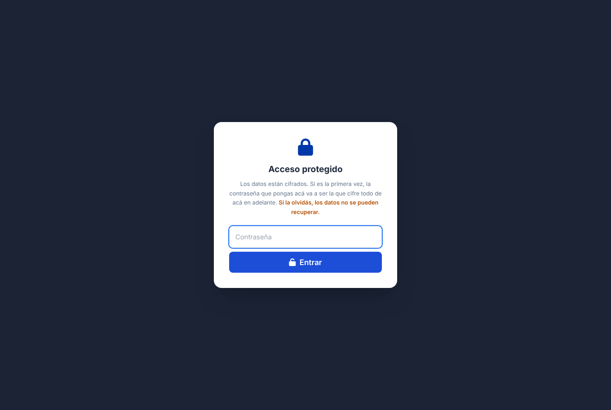
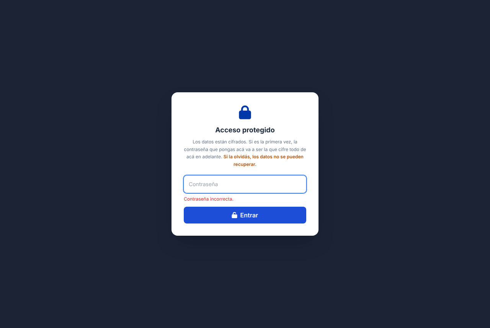
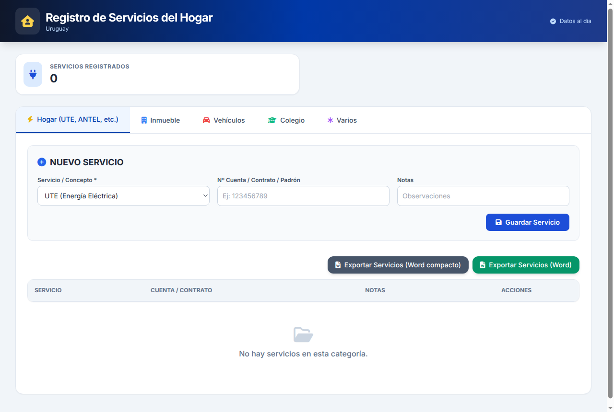
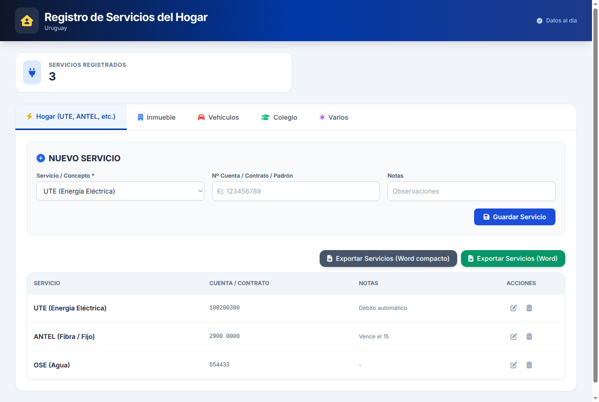
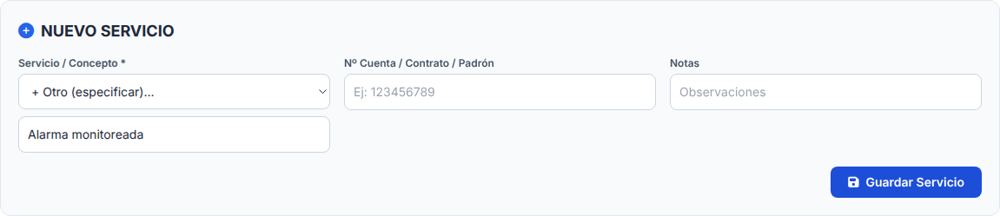
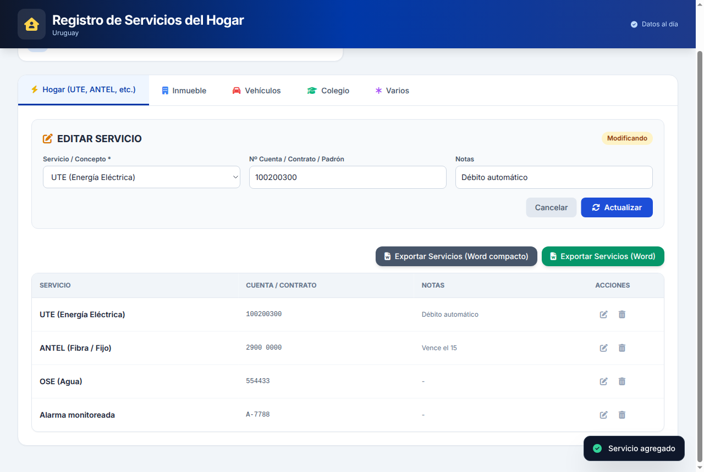
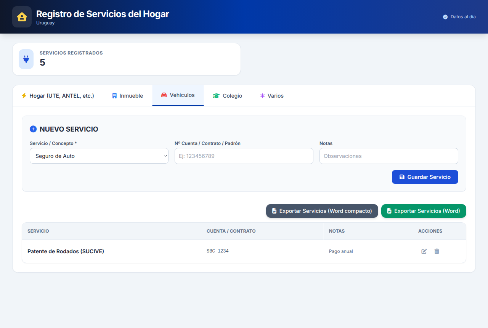
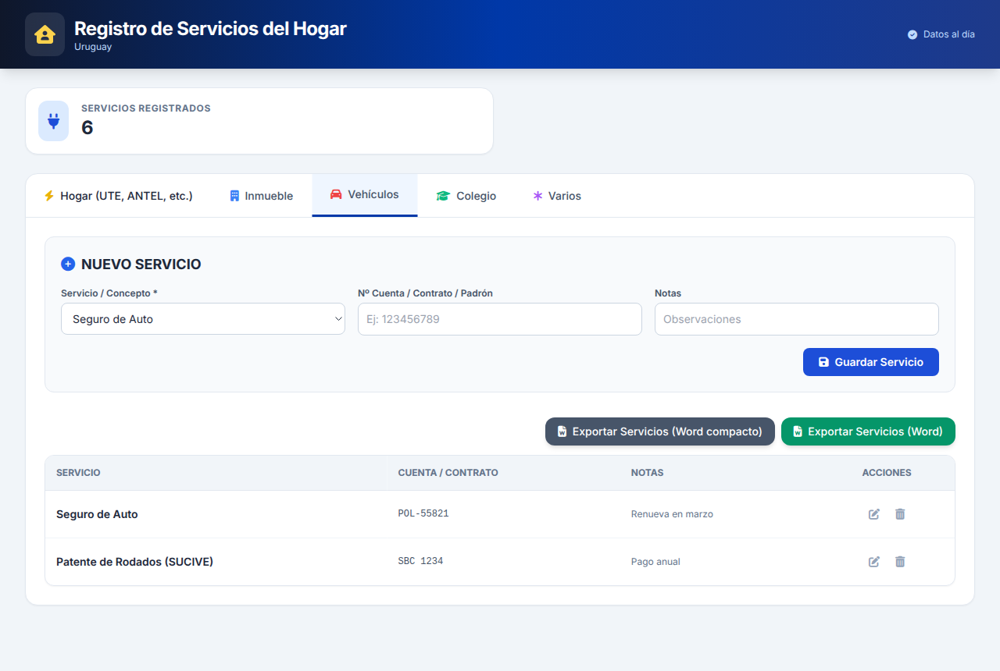

# Manual de Usuario — Registro de Servicios del Hogar

Guía para registrar los servicios, cuentas y gastos fijos de la casa y exportarlos a Word.

---

## 1. Introducción

**Registro de Servicios del Hogar** sirve para tener en un solo lugar los datos de los servicios y gastos fijos de la casa: luz, agua, internet, alquiler, seguros, colegio, tarjetas y otros. Para cada uno se guarda el **número de cuenta, contrato o padrón** y una nota.

Con la aplicación puede:

- organizar los servicios en **cinco categorías**;
- agregar, modificar y eliminar servicios;
- **exportar** la lista completa a un documento de Word.

Los datos se guardan **protegidos con una contraseña** que usted elige.

Los servicios y números de las imágenes son **inventados**.

## 2. Ingreso con contraseña

Al abrir la aplicación aparece **Acceso protegido**.

1. Escriba la **Contraseña**.
2. Presione **Entrar**. Mientras comprueba la contraseña, el botón dice *Verificando...*

**La primera vez**, la contraseña que escriba queda como la contraseña de todos sus datos de ahí en adelante. Elija una que pueda recordar.

> **Importante:** si olvida la contraseña, **los datos no se pueden recuperar**. Nadie puede recuperarla por usted. Anótela en un lugar seguro.

Si la contraseña no es la correcta, aparece *"Contraseña incorrecta."* y puede volver a intentarlo.

La aplicación pide la contraseña **cada vez que se abre o se recarga la página**.

## 3. La pantalla principal

- **Encabezado**: arriba a la derecha está el estado de los datos:
  - *Cargando datos...* o *Guardando...*: la aplicación está trabajando, espere.
  - *Datos al día*: todo está guardado.
  - *Error: …*: no se pudo guardar o leer. Revise su conexión a internet y vuelva a intentarlo.
- **Servicios Registrados**: el total de servicios de **todas** las categorías.
- **Pestañas de categorías**:
  - **Hogar (UTE, ANTEL, etc.)**
  - **Inmueble**
  - **Vehículos**
  - **Colegio**
  - **Varios**
- **Formulario** para agregar o modificar un servicio.
- **Botones de exportación** a Word.
- **Tabla** con los servicios de la categoría elegida. Si no hay ninguno, dice *"No hay servicios en esta categoría."*

## 4. Agregar un servicio

1. Elija la **pestaña** de la categoría.
2. En **Servicio / Concepto**, elija el servicio de la lista. La lista cambia según la categoría.
3. En **Nº Cuenta / Contrato / Padrón**, escriba el número que identifica su cuenta (opcional).
4. En **Notas**, escriba lo que quiera recordar, por ejemplo *"Débito automático"* o *"Vence el 15"* (opcional).
5. Presione **Guardar Servicio**.

Abajo a la derecha aparece el mensaje *"Servicio agregado"* y el servicio se suma a la tabla.

### 4.1 Servicios de cada categoría

| Categoría | Servicios de la lista |
|---|---|
| **Hogar** | UTE (Energía Eléctrica), ANTEL (Fibra / Fijo), Ancel / Movistar / Claro, OSE (Agua), Gas Natural / Garrafa, Servicio Técnico / Mantenimiento |
| **Inmueble** | Alquiler de Apartamento, Gastos Comunes, Tributos Inmobiliarios (IMM/Intendencia), Impuesto de Enseñanza Primaria, Fondo de Garantía |
| **Vehículos** | Seguro de Auto, Patente de Rodados (SUCIVE), Cochera / Garaje, Mantenimiento / Taller, Peajes / Telepeaje |
| **Colegio** | Cuota Mensual Colegio / Liceo, Matrícula Anual, Materiales / Libros / Uniforme, Actividades Extraescolares, Transporte Escolar / Comedor |
| **Varios** | Tarjeta de Crédito, Gimnasio / Club, Servicios Streaming, Préstamo / Cuota, Gastos Médicos / Mutualista |

### 4.2 Un servicio que no está en la lista

1. En **Servicio / Concepto**, elija **+ Otro (especificar)...**
2. Aparece el casillero **Especifique el servicio**. Escriba el nombre, por ejemplo *"Alarma monitoreada"*.
3. Complete el resto y presione **Guardar Servicio**.

## 5. Modificar un servicio

1. En la tabla, presione el ícono del **lápiz** (Editar) del servicio.
2. El formulario cambia a **Editar servicio**, con la etiqueta **Modificando**, y se cargan los datos.
3. Haga los cambios y presione **Actualizar**. Aparece *"Servicio actualizado"*.
4. Para no cambiar nada, presione **Cancelar**.

## 6. Eliminar un servicio

1. Presione el ícono de la **papelera** (Eliminar) del servicio.
2. La aplicación pregunta *"¿Eliminar este servicio?"*
3. Si confirma, el servicio se borra y aparece *"Servicio eliminado"*.

> Un servicio eliminado no se puede recuperar. Si lo borró por error, vuelva a cargarlo.

## 7. Exportar a Word

Arriba de la tabla hay dos botones:

- **Exportar Servicios (Word)**: documento con letra normal y más espacio, fácil de leer.
- **Exportar Servicios (Word compacto)**: el mismo contenido con letra más chica, para que entre en menos hojas.

Los dos incluyen **todos los servicios de todas las categorías**, agrupados por categoría, y al final el total de servicios registrados. El archivo se descarga con un nombre que empieza con *Servicios_Hogar* y lleva la fecha del día, y se puede abrir con Word.

## 8. Cuidados y preguntas frecuentes

**¿Dónde quedan guardados mis datos?**
Se guardan automáticamente cada vez que agrega, modifica o elimina un servicio. Cuando terminan de guardarse, el encabezado dice *Datos al día*.

**Olvidé la contraseña.**
No hay forma de recuperarla ni de recuperar los datos. Por eso conviene anotarla en un lugar seguro.

**Escribí la contraseña bien y dice "No se pudo acceder: …".**
Hubo un problema de conexión. Verifique internet y vuelva a intentar.

**El documento de Word está guardado en mi computadora.**
El archivo exportado **no está protegido con contraseña**. Guárdelo en un lugar seguro, porque tiene sus números de cuenta.

**¿Qué pasa si cierro la página?**
Sus datos quedan guardados. La próxima vez tendrá que escribir la contraseña de nuevo.
