# Manual de Usuario — Simulador de Maletines

Guía para jugar la partida clásica y para conducir las dinámicas individuales y grupales.

---

## 1. Introducción

El **Simulador de Maletines** reproduce el juego de los maletines (estilo "Trato o No Trato"). Hay 26 maletines cerrados con premios que van de **$1 a $1.000.000**. Ronda a ronda, se abren maletines y la banca hace ofertas para comprar el maletín del jugador.

Tiene dos usos:

- **Jugar**: la partida clásica, con ayudas para entender el **valor esperado** y un modo para seguir en vivo un programa de televisión.
- **Dinámicas**: ejercicios para observar cómo decide una persona o un grupo bajo incertidumbre, con un informe profesional al final.

Los nombres de participantes de las imágenes son **de ejemplo**.

## 2. Menú principal

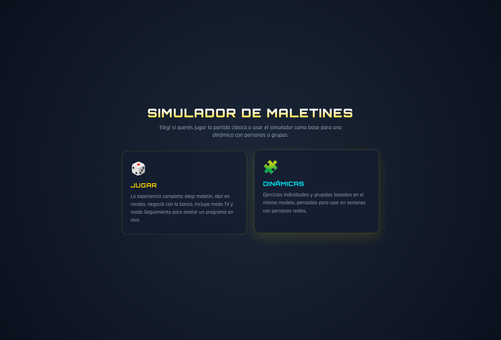

Elija **Jugar** para la partida clásica o **Dinámicas** para los ejercicios con personas o grupos.

## 3. Cómo funciona una partida

1. **Elegir el maletín propio**: es el que se lleva si no acepta ninguna oferta.
2. **Abrir maletines**: hay 9 rondas. En cada una se abren 6, 5, 4, 3, 2, 1, 1, 1 y 1 maletines. Cada premio que sale se tacha en las columnas de los costados.
3. **La oferta de la banca**: al terminar cada ronda, la banca ofrece dinero por su maletín.
   - **Trato**: acepta la oferta y la partida termina.
   - **No Trato**: sigue jugando.
4. **Última decisión**: si rechaza todas las ofertas, quedan dos maletines, el suyo y otro. Elija **Me quedo con el mío** o **Cambiar maletín**.
5. **Resultado**: se muestra lo que ganó, cuánto había en su maletín y el **historial de ofertas**.

### 3.1 Los indicadores

| Indicador | Qué muestra |
|---|---|
| **Ronda** | Ronda actual sobre el total (por ejemplo, *1 / 9*). |
| **Maletines restantes** | Cuántos maletines siguen cerrados. |
| **Valor Esperado (VE)** | El promedio de los premios que siguen en juego. Es lo que "vale" en promedio un maletín cerrado. |
| **Oferta Estimada Banca** | Lo que la banca ofrecería en ese momento. |

La banca empieza ofreciendo menos que el valor esperado y se va acercando a medida que avanza la partida.

## 4. Jugar

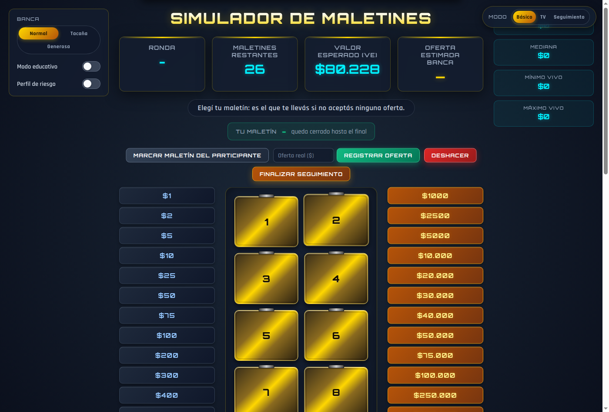

Arriba a la derecha está el selector **Modo**: **Básico**, **TV** y **Seguimiento**.

A la izquierda está el panel de opciones:

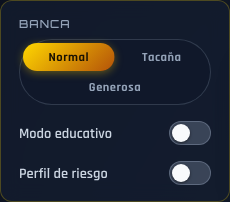

- **Banca**: cambia lo generosa que es la banca.
  - **Normal** ofrece entre el 60% y el 90% del valor esperado.
  - **Tacaña** ofrece entre el 42% y el 72%.
  - **Generosa** ofrece entre el 72% y el 97%.
- **Modo educativo**: agrega una fila con la **desviación**, la **mediana**, el **mínimo** y el **máximo** de los premios que quedan.
- **Perfil de riesgo**: al final de la partida muestra qué tipo de jugador fue.

Estas opciones se eligen **antes de elegir el maletín**. Una vez elegido, quedan fijas hasta la próxima partida.

### 4.1 Durante la partida

Toque un maletín para elegirlo como propio. Queda marcado como **TUYO**. Después toque los maletines que quiera abrir. El mensaje del centro indica cuántos faltan en la ronda.

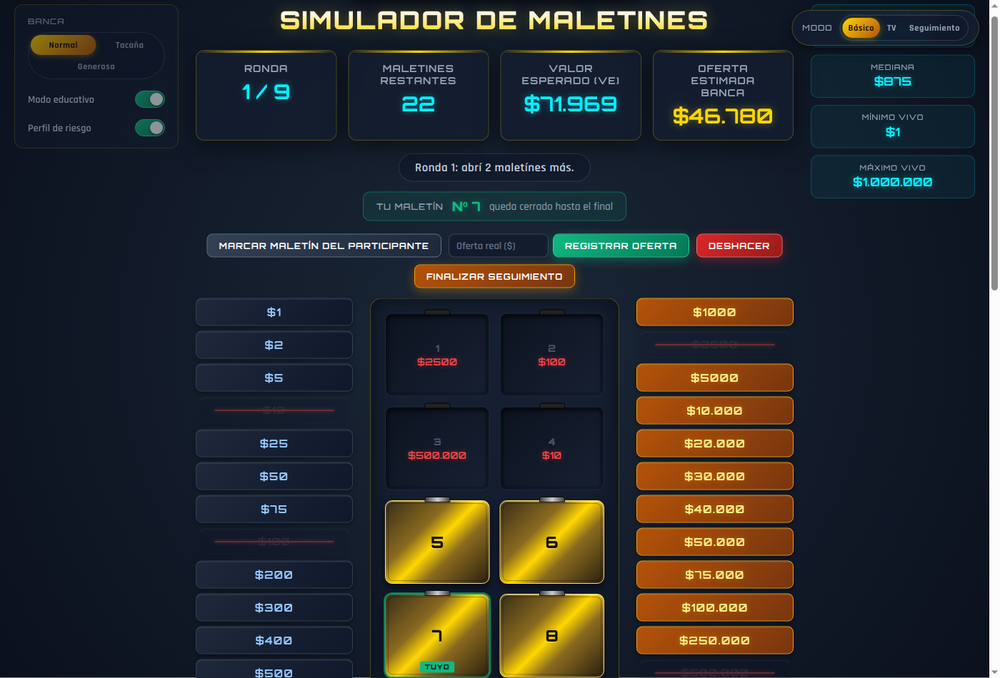

Al completar la ronda aparece la oferta:

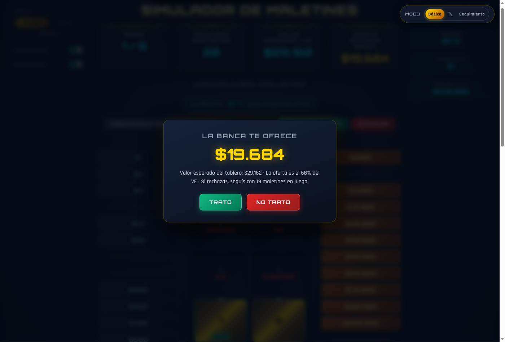

### 4.2 Resultado y perfil de riesgo

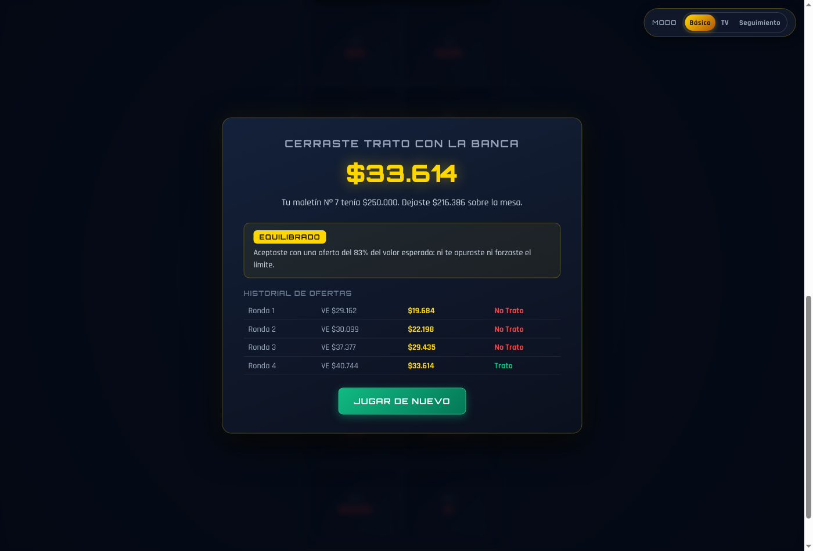

Si activó **Perfil de riesgo**, el resultado muestra una de estas clasificaciones:

| Perfil | Cuándo aparece |
|---|---|
| **Conservador** | Aceptó una oferta menor al 68% del valor esperado. |
| **Equilibrado** | Aceptó una oferta de entre el 68% y el 85% del valor esperado. |
| **Buscador de riesgo** | Aceptó una oferta mayor al 85%, o jugó hasta el final sin aceptar ninguna. |

**Jugar de nuevo** empieza otra partida. **Reiniciar Juego**, debajo del tablero, la reinicia en cualquier momento.

### 4.3 Modo TV

Tiene las mismas reglas que el modo Básico, pero con una presentación de estudio de televisión: un cartel de noticias arriba y destellos al abrir maletines. Es útil para proyectar.

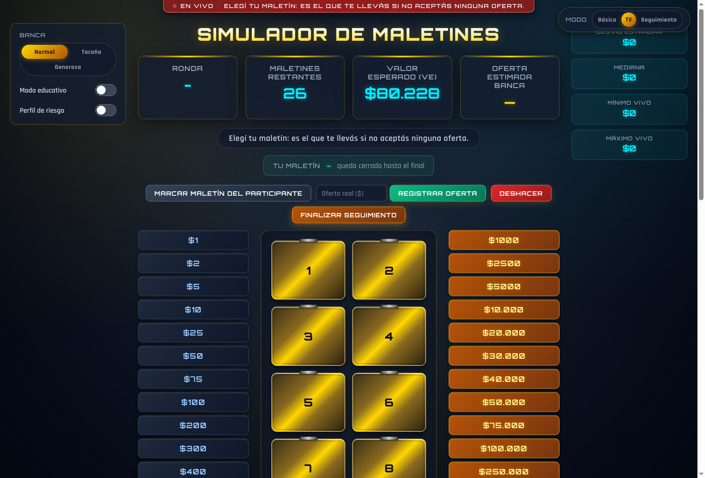

### 4.4 Modo Seguimiento

Sirve para **anotar en vivo un programa de televisión real** y comparar las ofertas del programa con las del modelo. Los premios no se mezclan: usted carga lo que va saliendo.

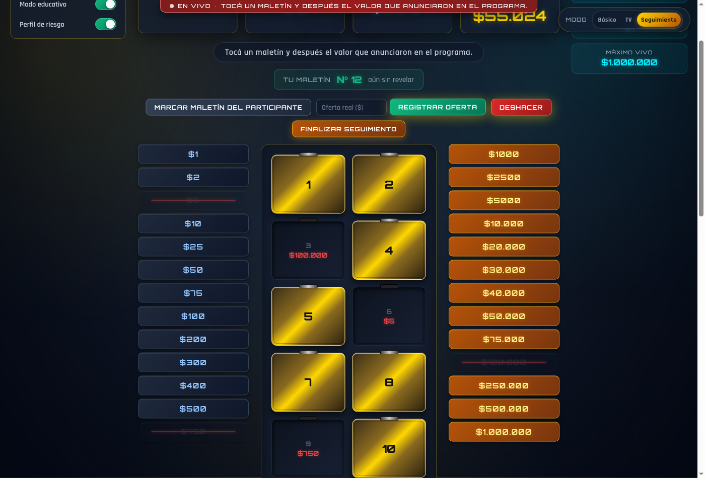

1. Presione **Marcar maletín del participante** y toque el maletín que eligió el concursante.
2. Cuando en el programa abren un maletín, tóquelo en el tablero y después toque, en las columnas laterales, el premio que anunciaron.
3. Cuando la banca hace una oferta en el programa, escriba el monto en **Oferta real ($)** y presione **Registrar oferta**.
4. **Deshacer** borra el último paso.
5. **Finalizar seguimiento** muestra cada oferta real comparada con la que habría hecho el modelo.

**Reiniciar Seguimiento** borra todo y pide confirmación antes.

> En los modos Básico y TV también puede verse la barra de botones de Seguimiento. Esos botones solo se usan en el modo Seguimiento.

Si cambia de modo con una partida empezada, la aplicación avisa que se va a reiniciar y pide confirmación.

## 5. Dinámicas

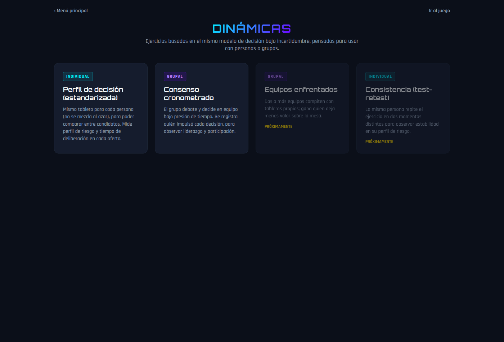

Hay dos dinámicas disponibles: **Perfil de decisión (estandarizada)** y **Consenso cronometrado**. **Equipos enfrentados** y **Consistencia (test-retest)** figuran como *Próximamente* y todavía no se pueden usar.

En las dinámicas, la banca es siempre **Normal**.

### 5.1 Perfil de decisión (individual)

El tablero es **siempre el mismo**: los mismos premios en los mismos maletines. Así los resultados de distintas personas se pueden comparar. La aplicación registra qué decidió la persona en cada oferta y **cuánto tardó** en decidir.

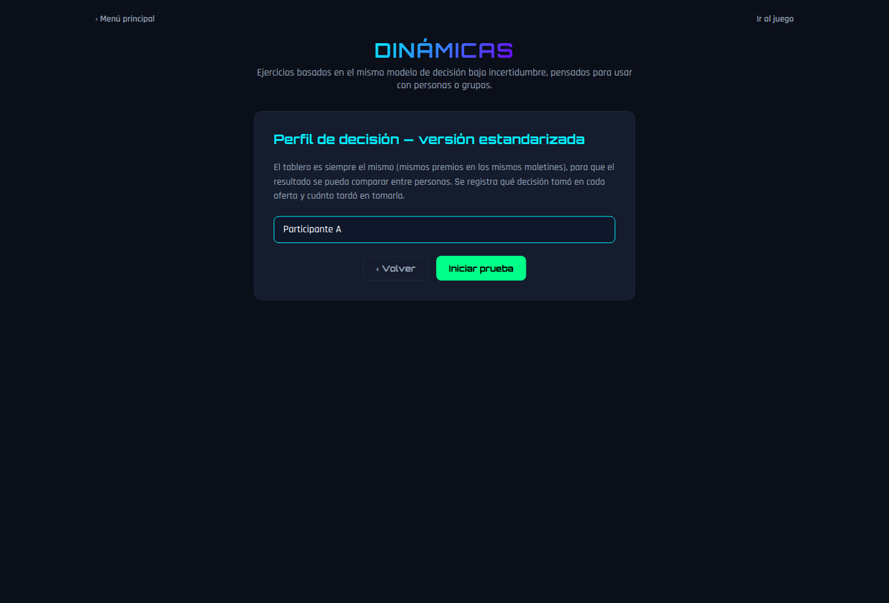

1. Escriba el nombre del participante (es opcional) y presione **Iniciar prueba**.
2. El participante elige su maletín, abre los de cada ronda y responde **Trato** o **No Trato** a cada oferta.

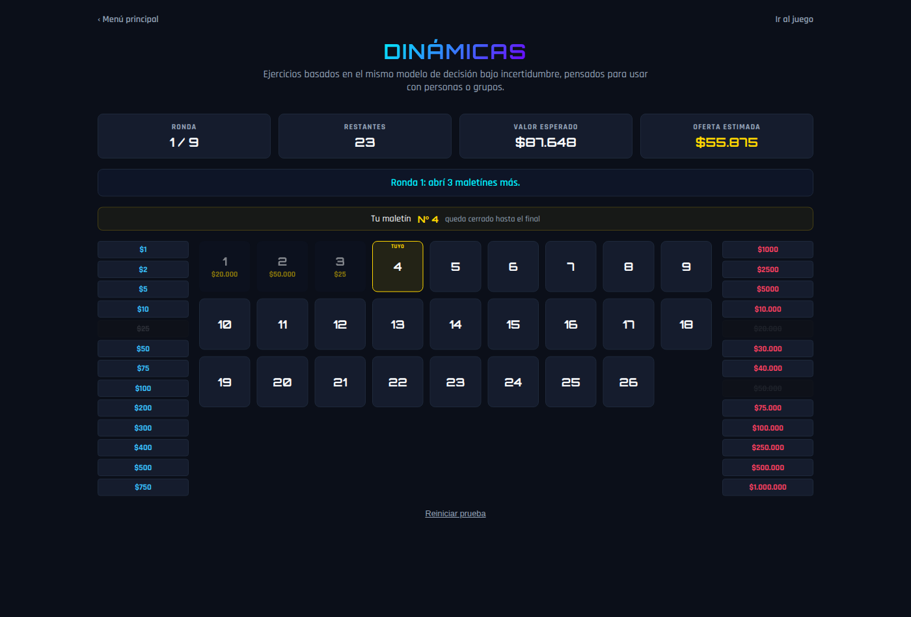

3. Al terminar se ve un resultado sencillo, pensado para mostrarle al participante:

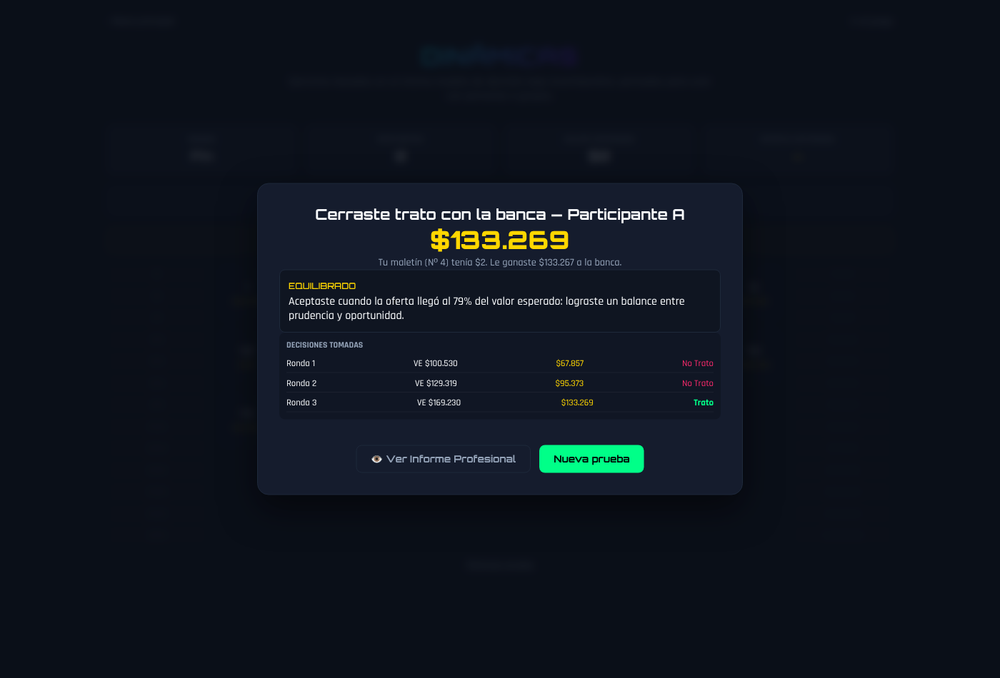

4. **Ver Informe Profesional** abre el **Informe Técnico de Evaluación Conductual**:

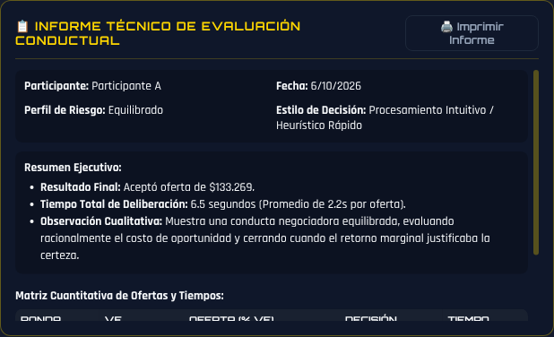

El informe incluye:

- el **perfil de riesgo**;
- el **estilo de decisión**: *intuitivo / rápido* si respondió en menos de 3 segundos en promedio, o *analítico / reflexivo* si tardó más;
- un resumen con el resultado y los tiempos de deliberación;
- una observación cualitativa;
- una tabla con cada ronda, el valor esperado, la oferta, la decisión y el tiempo.

**Imprimir Informe** lo imprime o lo guarda como PDF. **Nueva prueba** prepara la prueba para otra persona.

### 5.2 Consenso cronometrado (grupal)

El grupo mira el mismo tablero, por ejemplo proyectado, y decide en conjunto. Cada oferta tiene un **tiempo límite de 45 segundos**.

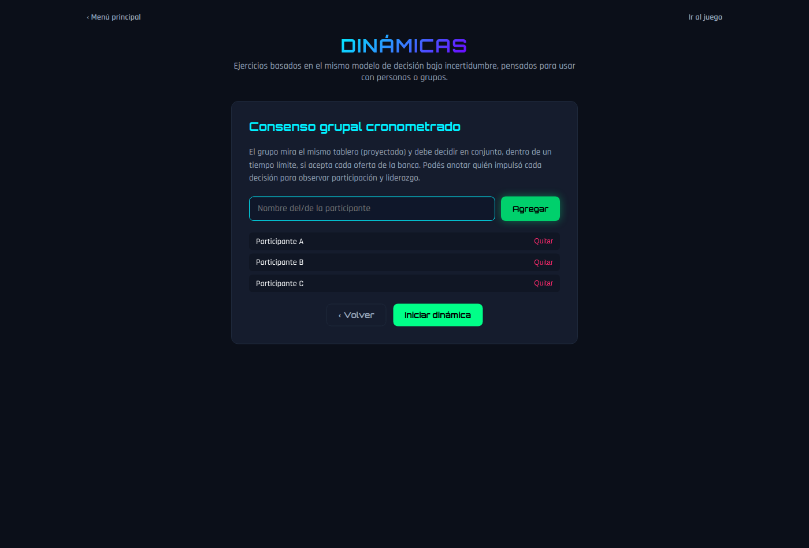

1. Si quiere registrar quién impulsa cada decisión, agregue a los participantes: escriba el nombre y presione **Agregar**. **Quitar** saca un nombre de la lista. Este paso es opcional.
2. Presione **Iniciar dinámica**. El grupo elige el maletín y abre los de cada ronda.
3. Cuando llega la oferta, empieza la cuenta regresiva. En los últimos 10 segundos, el contador cambia de color.

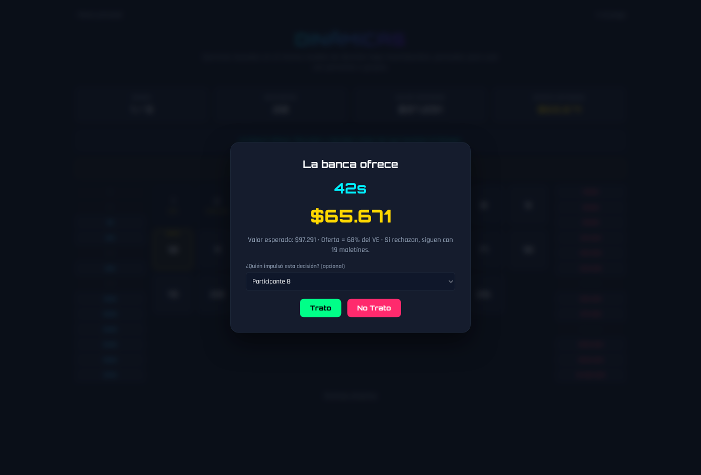

4. Opcionalmente, en **¿Quién impulsó esta decisión?** elija al participante que llevó al grupo a decidir. Después presione **Trato** o **No Trato**.
5. **Si se termina el tiempo, la aplicación registra No Trato automáticamente.** En el informe figura como *Tiempo agotado*.
6. En la última decisión también se puede indicar quién la impulsó.

Al final se ve el resultado del grupo y cuántas decisiones impulsó cada participante:

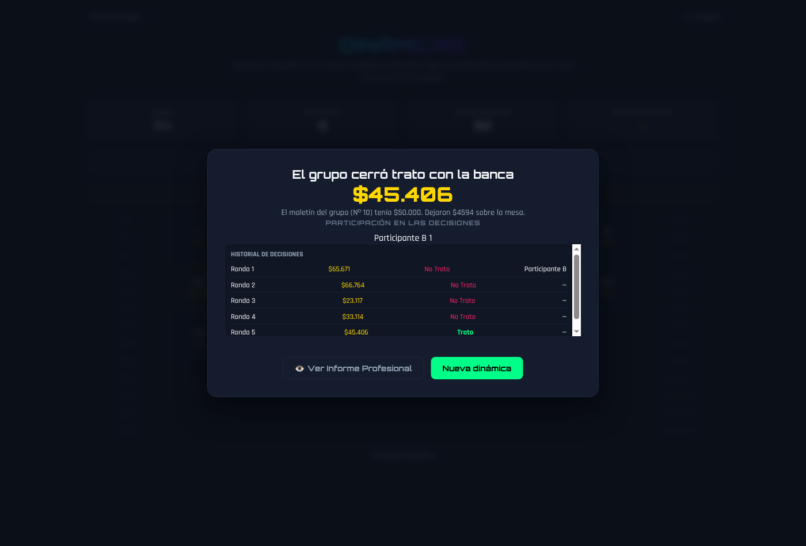

**Ver Informe Profesional** abre el **Informe Técnico de Dinámica Grupal**:

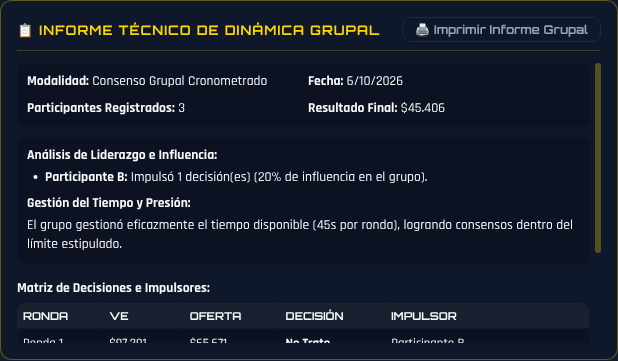

El informe incluye:

- el análisis de liderazgo e influencia: quién impulsó cuántas decisiones;
- la gestión del tiempo: cuántas decisiones se forzaron porque se terminó el tiempo;
- una tabla con cada ronda, la oferta, la decisión y quién la impulsó.

Se imprime con **Imprimir Informe Grupal**.

### 5.3 Reiniciar

**Reiniciar prueba** o **Reiniciar dinámica**, debajo del tablero, empieza de cero. Antes pide confirmación.

## 6. Preguntas frecuentes

**¿Se guardan los resultados?**
No. Si cierra o recarga la página se pierden. **Imprima o guarde como PDF el informe antes de salir.**

**¿Los informes son un diagnóstico?**
No. Son una descripción de las decisiones tomadas en el ejercicio. La interpretación la hace el profesional que conduce la dinámica.

**¿Por qué en el perfil individual siempre salen los mismos premios?**
A propósito: todos los participantes enfrentan el mismo tablero, para poder comparar sus resultados.
