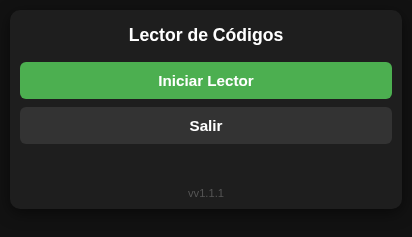
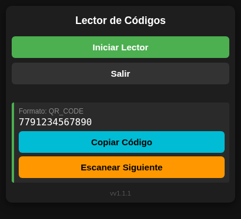
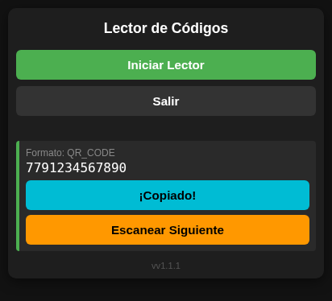
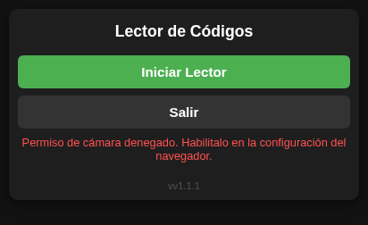

# Manual de Usuario — Lector de Códigos

Guía para leer códigos QR y de barras con la cámara del celular.

---

## 1. Introducción

El **Lector de Códigos** usa la cámara del celular, la tablet o la computadora para leer **códigos QR** y **códigos de barras**. Muestra el contenido del código, que se puede copiar con un toque para pegarlo en otra aplicación (una planilla, un mensaje, un formulario).

Los códigos de las imágenes son **de ejemplo**.

## 2. Pantalla principal

| Botón | Para qué sirve |
|---|---|
| **Iniciar Lector** | Enciende la cámara y empieza a buscar un código. Mientras la cámara está encendida, cambia a **Detener Lector** (en rojo). |
| **Salir** | Apaga la cámara y cierra la aplicación. |

Abajo se ve el número de versión de la aplicación.

## 3. Leer un código

1. Toque **Iniciar Lector**.
2. La primera vez, el navegador pregunta si la página puede usar la cámara. Toque **Permitir**.
3. Apunte la cámara al código y ubíquelo **dentro del recuadro** que aparece en el centro de la imagen.

4. Mantenga el celular quieto, a unos 15 o 20 cm. Cuando lee el código, el celular **vibra** (si lo permite) y la cámara se apaga sola.

Si hay varias cámaras, la aplicación usa la **trasera**.

## 4. El resultado

Debajo de los botones aparece:

- **Formato**: el tipo de código leído (por ejemplo, *QR_CODE* o *EAN_13*).
- **El contenido** del código: un número, un texto o una dirección web.
- **Copiar Código**: copia el contenido. El botón muestra **¡Copiado!** durante dos segundos. Después puede pegarlo donde lo necesite.
- **Escanear Siguiente**: borra el resultado y vuelve a encender la cámara para leer otro código.

## 5. Detener la cámara

Si quiere apagar la cámara sin haber leído nada, toque **Detener Lector**. Aparece el aviso *Lector detenido.* y el botón vuelve a **Iniciar Lector**.

## 6. Instalarla en el celular

La aplicación se puede agregar a la pantalla de inicio del celular y abrir como cualquier otra aplicación:

- **Android (Chrome)**: menú **⋮** → **Instalar aplicación** o **Agregar a pantalla de inicio**.
- **iPhone (Safari)**: botón **Compartir** → **Agregar a inicio**.

## 7. Mensajes de error

| Mensaje | Qué hacer |
|---|---|
| *Permiso de cámara denegado. Habilitalo en la configuración del navegador.* | Se respondió **Bloquear** a la pregunta del navegador. Entre a la configuración del sitio en el navegador (el candado junto a la dirección), permita la **Cámara** y recargue la página. |
| *No se encontró ninguna cámara en este dispositivo.* | El equipo no tiene cámara o está desactivada. |
| *La cámara está siendo usada por otra aplicación.* | Cierre la otra aplicación que usa la cámara (videollamada, cámara de fotos) y vuelva a intentar. |
| *Error de permisos de cámara. Usa HTTPS.* | La dirección no es segura. Abra la aplicación desde su dirección oficial, que empieza con **https://**. |
| *No se pudo iniciar la cámara.* | Vuelva a tocar **Iniciar Lector**. Si sigue, recargue la página. |

## 8. Consejos para que lea mejor

- Buena luz, sin reflejos sobre el código.
- El código entero dentro del recuadro, ni muy cerca ni muy lejos.
- Los códigos de barras se leen mejor con el celular **horizontal respecto a las barras** (las barras de arriba a abajo en la imagen).
- Si el código está arrugado o borroso, pruebe acercar o alejar un poco el celular.

## 9. Preguntas frecuentes

**¿Se guardan los códigos que leo?** No. La aplicación muestra solo el último código leído. Si necesita guardarlo, cópielo y péguelo en otro lugar.

**¿Necesita internet?** Para abrirla la primera vez, sí. Después la cámara lee los códigos en el mismo equipo.

**El botón Salir no cierra la pestaña.** Algunos navegadores no permiten que una página se cierre sola. En ese caso la aplicación queda en blanco y puede cerrar la pestaña a mano.
