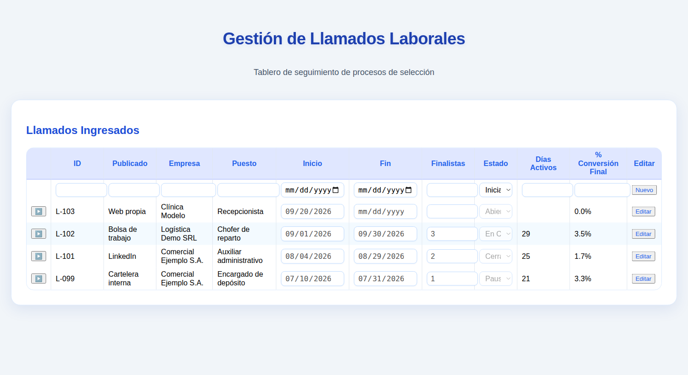
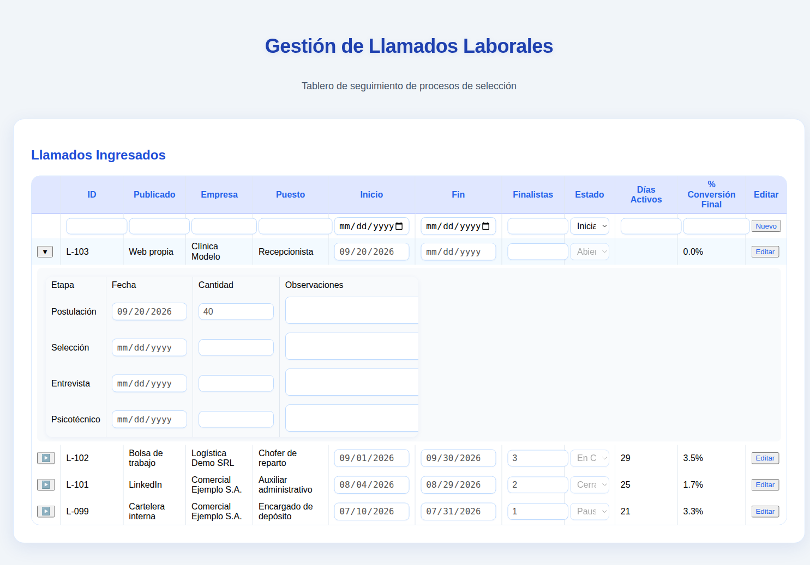
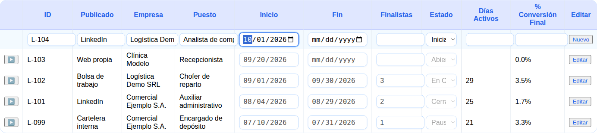
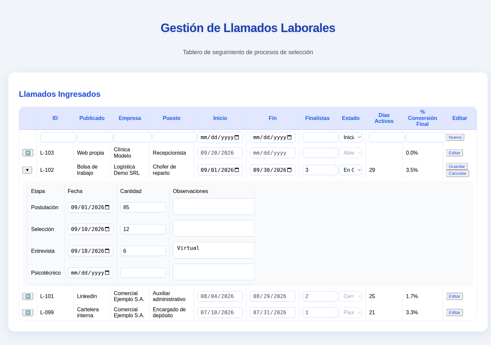

# Manual de Usuario — Gestión de Llamados Laborales

Guía para registrar y seguir los llamados laborales (procesos de selección) y sus etapas.

---

## 1. Introducción

**Gestión de Llamados Laborales** es un tablero para seguir los procesos de selección. Con él puede:

- tener en una sola tabla todos los **llamados**, con empresa, puesto, fechas y estado;
- registrar cuántas personas pasaron por cada **etapa**: Postulación, Selección, Entrevista y Psicotécnico;
- ver calculados los **días activos** de cada llamado y su **porcentaje de conversión final**;
- dar de alta llamados nuevos y modificar los existentes.

Las empresas, puestos y cifras de las imágenes son **inventados**.

## 2. La pantalla principal

Al abrir la aplicación se ve el título **Gestión de Llamados Laborales** y la tabla **Llamados Ingresados**.

- La **primera fila**, con los casilleros vacíos, sirve para cargar un llamado nuevo (capítulo 4).
- Debajo están los llamados cargados, **del más reciente al más antiguo** según su fecha de inicio.

### 2.1 Columnas

| Columna | Qué contiene |
|---|---|
| **▶** | Abre o cierra el detalle por etapas (capítulo 3). |
| **ID** | Identificador del llamado (por ejemplo, *L-102*). |
| **Publicado** | Dónde se publicó el llamado (por ejemplo, *LinkedIn*). |
| **Empresa** | Empresa que solicita el puesto. |
| **Puesto** | Nombre del puesto. |
| **Inicio** / **Fin** | Fechas de inicio y fin del llamado. |
| **Finalistas** | Cantidad de personas que llegaron al final. |
| **Estado** | Iniciado, Abierto, En Curso, Pausado o Cerrado. |
| **Días Activos** | Días entre Inicio y Fin. Queda vacío si falta alguna de las dos fechas. |
| **% Conversión Final** | Finalistas sobre la cantidad de postulantes de la etapa Postulación. Muestra *0%* si no hay postulantes cargados. |
| **Editar** | Botón para modificar el llamado (capítulo 5). |

**Días Activos** y **% Conversión Final** los calcula la aplicación. No se escriben a mano.

Las fechas se muestran en el formato de fecha de su equipo. En las imágenes, el formato es mes/día/año.

### 2.2 Ejemplo de los cálculos

Un llamado con Inicio 04/08 y Fin 29/08 tiene **25 días activos**. Si tuvo **120 postulantes** y **2 finalistas**, su conversión final es 2 ÷ 120 = **1.7%**.

## 3. Ver el detalle por etapas

Presione **▶** a la izquierda de un llamado. Debajo se abre una tabla con las cuatro etapas del proceso:

| Columna | Qué contiene |
|---|---|
| **Etapa** | Postulación, Selección, Entrevista o Psicotécnico. |
| **Fecha** | Fecha de la etapa. |
| **Cantidad** | Cuántas personas participaron en esa etapa. |
| **Observaciones** | Notas libres. |

El botón cambia a **▼**. Presiónelo de nuevo para cerrar el detalle. Mientras no esté editando el llamado, el detalle es solo de lectura.

## 4. Cargar un llamado nuevo

1. En la primera fila de la tabla, complete **ID** y **Puesto**, que son obligatorios.
2. Complete, si los tiene, **Publicado**, **Empresa**, **Inicio**, **Fin** y **Finalistas**.
3. Elija el **Estado**. Por defecto aparece *Iniciado*.
4. Presione **Nuevo**.

Si falta el ID o el puesto, la aplicación avisa *"Debe completar al menos ID y Nombre Puesto"* y no guarda nada.

El llamado nuevo se agrega a la tabla. Las fechas y cantidades de cada etapa se cargan después, editando el llamado (capítulo 5).

> Elija bien el **ID**, la **Empresa**, el **Puesto** y la **publicación** al dar el alta: después **no se pueden modificar** desde la pantalla.

## 5. Modificar un llamado

1. Presione **Editar** en la fila del llamado. Se habilitan **Inicio**, **Fin**, **Finalistas** y **Estado**, y aparecen los botones **Guardar** y **Cancelar**.
2. Para cargar o corregir las etapas, presione **▶** y complete **Fecha**, **Cantidad** y **Observaciones** de cada una.
3. Presione **Guardar** para confirmar, o **Cancelar** para dejar todo como estaba.

Al guardar, la tabla se actualiza y se recalculan **Días Activos** y **% Conversión Final**.

Se edita **un llamado por vez**. Si presiona Editar en otro llamado sin guardar, se pierden los cambios del anterior.

## 6. Estados de un llamado

| Estado | Uso sugerido |
|---|---|
| **Iniciado** | El llamado se registró pero todavía no se publicó. |
| **Abierto** | Se están recibiendo postulaciones. |
| **En Curso** | Ya hay selección, entrevistas o pruebas en marcha. |
| **Pausado** | El proceso está detenido por el momento. |
| **Cerrado** | El proceso terminó. |

## 7. Preguntas frecuentes

**¿Cómo borro un llamado?**
La pantalla no tiene opción para borrar llamados. Si necesita quitar uno, pídaselo al responsable de la aplicación. Mientras tanto, puede marcarlo como *Cerrado*.

**Días Activos aparece vacío.**
Falta la fecha de Inicio o la de Fin, o la de Fin es anterior a la de Inicio.

**La conversión dice 0%.**
Falta la cantidad de la etapa **Postulación** o la de **Finalistas**.

**Me equivoqué en el ID o en la empresa.**
Esos datos no se editan desde la pantalla. Pídale la corrección al responsable de la aplicación.

**¿Aparece un mensaje al guardar?**
No. Al guardar, la fila vuelve al modo de lectura con los datos nuevos.
