# Manual de Usuario — MiniPet

Guía para cuidar a tu mascota virtual, jugar los minijuegos y decorarla.

---

## 1. Introducción

**MiniPet** es una mascota virtual. Hay que darle de comer, curarla cuando se enferma y dejarla dormir. Con los **minijuegos** se ganan **monedas**, que sirven para comprarle accesorios y escenarios en la **Tienda**.

Se juega en el celular, la tablet o la computadora, y se puede instalar como una aplicación.

## 2. Pantalla principal

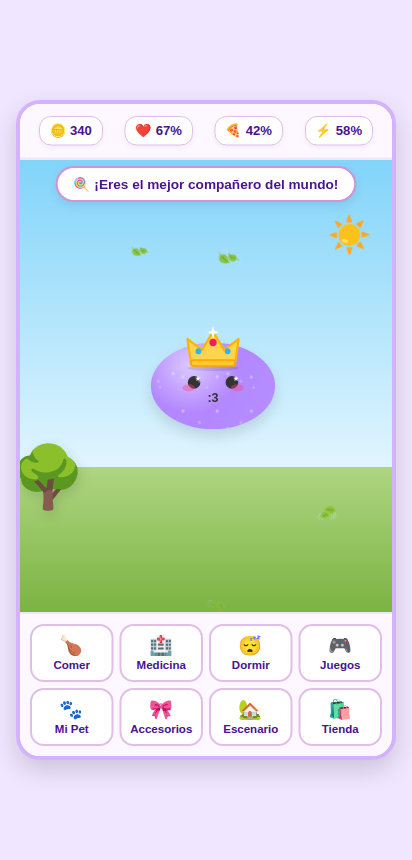

### 2.1 Los indicadores

Arriba hay cuatro indicadores:

| Indicador | Qué muestra |
|---|---|
| **🪙 Monedas** | Las monedas para gastar en la Tienda. Se empieza con 500. |
| **❤️ Felicidad** | Qué tan contenta está la mascota. Sube al jugar. |
| **🍕 Hambre** | Qué tan alimentada está. Al 100% está llena. |
| **⚡ Energía** | Cuánta energía le queda. Se recupera durmiendo. |

Con el tiempo, la felicidad, el hambre y la energía **bajan solas**, un poco cada pocos segundos. La mascota se mueve por la pantalla y, arriba, un globo muestra lo que piensa o siente.

**Tocá a la mascota** para hacerle mimos.

### 2.2 Los botones

| Botón | Qué hace |
|---|---|
| **🍗 Comer** | Le da de comer: el hambre sube 30 puntos. Si ya está llena, dice *No preciso comer ahora.* |
| **🏥 Medicina** | La cura si está enferma y le sube la felicidad. Si está sana, dice que no necesita un doctor. |
| **😴 Dormir** | La hace dormir y le recupera toda la energía. Se despierta sola en unos segundos, o tocando **Dormir** otra vez. Mientras duerme, no come. |
| **🎮 Juegos** | Abre los minijuegos. |
| **🐾 Mi Pet** | Cambia el color, el tamaño, la forma y la brillantina. |
| **🎀 Accesorios** | Le pone los accesorios que compraste y guarda looks. |
| **🏡 Escenario** | Cambia el fondo. |
| **🛍️ Tienda** | Compra accesorios y escenarios. |

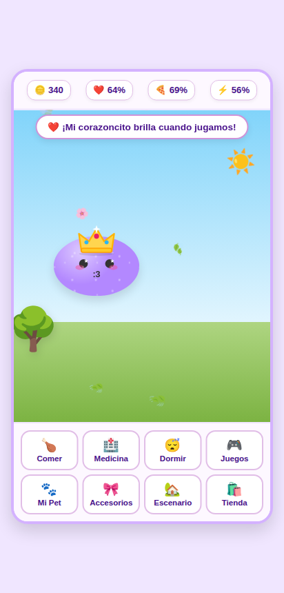

Las ventanas de Juegos, Mi Pet, Accesorios, Escenario y Tienda se cierran con **❌ Cerrar**, arriba a la derecha.

## 3. Cuidar a la mascota

### 3.1 Enfermedad

Si el hambre o la felicidad bajan de 40%, la mascota se puede **enfermar**. Se nota en la cara y en el globo (por ejemplo, *Tengo un poquito de fiebre...*).

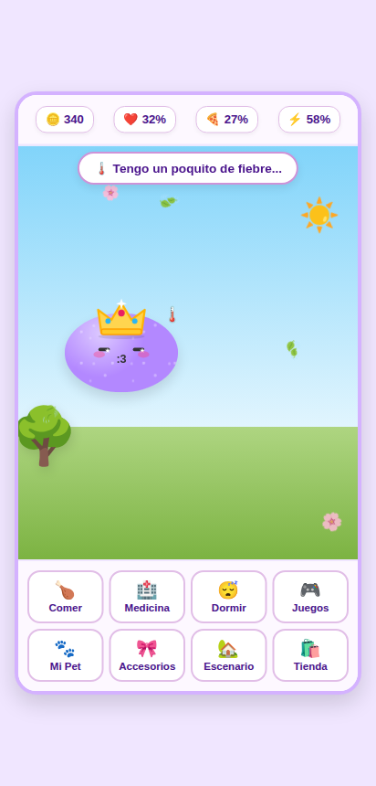

Tocá **🏥 Medicina** para curarla. Además, conviene darle de comer y jugar con ella para que no se vuelva a enfermar.

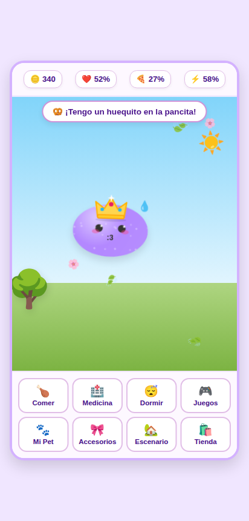

### 3.2 Dormir

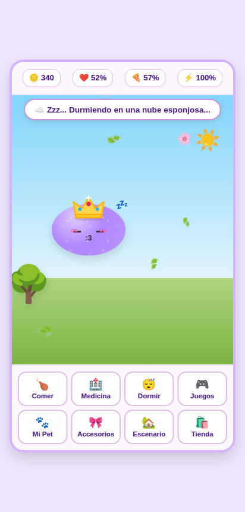

Cuando la energía está baja, tocá **😴 Dormir**. La mascota cierra los ojos, aparecen las **zzz** y la energía vuelve al 100%.

## 4. Minijuegos

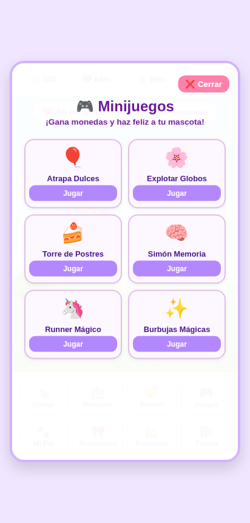

Tocá **Jugar** en el juego que quieras. Antes de empezar aparece **¡A JUGAR!** con una cuenta regresiva.

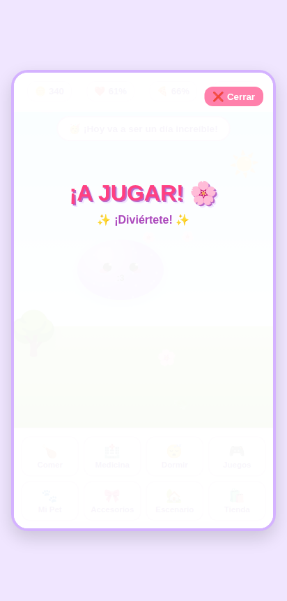

Durante el juego, arriba se ven los **puntos** de la partida y tu **mejor puntaje** (⭐).

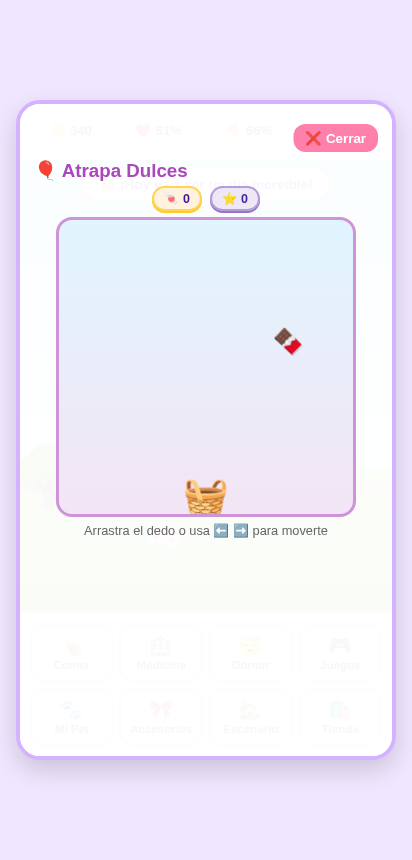

| Juego | Cómo se juega | Cuándo termina |
|---|---|---|
| **🎈 Atrapa Dulces** | Mové la cesta arrastrando el dedo (o con las flechas ⬅️ ➡️) para agarrar los dulces que caen. 5 puntos por dulce. | Cuando un dulce toca el piso. |
| **🌸 Explotar Globos** | Tocá los globos antes de que se escapen por arriba. 5 puntos por globo. | A los 20 segundos. |
| **🍰 Torre de Postres** | Tocá la pantalla (o la barra espaciadora) para soltar cada capa del pastel encima de la anterior. 10 puntos por capa. | Cuando la torre se cae. |
| **🧠 Simón Memoria** | Mirá la secuencia de colores que se ilumina y repetila tocando los botones. Cada vez es una más larga. 10 monedas por cada secuencia completa. | Cuando te equivocás. |
| **🦄 Runner Mágico** | Tocá la pantalla (o la barra espaciadora) para saltar los obstáculos. 10 puntos por salto. | Cuando chocás. |
| **✨ Burbujas Mágicas** | Tocá las burbujas. Las burbujas 🌟 doradas valen 15 puntos y las comunes, 5. | A los 15 segundos. |

Al terminar aparece el resultado con las **monedas ganadas**. Los puntos se convierten en monedas y la mascota se pone más contenta. Si superaste tu mejor puntaje, lo avisa.

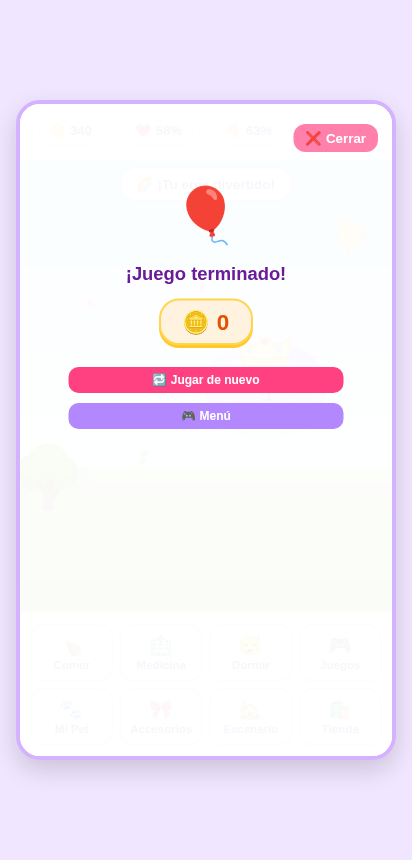

- **Jugar de nuevo**: otra partida del mismo juego.
- **Menú**: vuelve a la lista de juegos.

Si cerrás un juego por la mitad, las monedas que llevabas ganadas se guardan igual.

## 5. Mi Pet

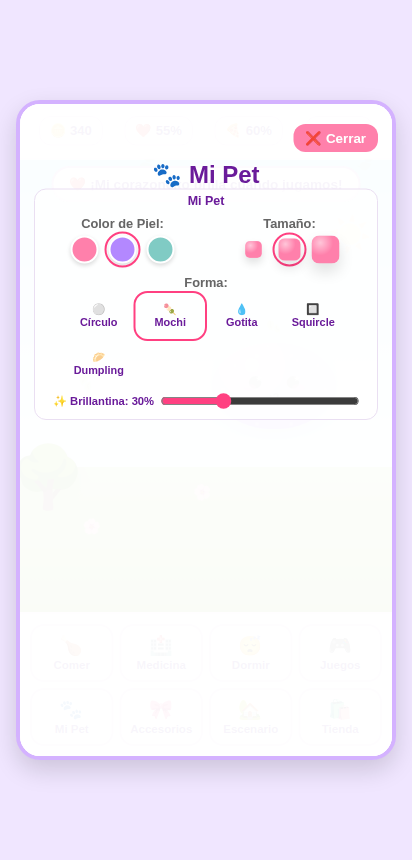

- **Color de Piel**: rosa, violeta o turquesa.
- **Tamaño**: chico, mediano o grande.
- **Forma**: **Círculo**, **Mochi**, **Gotita**, **Squircle** o **Dumpling**.
- **Brillantina**: la cantidad de brillos sobre la mascota, de 0% (sin brillos) a 100%.

Los cambios se ven al instante y no cuestan monedas.

## 6. Accesorios y looks

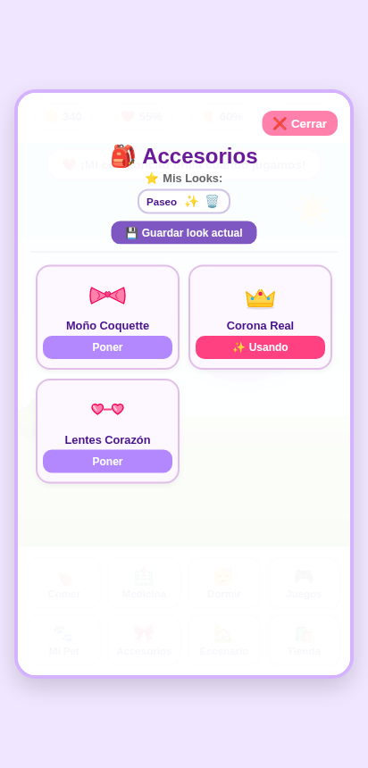

Acá aparecen solo los accesorios que ya **compraste**. La mascota puede llevar **un accesorio a la vez**.

- **Poner**: le pone el accesorio. El botón pasa a **✨ Usando**.
- Tocá **✨ Usando** para sacárselo.

### 6.1 Mis Looks

Un **look** guarda la combinación actual de **accesorio, escenario y color**, para volver a ella con un toque.

- **💾 Guardar look actual**: pide un nombre y lo guarda.
- **✨** junto al nombre: aplica ese look.
- **🗑️**: lo borra.

Se pueden guardar hasta **6 looks**. Si guardás uno más, se borra el más viejo.

## 7. Escenario

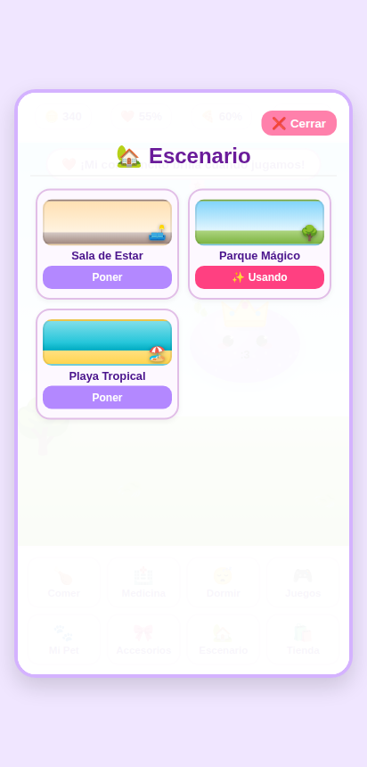

Muestra los fondos que tenés. **Poner** cambia el fondo; el que está en uso dice **✨ Usando**. Si lo tocás, vuelve el fondo **Sala de Estar**, que es gratis.

## 8. Tienda

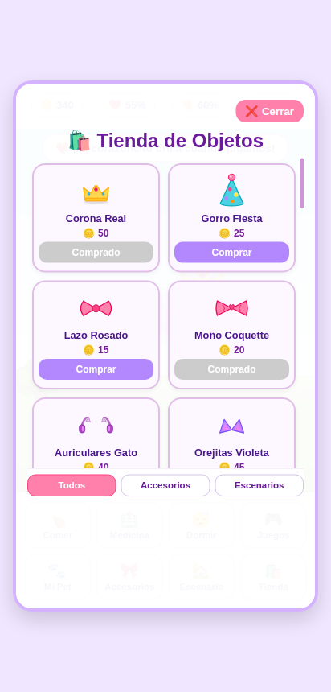

Cada objeto muestra su nombre y su precio en monedas. Abajo hay tres pestañas: **Todos**, **Accesorios** y **Escenarios**.

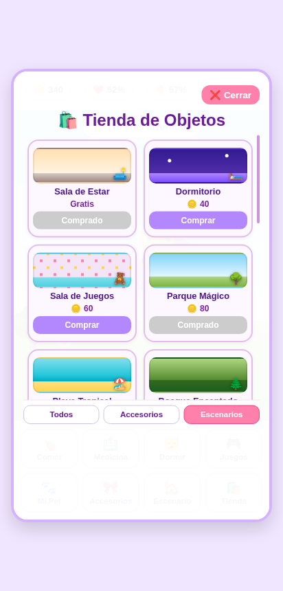

- **Comprar**: lo compra y descuenta las monedas. Después aparece en **Accesorios** o en **Escenario**.
- **Comprado**: ya lo tenés.
- Si no te alcanzan las monedas, aparece *¡No tienes suficientes monedas!*. Jugá a los minijuegos para ganar más.

## 9. Instalarla en el celular

- **Android (Chrome)**: menú **⋮** → **Instalar aplicación** o **Agregar a pantalla de inicio**.
- **iPhone (Safari)**: botón **Compartir** → **Agregar a inicio**.

Cuando hay una versión nueva del juego, aparece el aviso *¡Hay una nueva versión del juego disponible! ¿Quieres actualizar ahora?*. Tocá **Aceptar** para actualizar; tu mascota y tus monedas no se pierden.

## 10. Preguntas frecuentes

**¿Se guarda mi mascota?** Sí, en el mismo celular o computadora y en el mismo navegador. Si abrís el juego en otro equipo o en otro navegador, empieza una mascota nueva.

**¿Puedo perder la mascota?** Sí, si borrás los datos de navegación del navegador o desinstalás la aplicación.

**¿La mascota se muere si no la cuido?** No. Los indicadores pueden llegar a 0% y se puede enfermar, pero siempre se recupera comiendo, durmiendo, jugando y con medicina.
