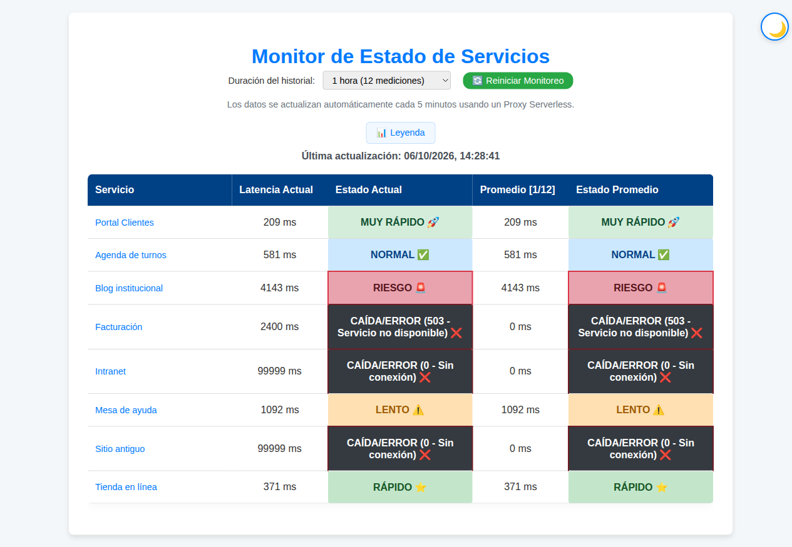
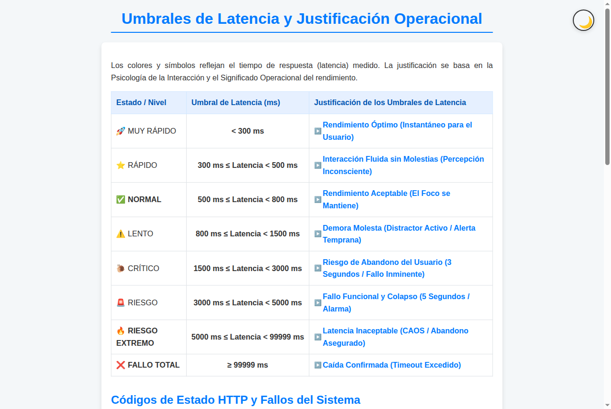
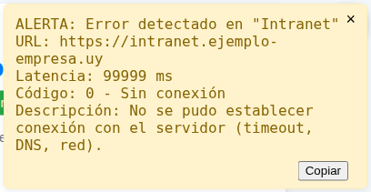
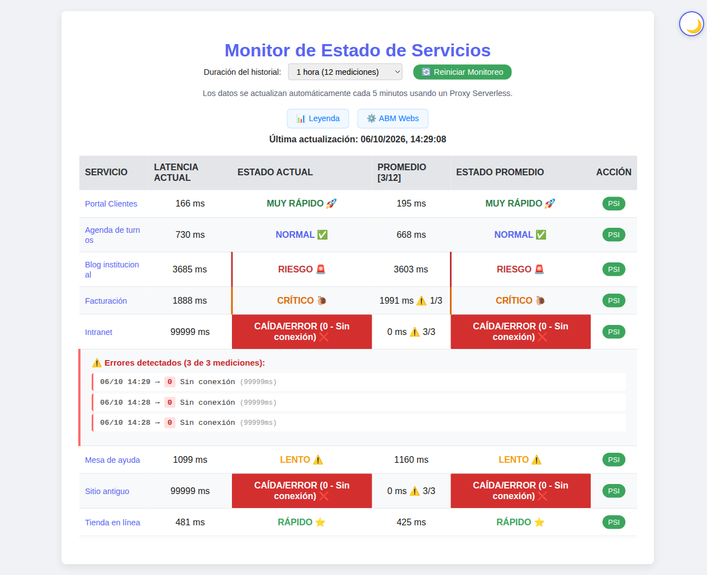
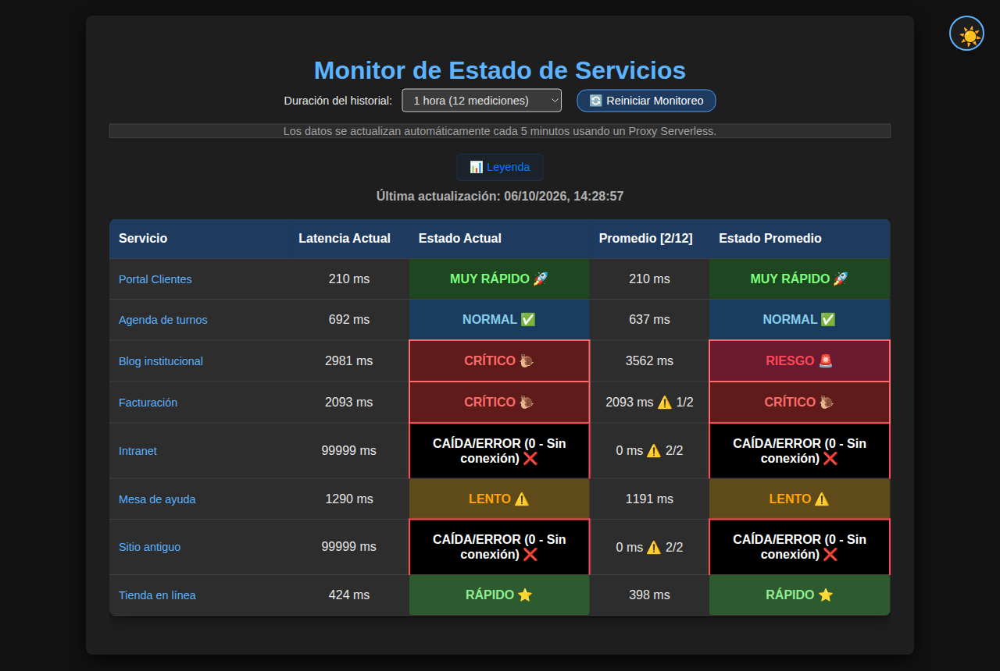
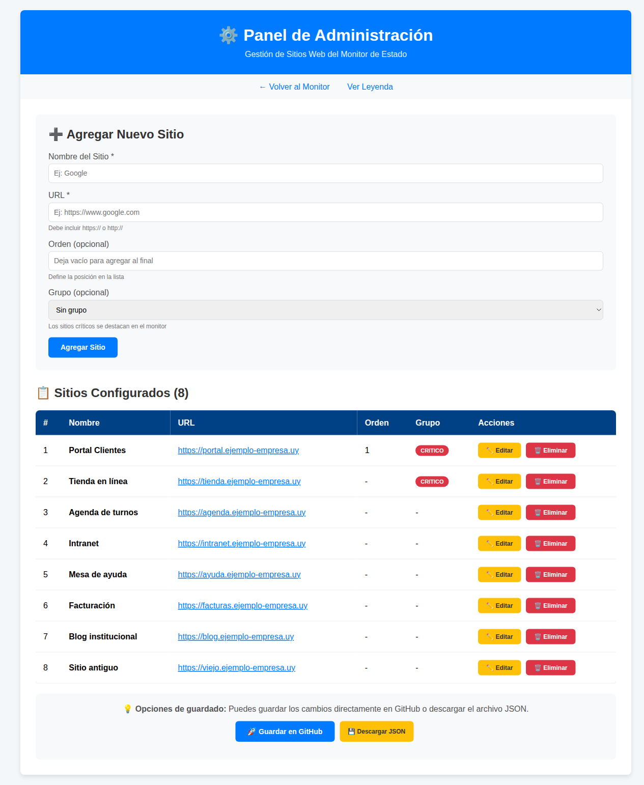
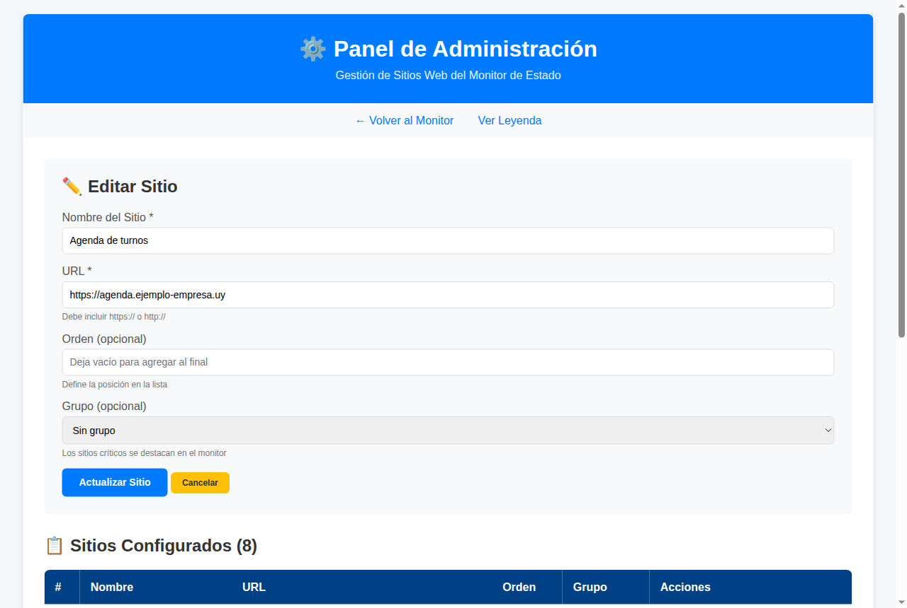

# Manual de Usuario — Monitor de Estado de Servicios

Guía para seguir el estado de los sitios web desde el monitor y mantener la lista de sitios.

---

## 1. Introducción

El **Monitor de Estado de Servicios** muestra en una sola pantalla si cada sitio web está funcionando y cuánto tarda en responder (su **latencia**, en milisegundos, "ms").

Con el monitor usted puede:

- ver el **estado actual** y el **promedio** de cada sitio;
- reconocer de un vistazo, por los colores, qué sitios andan bien y cuáles están lentos o caídos;
- recibir un **aviso** cuando un sitio da error;
- agregar, modificar o quitar sitios desde el panel **ABM Webs**.

Los sitios y los valores que aparecen en las imágenes son **inventados**.

## 2. Abrir el monitor

Abra en el navegador la dirección del monitor que le dieron. No hace falta usuario ni contraseña.

El monitor se puede ver de distintas formas, según el enlace que usted use:

- **Vista básica clara**: muestra la tabla de estados.
- **Vista básica oscura**: la misma tabla en colores oscuros. Agrega el contador y el detalle de errores de cada sitio (capítulo 7).
- **Vista avanzada** (clara u oscura): además, muestra la columna **Acción** con el botón **PSI** y el enlace **⚙️ ABM Webs**.

El botón redondo de la esquina superior derecha (🌙 o ☀️) cambia entre la versión clara y la oscura de la vista que esté usando.

## 3. La pantalla principal

En la parte de arriba encontrará:

- **Duración del historial**: cuántas horas de mediciones se guardan para calcular el promedio (ver capítulo 5).
- **Reiniciar Monitoreo**: borra las mediciones guardadas y empieza a medir de nuevo.
- **📊 Leyenda**: abre la explicación de los colores y estados.
- **⚙️ ABM Webs**: abre el panel para administrar los sitios (solo en la vista avanzada).
- **Última actualización**: fecha y hora de la última medición.

El monitor **se actualiza solo cada 5 minutos**. No hace falta recargar la página.

### 3.1 Columnas de la tabla

| Columna | Qué muestra |
|---|---|
| **Servicio** | Nombre del sitio. Al hacer clic se abre el sitio en otra pestaña. |
| **Latencia Actual** | Cuánto tardó el sitio en responder en la última medición. |
| **Estado Actual** | El estado según esa última medición, con su color. |
| **Promedio [n/12]** | Promedio de las mediciones correctas. Entre corchetes, cuántas mediciones lleva y cuántas guarda como máximo. |
| **Estado Promedio** | El estado que corresponde a ese promedio. |
| **Acción** | Solo en la vista avanzada: botón **PSI** (ver capítulo 7). |

Los sitios marcados con **orden 1** en el panel de administración aparecen primero. El resto se ordena alfabéticamente.

## 4. Estados y colores

Cada medición se clasifica según cuánto tardó el sitio en responder:

| Estado | Tiempo de respuesta | Qué significa |
|---|---|---|
| 🚀 **MUY RÁPIDO** | menos de 300 ms | Funciona de forma óptima. |
| ⭐ **RÁPIDO** | de 300 a 500 ms | Funciona muy bien. |
| ✅ **NORMAL** | de 500 a 800 ms | Rendimiento aceptable. |
| ⚠️ **LENTO** | de 800 a 1.500 ms | La demora ya se nota. Conviene revisar. |
| 🐌 **CRÍTICO** | de 1.500 a 3.000 ms | Riesgo de que los usuarios abandonen el sitio. |
| 🚨 **RIESGO** | de 3.000 a 5.000 ms | El sitio está al borde de fallar. |
| 🔥 **RIESGO EXTREMO** | más de 5.000 ms | Demora inaceptable. Requiere atención inmediata. |
| ❌ **CAÍDA/ERROR** | sin respuesta o con error | El sitio no respondió o respondió con un error. |

Cuando un sitio responde con error, el estado muestra también el **código** y su descripción entre paréntesis. Por ejemplo: *CAÍDA/ERROR (503 - Servicio no disponible)* o *CAÍDA/ERROR (0 - Sin conexión)*.

La página **📊 Leyenda** tiene la explicación completa de cada estado y de cada código de error.

## 5. Historial y promedio

El monitor guarda las mediciones de cada sitio para calcular el **promedio**. Hace una medición cada 5 minutos, o sea **12 mediciones por hora**.

- En **Duración del historial** elija de **1 a 9 horas**. Por ejemplo, *1 hora (12 mediciones)* o *2 horas (24 mediciones)*. El monitor recuerda su elección.
- El promedio solo cuenta las mediciones correctas. Las caídas y errores no lo bajan ni lo suben.
- Cuando el historial se completa, el monitor deja de sumar mediciones y muestra las guardadas. Para empezar de nuevo, presione **Reiniciar Monitoreo**.
- Las mediciones se guardan **mientras la pestaña esté abierta**. Si cierra la pestaña, el historial empieza de cero la próxima vez.

## 6. Avisos de error

### 6.1 Aviso de un sitio

Cuando un sitio da error, aparece un **aviso amarillo** en la esquina superior derecha con:

- el nombre y la dirección del sitio;
- la latencia;
- el código de error y su descripción.

- **Copiar** copia el texto del aviso, por ejemplo para enviarlo por correo o chat al responsable del sitio.
- **×** cierra el aviso.

El aviso de un sitio aparece **una sola vez**. No se repite en cada medición mientras el sitio siga con problemas, pero vuelve a aparecer si el sitio se recupera y después vuelve a fallar.

### 6.2 Aviso general

Si fallan **todos** los sitios del grupo **CRÍTICO**, o si una gran parte de los sitios tarda demasiado al mismo tiempo, la barra de información se pone roja y muestra:

> *Datos de monitoreo no disponibles/no confiables. Se detectó una latencia crítica generalizada, posiblemente debido a una sobrecarga del sistema de monitoreo. Por favor, espere el próximo ciclo o actualice la página.*

En ese caso, los datos de esa medición pueden no ser confiables. Espere la próxima actualización o recargue la página.

## 7. Vista avanzada

La vista avanzada agrega herramientas para quien hace el seguimiento técnico. El contador y el detalle de errores también están en la vista básica oscura.

- **Contador de errores**: en la columna de promedio aparece, por ejemplo, **⚠️ 3/3**. Significa que 3 de las 3 mediciones guardadas fueron error.
- **Detalle de errores**: haga clic en el estado de un sitio con errores. Debajo de su fila se abre la lista de errores con fecha y hora, código, descripción y latencia. Se ven los últimos 10. Haga clic de nuevo para cerrarla.
- **PSI**: abre en otra pestaña el análisis de velocidad del sitio en *PageSpeed Insights* de Google.
- **⚙️ ABM Webs**: abre el panel de administración (capítulo 8).

## 8. Panel de administración (ABM Webs)

En este panel se mantiene la lista de sitios que vigila el monitor. Se abre desde **⚙️ ABM Webs**.

Arriba están los enlaces **← Volver al Monitor** y **Ver Leyenda**.

### 8.1 Agregar un sitio

1. En **Agregar Nuevo Sitio**, escriba el **Nombre del Sitio** (obligatorio).
2. Escriba la **URL**, es decir, la dirección completa (obligatoria). Debe empezar con *https://* o *http://*.
3. Si quiere, complete **Orden**. Los sitios con orden 1 aparecen primero en el monitor.
4. Si quiere, elija el **Grupo**: *Sin grupo* o *CRÍTICO*. Use CRÍTICO para los sitios más importantes, que son los que se tienen en cuenta para el aviso general (6.2).
5. Presione **Agregar Sitio**. Aparece el mensaje *"✅ Sitio agregado correctamente"*.

### 8.2 Modificar un sitio

1. En la tabla **Sitios Configurados**, presione **✏️ Editar** en la fila del sitio.
2. Los datos pasan al formulario, que cambia su título a **✏️ Editar Sitio**.
3. Haga los cambios y presione **Actualizar Sitio**, o **Cancelar** para no cambiar nada.

### 8.3 Eliminar un sitio

Presione **🗑️ Eliminar** en la fila del sitio. La aplicación pregunta *"¿Estás seguro de eliminar "…"?"*. Si confirma, el sitio sale de la lista.

### 8.4 Guardar los cambios

Agregar, editar o eliminar **no cambia todavía el monitor**: los cambios quedan guardados en su navegador. Para que el monitor los use:

- **🚀 Guardar en GitHub**: publica la lista nueva. Mientras trabaja aparece *"Enviando cambios al servidor..."*. Si todo sale bien, aparece *"✓ Última actualización:"* con la fecha y la hora. Si algo falla, se muestra el error en rojo. El monitor puede tardar unos minutos en mostrar los cambios.
- **💾 Descargar JSON**: descarga un archivo con la lista de sitios. Sirve como respaldo o para entregárselo al responsable técnico si se lo pide.

## 9. Preguntas frecuentes

**No veo el enlace ABM Webs.**
Está en la vista básica. Pida el enlace de la vista avanzada.

**Un sitio aparece caído pero yo lo puedo abrir.**
El monitor mide desde un servidor externo, que a veces puede estar bloqueado por el sitio. Revise el código de error en el aviso o en la Leyenda y avise al responsable técnico.

**El promedio dice 0 ms.**
Todas las mediciones guardadas de ese sitio fueron error, así que no hay mediciones correctas para promediar.

**Cambié la duración del historial y no pasó nada.**
El cambio se aplica a las próximas mediciones. Si quiere empezar de cero con la nueva duración, presione **Reiniciar Monitoreo**.

**Agregué un sitio y no aparece en el monitor.**
Revise que haya presionado **🚀 Guardar en GitHub** y espere unos minutos.
