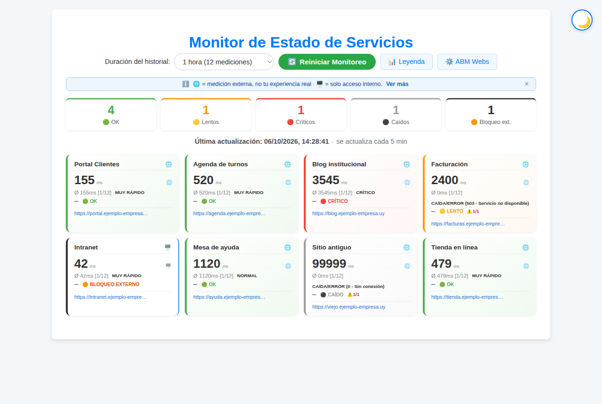
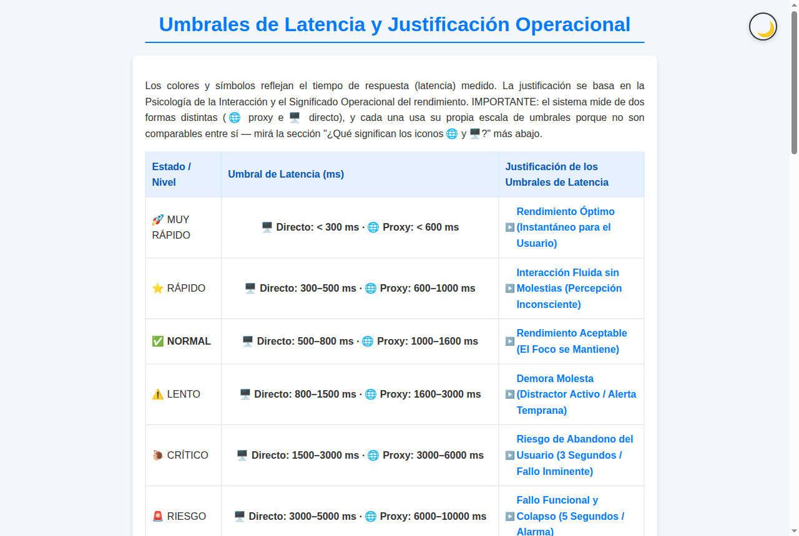
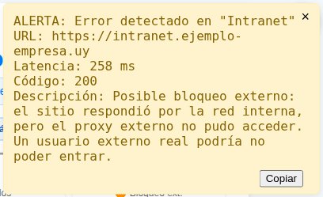
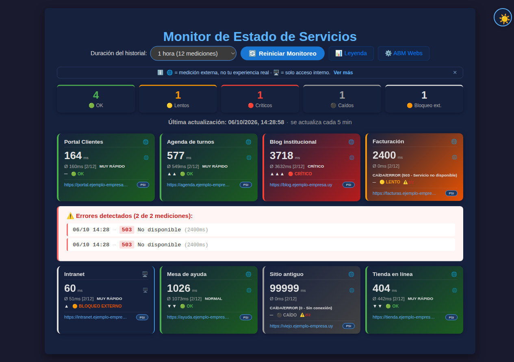
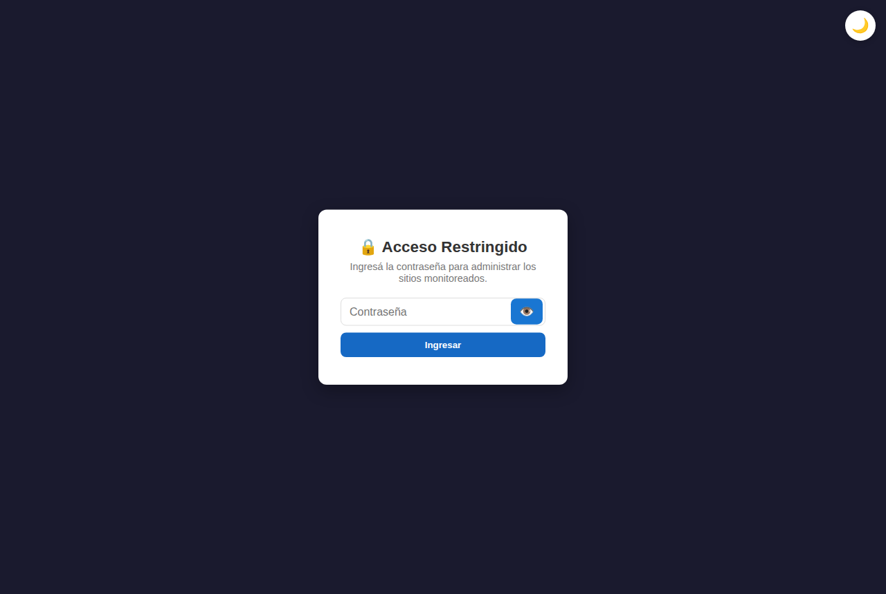
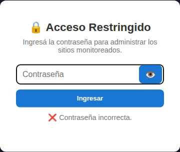
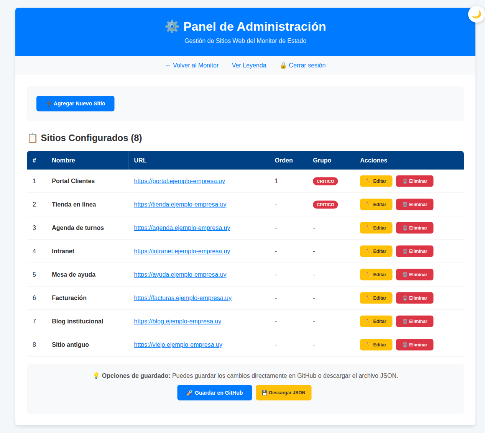
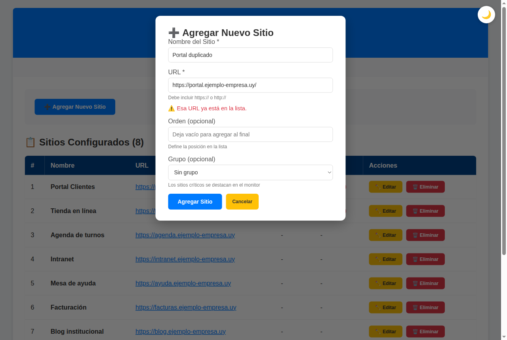

# Manual de Usuario — Monitor de Estado de Servicios (versión 2)

Guía para seguir el estado de los sitios web con el tablero de tarjetas y mantener la lista de sitios.

---

## 1. Introducción

Esta versión del **Monitor de Estado de Servicios** muestra cada sitio web en una **tarjeta**, con su estado, su tiempo de respuesta (su **latencia**, en milisegundos, "ms") y si viene mejorando o empeorando.

Con el monitor usted puede:

- ver de un vistazo cuántos sitios están bien, lentos, críticos o caídos;
- distinguir un sitio **caído** de uno que solo está **bloqueado para el acceso externo**;
- recibir un **aviso** cuando un sitio da error;
- agregar, modificar o quitar sitios desde el panel de administración, protegido con contraseña.

Los sitios y los valores que aparecen en las imágenes son **inventados**.

## 2. Abrir el monitor

Abra en el navegador la dirección del monitor. Para ver el monitor no hace falta contraseña. Solo se pide para el panel de administración.

El botón redondo de la esquina superior derecha (🌙 o ☀️) cambia entre la **vista clara** y la **vista oscura**. La vista oscura agrega el botón **PSI** en cada tarjeta (capítulo 7).

## 3. La pantalla principal

### 3.1 Barra superior

- **Duración del historial**: cuántas horas de mediciones se guardan para el promedio (capítulo 6).
- **🔄 Reiniciar Monitoreo**: borra las mediciones guardadas y empieza a medir de nuevo.
- **📊 Leyenda**: abre la explicación de estados, colores e íconos.
- **⚙️ ABM Webs**: abre el panel de administración (capítulo 8).

### 3.2 Aviso sobre las mediciones

Debajo aparece un aviso azul:

> *🌐 = medición externa, no tu experiencia real · 🖥️ = solo acceso interno.*

**Ver más** abre la Leyenda. La **✕** cierra el aviso, y no vuelve a aparecer en ese navegador.

### 3.3 Contadores

Cinco recuadros resumen cuántos sitios hay en cada estado:

| Contador | Significado |
|---|---|
| 🟢 **OK** | Responden en un tiempo normal o mejor. |
| 🟡 **Lentos** | Responden, pero con demora. |
| 🔴 **Críticos** | Responden muy lento, o con error y demora. |
| ⚫ **Caídos** | No responden. |
| 🟠 **Bloqueo ext.** | Funcionan por dentro, pero el acceso desde afuera falló (ver 4.2). |

Debajo se ve la **Última actualización**. El monitor **se actualiza solo cada 5 minutos**.

## 4. Las tarjetas

Cada sitio tiene una tarjeta. El color del borde izquierdo indica su estado.

| Parte de la tarjeta | Qué muestra |
|---|---|
| **Nombre** y ícono 🌐 o 🖥️ | El sitio y desde dónde se midió (ver 4.1). |
| **Número grande** | Latencia de la última medición, en ms. |
| **Ø … [n/12]** | Promedio de las mediciones correctas. Entre corchetes, cuántas lleva y cuántas guarda como máximo. Al lado, el estado de ese promedio (por ejemplo, *MUY RÁPIDO*). |
| **Flechas** | Tendencia de las últimas mediciones: ▲ empeorando, ▼ mejorando, ─ estable. Cuantas más flechas, mayor el cambio. Al pasar el mouse se ve el porcentaje. |
| **Estado actual** | 🟢 OK, 🟡 LENTO, 🔴 CRÍTICO, ⚫ CAÍDO o 🟠 BLOQUEO EXTERNO. |
| **⚠️ n/m** | Aparece si hubo errores: n errores en m mediciones. Haga clic para ver el detalle (capítulo 7). |
| **Dirección** | Al hacer clic se abre el sitio en otra pestaña. |

### 4.1 Íconos 🌐 y 🖥️

- 🌐 **Medición externa**: el sitio se midió desde un servidor en internet, como lo vería alguien de afuera. Es la medición habitual. Como viaja por internet, suele tardar más que su experiencia real.
- 🖥️ **Medición directa**: se usa cuando la medición externa falló. El monitor vuelve a probar desde **su propio navegador**, para saber si el sitio está realmente caído o si solo se bloqueó el acceso externo.

Como las dos formas de medir no son comparables, cada una usa su propia escala de tiempos (capítulo 5).

### 4.2 Bloqueo externo

Si la medición externa falla pero el sitio responde desde su navegador, la tarjeta se marca como 🟠 **BLOQUEO EXTERNO**. Significa que el sitio funciona por dentro, pero **un usuario de afuera podría no poder entrar**. No lo tome como un sitio "OK": conviene avisar al responsable técnico.

## 5. Estados y escalas de tiempo

| Estado del promedio | 🖥️ Directo | 🌐 Externo |
|---|---|---|
| 🚀 MUY RÁPIDO | menos de 300 ms | menos de 600 ms |
| ⭐ RÁPIDO | 300 a 500 ms | 600 a 1.000 ms |
| ✅ NORMAL | 500 a 800 ms | 1.000 a 1.600 ms |
| ⚠️ LENTO | 800 a 1.500 ms | 1.600 a 3.000 ms |
| 🐌 CRÍTICO | 1.500 a 3.000 ms | 3.000 a 6.000 ms |
| 🚨 RIESGO | 3.000 a 5.000 ms | 6.000 a 10.000 ms |
| 🔥 RIESGO EXTREMO | más de 5.000 ms | más de 10.000 ms |

En el estado actual de la tarjeta, Muy rápido, Rápido y Normal se muestran como 🟢 **OK**; Lento como 🟡 **LENTO**; Crítico y Riesgo como 🔴 **CRÍTICO**, y más de Riesgo, o sin respuesta, como ⚫ **CAÍDO**.

Cuando el sitio responde con un **código de error**, se muestra como LENTO, CRÍTICO o CAÍDO según cuánto haya tardado.

La **📊 Leyenda** explica cada estado, la sección *"¿Qué significan los iconos 🌐 y 🖥️?"* y el significado de cada código de error.

## 6. Historial y promedio

- El monitor mide cada 5 minutos, o sea **12 mediciones por hora**.
- En **Duración del historial** elija de **1 a 9 horas**. El monitor recuerda su elección.
- El promedio solo cuenta las mediciones correctas.
- Cuando el historial se completa, el monitor muestra las mediciones guardadas. Para empezar de nuevo, use **🔄 Reiniciar Monitoreo**.
- Las mediciones se guardan **mientras la pestaña esté abierta**.

## 7. Avisos y detalle de errores

### 7.1 Aviso de un sitio

Cuando un sitio da error o queda con posible bloqueo externo, aparece un **aviso amarillo** arriba a la derecha. Muestra el sitio, la latencia, el código y una descripción.

- **Copiar** copia el texto para enviarlo al responsable.
- **×** cierra el aviso.

El aviso aparece una sola vez por sitio, hasta que el sitio se recupera.

### 7.2 Detalle de errores

Haga clic en **⚠️ n/m** de una tarjeta para ver la lista de errores con fecha y hora, código, descripción y latencia. Haga clic de nuevo para cerrarla.

### 7.3 Botón PSI

En la vista oscura, cada tarjeta tiene el botón **PSI**. Abre en otra pestaña el análisis de velocidad del sitio en *PageSpeed Insights* de Google.

### 7.4 Aviso general

Si fallan todos los sitios del grupo **CRÍTICO**, o muchos sitios a la vez, la barra de información se pone roja y avisa que los datos *no están disponibles o no son confiables*. Espere la próxima actualización o recargue la página.

## 8. Panel de administración (ABM Webs)

### 8.1 Ingresar

1. Presione **⚙️ ABM Webs**.
2. Aparece **🔒 Acceso Restringido**. Escriba la contraseña que le dio el responsable. El botón 👁️ muestra u oculta lo que escribe.
3. Presione **Ingresar**.

Si la contraseña no es correcta, aparece *"❌ Contraseña incorrecta."*

La sesión queda abierta **mientras no cierre la pestaña**. Para salir antes, use **🔒 Cerrar sesión**.

### 8.2 La lista de sitios

El panel muestra **📋 Sitios Configurados**, con la cantidad entre paréntesis. La tabla tiene número, nombre, URL, orden, grupo y los botones **Editar** y **Eliminar**.

### 8.3 Agregar un sitio

1. Presione **➕ Agregar Nuevo Sitio**. Se abre una ventana.
2. Escriba el **Nombre del Sitio** y la **URL**, que debe empezar con *https://* o *http://*. Los dos son obligatorios.
3. Si quiere, complete **Orden** y **Grupo** (*Sin grupo* o *CRÍTICO*).
4. Presione **Agregar Sitio**. Aparece *"✅ Sitio agregado correctamente"*.

Si la dirección ya está en la lista, la ventana no se cierra y muestra *"⚠️ Esa URL ya está en la lista."* No importa si se escribió con mayúsculas o con una barra al final.

### 8.4 Modificar o eliminar

- **Editar** abre la ventana **✏️ Editar Sitio** con los datos cargados. Cambie lo necesario y presione **Actualizar Sitio**.
- **Eliminar** pregunta *"¿Estás seguro de eliminar "…"?"*. Si confirma, el sitio sale de la lista.
- **Cancelar** cierra la ventana sin guardar.

### 8.5 Guardar los cambios

Los cambios quedan en su navegador hasta que los publique:

- **🚀 Guardar en GitHub**: publica la lista nueva para el monitor. Muestra *"Enviando cambios al servidor..."* y después la fecha y hora de la actualización, o el error si algo falló. El monitor puede tardar unos minutos en mostrar los cambios.
- **💾 Descargar JSON**: descarga un archivo con la lista, como respaldo.

## 9. Preguntas frecuentes

**¿Por qué un sitio sale en 🟠 BLOQUEO EXTERNO si yo lo puedo abrir?**
Porque usted lo abre desde adentro. Desde afuera la medición falló, así que puede haber usuarios que no logren entrar.

**¿Por qué los tiempos 🌐 son más altos que los 🖥️?**
La medición externa viaja por internet y por eso tarda más. Por eso tiene su propia escala.

**Cerré el aviso azul y quiero volver a verlo.**
Esa información está siempre en la **📊 Leyenda**.

**No me deja guardar en el panel.**
Si la sesión se cerró, vuelva a ingresar con la contraseña. Si el error sigue, avise al responsable técnico.
