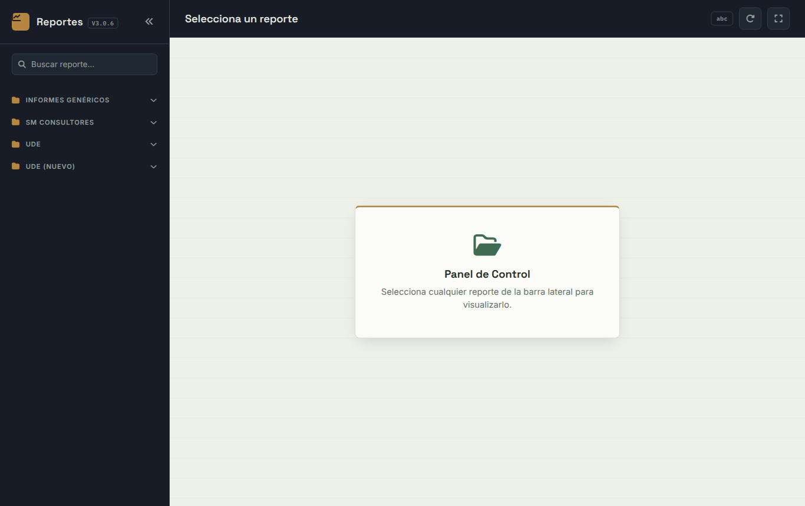
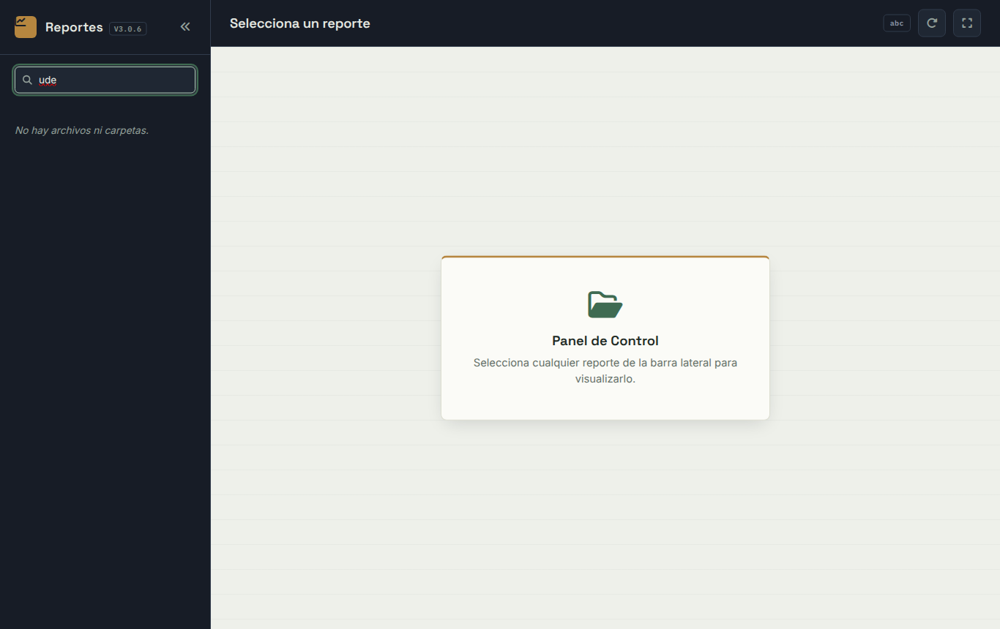
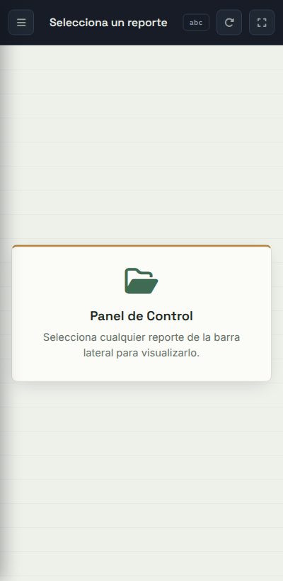
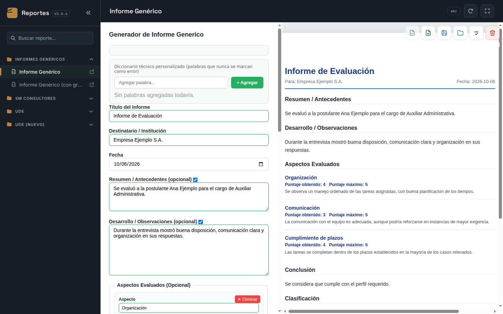
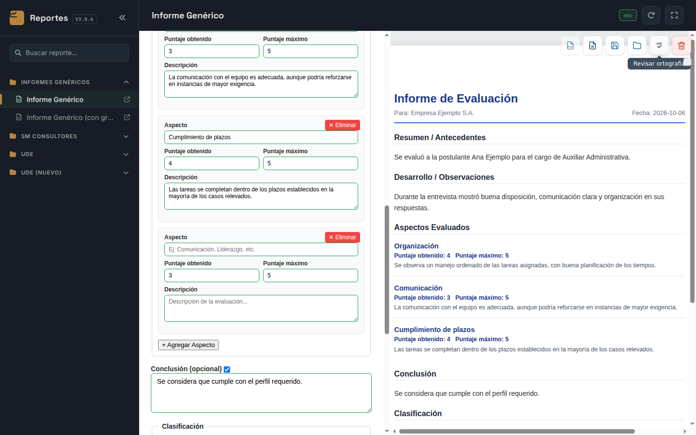
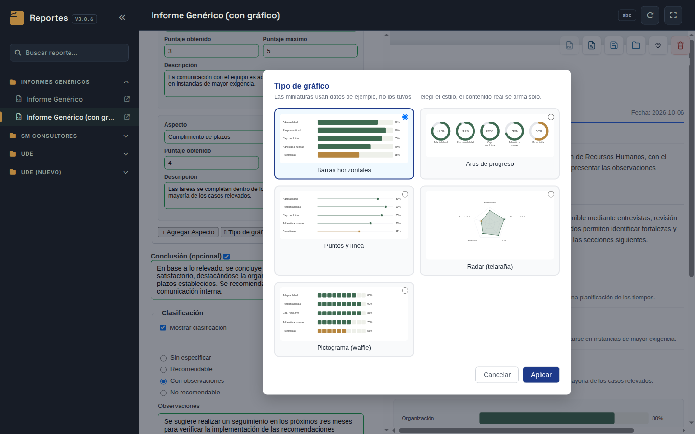
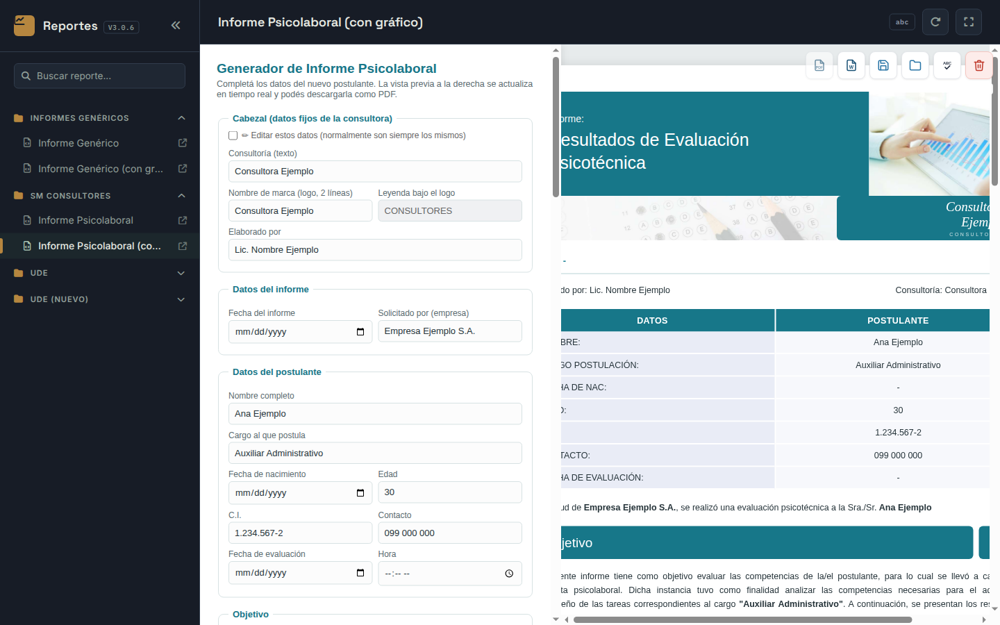
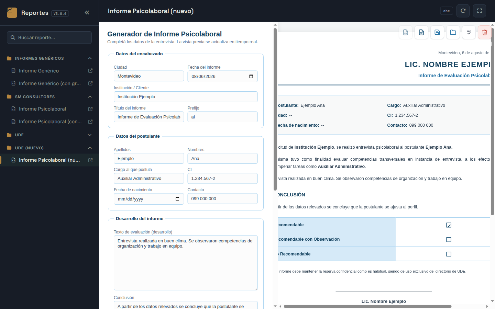

# Manual de Usuario — Reportes (Generador de Informes)

Guía para armar informes profesionales desde el panel de reportes.

---

## 1. Introducción

**Reportes** reúne en un solo panel varios generadores de informes. En cada uno se completa un formulario y, al mismo tiempo, se ve cómo queda el informe. Al terminar, el informe se descarga como documento de Word.

Informes disponibles:

| Carpeta del menú | Informe | Para qué sirve |
|---|---|---|
| Informes Genéricos | Informe Genérico | Informe libre con secciones opcionales, aspectos evaluados con puntaje, clasificación y firma. |
| Informes Genéricos | Informe Genérico (con gráfico) | Igual al anterior, con un gráfico de los aspectos evaluados. |
| SM Consultores | Informe Psicolaboral | Informe psicotécnico con el formato de la consultora. |
| SM Consultores | Informe Psicolaboral (con gráfico) | Igual al anterior, con un gráfico de las competencias. |
| UDE | Informe Psicolaboral | Informe psicolaboral para la institución. |
| UDE (nuevo) | Informe Psicolaboral (nuevo) | Versión nueva del informe psicolaboral para la institución. |

Los nombres y datos que aparecen en las imágenes son **inventados**.

## 2. El panel de reportes

Al abrir la aplicación se ve el **Panel de Control**:

- **Menú de la izquierda**: los informes, agrupados en carpetas. Haga clic en una carpeta para abrirla o cerrarla, y en un informe para abrirlo en el panel.
- **Buscar reporte…**: escriba parte del nombre y el menú muestra solo los informes que coinciden.
- **Ícono de flecha** al lado de cada informe: lo abre en una pestaña nueva del navegador.
- **«** (arriba del menú): oculta o muestra el menú, para tener más espacio.

Arriba a la derecha hay tres indicadores y botones:

| Elemento | Qué hace |
|---|---|
| **abc** | Estado del corrector ortográfico: gris = todavía no se usó, verde = conectado, rojo = sin conexión. Pase el mouse por encima para ver el detalle. |
| **Recargar** (flecha circular) | Vuelve a cargar el informe abierto. **Se pierde lo que no haya guardado.** |
| **Pantalla completa** | Muestra el informe ocupando toda la pantalla. Para salir, presione **Esc**. |

### 2.1 En el celular o la tablet

En pantallas chicas el menú queda oculto. Ábralo con el botón de las tres rayas (arriba a la izquierda).

## 3. Cómo se arma un informe

Todos los informes funcionan igual:

1. Elija el informe en el menú.
2. Complete el **formulario** de la izquierda.
3. Mire la **vista previa** de la derecha: se actualiza sola mientras escribe.
4. Revise la ortografía (sección 4.4).
5. Descargue el informe en Word (sección 4.1).

> **Importante:** los datos que escribe **no se guardan solos**. Si recarga la página, cambia de informe o cierra el navegador, se pierden. Si va a seguir otro día, use **Guardar datos** (sección 4.2).

## 4. Barra de botones

Arriba de la vista previa hay una barra con seis botones (al pasar el mouse por encima se ve el nombre de cada uno):

| Botón | Qué hace |
|---|---|
| **Descargar PDF** | Por ahora aparece en gris y no se puede usar. |
| **Descargar Word** | Descarga el informe como documento de Word. |
| **Guardar datos** | Descarga un archivo con lo que escribió, para seguir más tarde. |
| **Cargar datos** | Vuelve a cargar en el formulario un archivo guardado antes. |
| **Revisar ortografía** | Revisa la ortografía y la gramática de los textos. |
| **Limpiar formulario** (rojo) | Borra los datos del formulario. Pide confirmación. |

### 4.1 Descargar en Word

Presione **Descargar Word**. Según el navegador, se abre una ventana para elegir dónde guardar el documento o se descarga directamente en la carpeta de descargas. El documento se puede abrir y retocar en Word.

### 4.2 Guardar los datos para seguir después

Presione **Guardar datos**. Se descarga un archivo cuyo nombre empieza con `DATOS_INFORME_` y sigue con el título o el nombre cargado. Guárdelo en una carpeta que recuerde. Ese archivo no es el informe: sirve solo para volver a cargar los datos en esta aplicación.

### 4.3 Cargar datos guardados

1. Abra **el mismo informe** con el que guardó los datos.
2. Presione **Cargar datos** y elija el archivo.
3. El formulario se completa y aparece un mensaje de confirmación de que los datos se cargaron.

Si el archivo no es uno guardado por esta aplicación, aparece un aviso y no se carga nada.

### 4.4 Revisar la ortografía

1. Presione **Revisar ortografía**. Se necesita conexión a internet.
2. Debajo del título del formulario aparece la lista de posibles errores, agrupados por campo, con una sugerencia de corrección.
3. Corrija el texto en el campo correspondiente.
4. Si una palabra está bien (por ejemplo, un término técnico), presione **no es un error, ignorar siempre**: se agrega al diccionario personalizado y no se vuelve a marcar.

Si no hay conexión, aparece un aviso de que no hay conexión con el corrector. Puede seguir trabajando normalmente y volver a probar más tarde.

### 4.5 Diccionario técnico personalizado

Al principio del formulario está el **Diccionario técnico personalizado**: palabras que el corrector nunca marca como error. Escriba la palabra y presione **Agregar** (o Enter). Para quitar una palabra, presione la ✕ al lado. El diccionario queda guardado en ese navegador y en esa computadora.

### 4.6 Limpiar el formulario

Presione el botón rojo **Limpiar formulario** y confirme. Se borran los datos cargados (algunos datos fijos, como los de la consultora o del profesional, pueden mantenerse).

## 5. Informe Genérico

Campos principales:

- **Título del informe**, **Destinatario / Institución** y **Fecha**.
- **Resumen / Antecedentes**, **Desarrollo / Observaciones** y **Conclusión**: cada uno tiene una casilla para incluirlo o no en el informe.
- **Aspectos evaluados**: con **+ Agregar Aspecto** se suma un aspecto con su nombre, **Puntaje obtenido**, **Puntaje máximo** y una **Descripción**. Con **Eliminar** se quita.
- **Clasificación**: Sin especificar, Recomendable, Con observaciones o No recomendable, con observaciones opcionales. La casilla **Mostrar clasificación** decide si aparece.
- **Datos del firmante**: nombre, cargo y contacto. La casilla **Mostrar firma** decide si aparece.

### 5.1 Versión con gráfico

En **Informe Genérico (con gráfico)** los aspectos evaluados se muestran también en un gráfico. Con el botón **Tipo de gráfico** puede elegir entre: **Barras horizontales**, **Aros de progreso**, **Puntos y línea**, **Radar (telaraña)** y **Pictograma (waffle)**. El radar necesita al menos 3 aspectos con puntaje máximo mayor que cero; si no los hay, esa opción aparece deshabilitada. Las miniaturas usan datos de ejemplo.

## 6. Informes de SM Consultores

El **Informe Psicolaboral** de SM Consultores tiene estas secciones:

- **Cabezal**: datos fijos de la consultora (nombre, logo y quién elabora el informe). Normalmente no se tocan; para cambiarlos, marque **Editar estos datos**.
- **Datos del informe**: fecha y empresa que lo solicita.
- **Datos del postulante**: nombre, cargo al que postula, fecha de nacimiento, edad, C.I., contacto, fecha y hora de la evaluación.
- **Objetivo**, **Competencias evaluadas** (con **+ Agregar competencia**), **Evaluación de competencias** (enfoque, conclusión y oportunidad de mejora) y **Clasificación final**.

La versión **con gráfico** agrega un gráfico de las competencias.

## 7. Informes de UDE

Los informes **Psicolaboral** de UDE y UDE (nuevo) tienen:

- **Datos del encabezado**: ciudad, fecha, institución, título y prefijo ("al", "a la").
- **Datos del postulante**: apellidos, nombres, cargo, CI, fecha de nacimiento y contacto.
- **Desarrollo del informe**: texto de evaluación y conclusión.
- **Recomendación final**: Recomendable, Recomendable con Observación o No Recomendable.
- **Datos del profesional**: nombre, celular y especialidad.

## 8. Preguntas frecuentes

**El botón Descargar PDF está en gris.**
Por ahora esa opción está deshabilitada. Use **Descargar Word**; desde Word puede guardar el documento como PDF.

**Recargué la página y perdí lo que había escrito.**
Los datos no se guardan solos. Use **Guardar datos** cada tanto para tener una copia.

**El corrector no responde.**
Necesita conexión a internet. Si el indicador **abc** está en rojo, revise la conexión y vuelva a presionar Revisar ortografía.

**Agregué palabras al diccionario y en otra computadora no están.**
El diccionario se guarda en cada navegador por separado.
