# Manual de Usuario — TechFaRo Herramientas Internas

Guía de uso de las herramientas de evaluación y selección: OVO, MBTI, bolilleros y generador de hash.

---

## 1. Introducción

**TechFaRo Herramientas Internas** reúne, detrás de un ingreso con usuario y contraseña, varias herramientas para procesos de evaluación y selección:

| Herramienta | Para qué sirve |
|---|---|
| **OVO** (Orientación Vocacional) | Cuestionario de 80 preguntas Sí/No con perfil vocacional por áreas. |
| **MBTI Formulario** | Cuestionario de personalidad de 100 ítems que calcula el tipo MBTI. |
| **MBTI Corrector** | Corrige un MBTI ya aplicado, cargando puntajes o respuestas. |
| **Bolillero por CI** | Arma grupos al azar a partir de una lista de cédulas. |
| **Bolillero Datos Completo** | Arma grupos al azar a partir de una lista con datos de cada persona. |
| **Hash SHA-256** | Genera el código SHA-256 de un texto. |

Los nombres, cédulas y datos de las imágenes son **inventados**.

## 2. Ingreso

1. Abra la dirección de la aplicación.
2. Escriba su **Usuario** y su **Contraseña** (al menos 8 caracteres).
3. Presione **Login**.

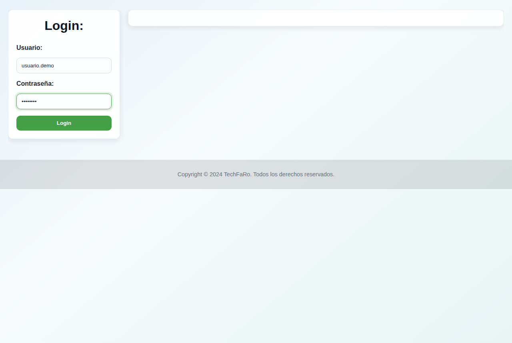

Si la contraseña tiene menos de 8 caracteres o los datos no son correctos, aparece un aviso.

## 3. El menú

Arriba se ve el saludo con su nombre y el botón **Cerrar sesión**. A la izquierda está el menú, con tres grupos que se despliegan al pasar el mouse:

- **Cuestionarios** → Test Vocacional (OVO) y MBTI (Formulario y Corrector).
- **Bolilleros** → Por CI y Datos Completo.
- **Utilidades** → Hash SHA-256.

Al elegir una herramienta, se abre a la derecha. La herramienta abierta queda marcada en el menú.

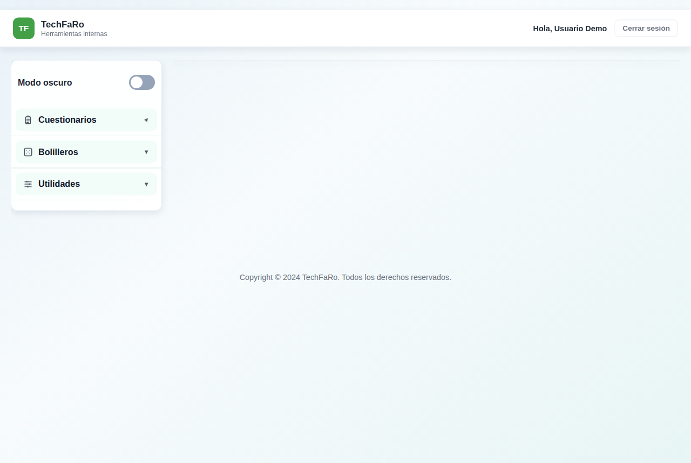

### 3.1 Modo oscuro

El interruptor **Modo oscuro** (arriba del menú) cambia los colores de la pantalla a fondo oscuro. La elección se recuerda la próxima vez.

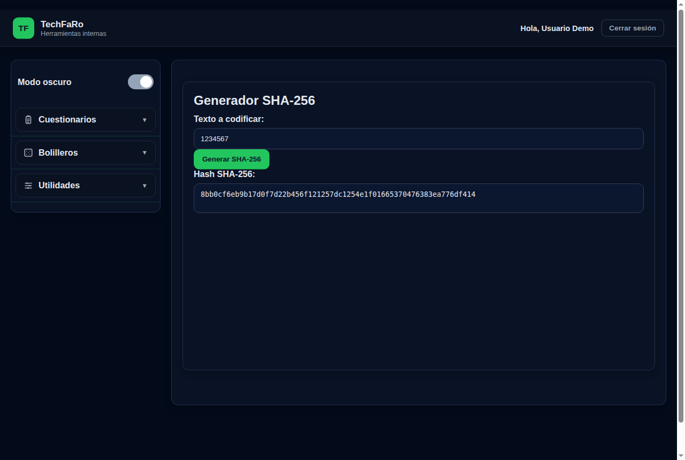

## 4. OVO — Orientación Vocacional

### 4.1 Comenzar

La pantalla inicial explica cómo funciona: 80 preguntas en 8 bloques de 10, respuestas Sí/No y una duración estimada de 5 a 8 minutos. Presione **Comenzar Test**.

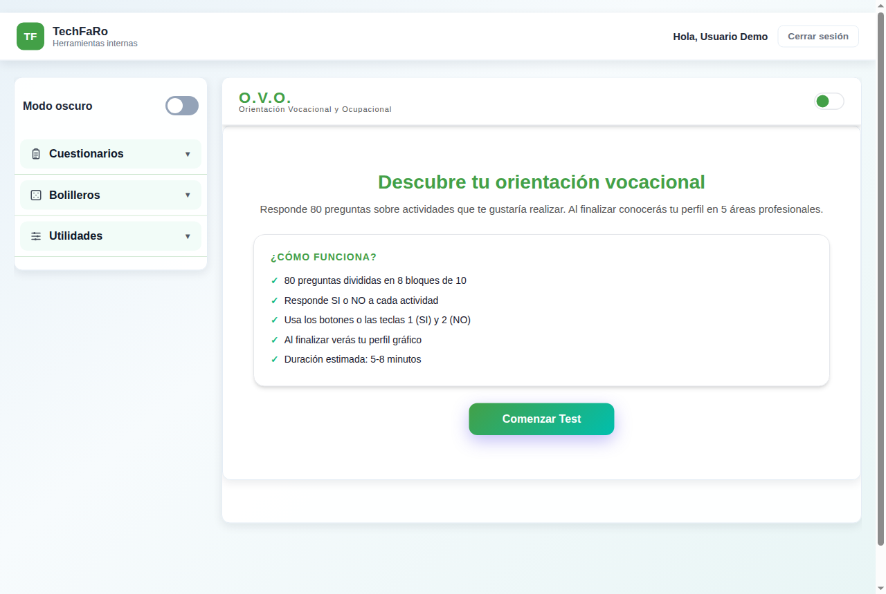

Se abre la ventana **Datos del evaluado** (nombre completo, cédula y fecha). Estos datos son opcionales y se usan en el cuestionario impreso. Presione **Continuar**, u **Omitir** para seguir sin datos.

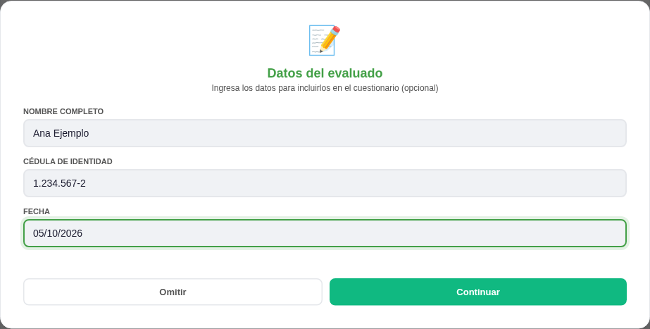

### 4.2 Responder

- Cada pregunta tiene los botones **SI** y **NO**. La respuesta elegida queda marcada en color.
- También puede responder con el teclado: **1** = Sí y **2** = No (responde la primera pregunta pendiente del bloque). Las flechas **←** y **→** cambian de bloque.
- Cuando se responden las 10 preguntas de un bloque, se pasa solo al siguiente.
- La barra superior muestra el avance, y los puntos permiten volver a cualquier bloque.

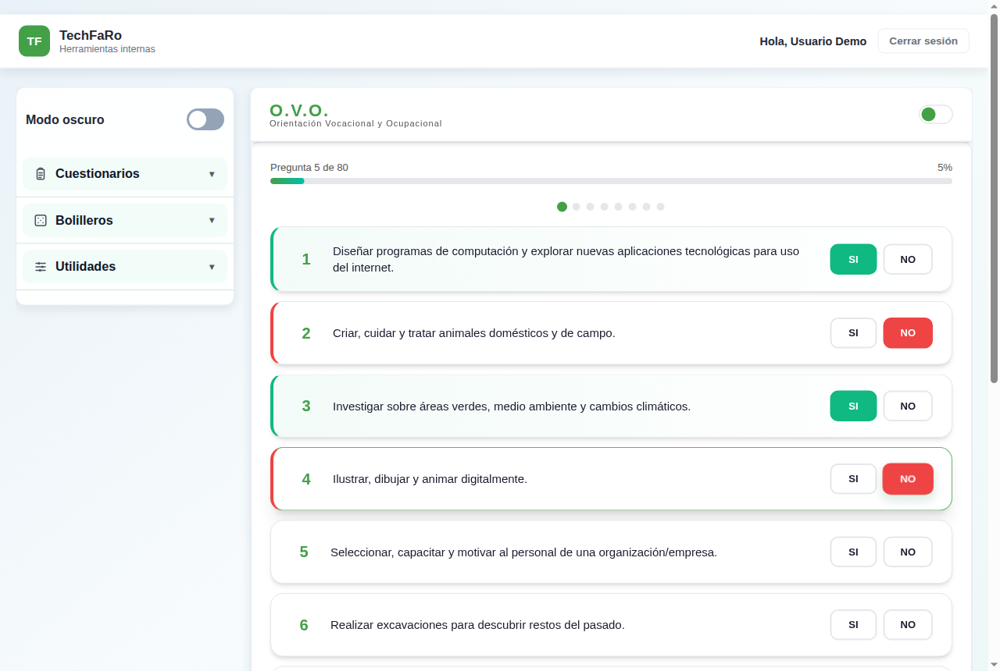

### 4.3 Ver los resultados

En el último bloque, presione **Ver resultados**. Si quedan preguntas sin responder, la aplicación avisa cuántas faltan.

Los resultados están protegidos: se abre la ventana **Acceso restringido**, donde una persona autorizada debe escribir su usuario y contraseña. Así el evaluado no ve el resultado por su cuenta.

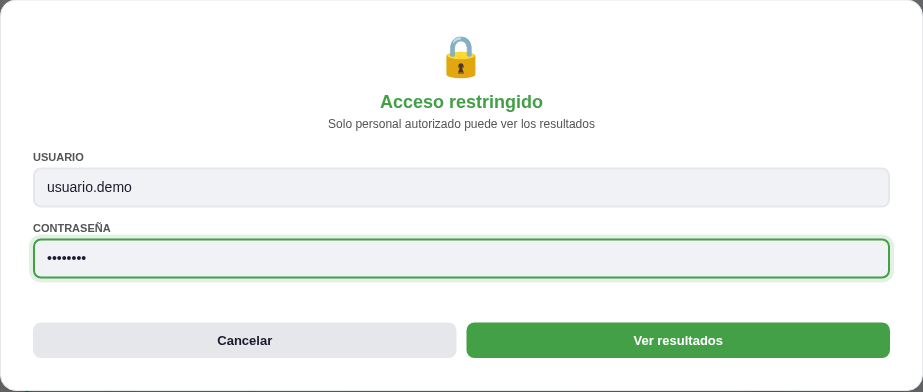

Los resultados muestran el **perfil vocacional** por áreas (Artística, Humanística, Administrativa, Científico-Técnica y Salud-Biológica), con cantidad de respuestas positivas, porcentaje y un gráfico.

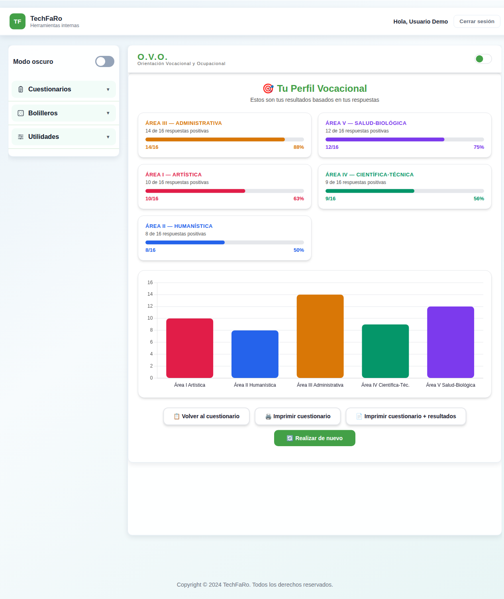

Botones disponibles:

- **Volver al cuestionario**: revisar las respuestas.
- **Imprimir cuestionario**: imprime las preguntas con las respuestas.
- **Imprimir cuestionario + resultados**: imprime todo.
- **Realizar de nuevo**: empieza un cuestionario nuevo (se borran las respuestas).

## 5. MBTI Formulario

Cuestionario de **100 ítems**. Cada ítem se responde en una escala de **1 a 5** (1 = Muy en desacuerdo, 3 = Neutro, 5 = Muy de acuerdo).

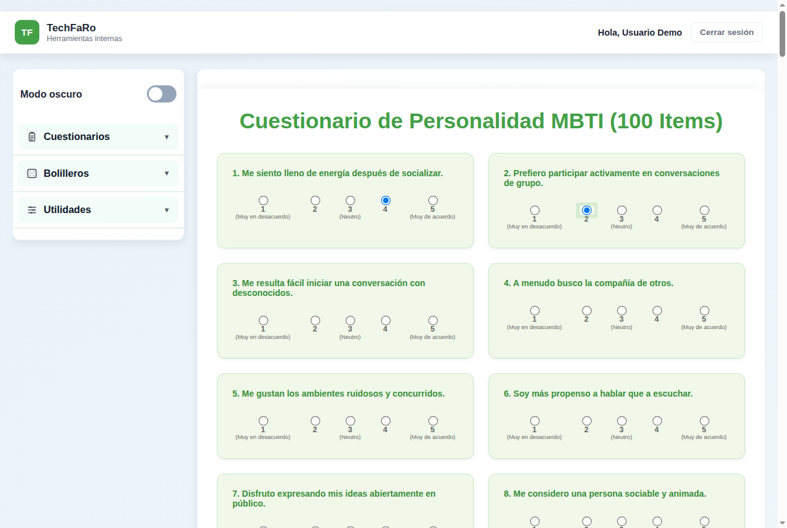

Botones:

- **Calcular Resultado**: calcula el tipo. Si falta alguna respuesta, indica cuál.
- **Imprimir Cuestionario**: imprime el cuestionario con las respuestas.
- **Imprimir Vacío**: imprime el cuestionario en blanco, para completarlo en papel.
- **Auto-Completar (Test)**: completa respuestas al azar. Es solo para probar la herramienta; **no lo use con un evaluado**.

El resultado muestra el puntaje de cada una de las cuatro dimensiones (de −50 a +50) y el **tipo de personalidad sugerido** (por ejemplo, ESTJ).

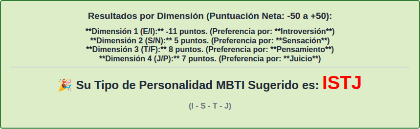

## 6. MBTI Corrector

Sirve para corregir un MBTI aplicado en papel. Primero complete los **datos del candidato** (nombre y cédula). Después use uno de los dos modos:

### 6.1 Modo 1: Carga directa de puntuación neta

Si ya tiene el puntaje de cada dimensión, escriba un valor entre **−50 y +50** para E/I, S/N, T/F y J/P, y presione el botón **Calcular Resultado** de ese modo.

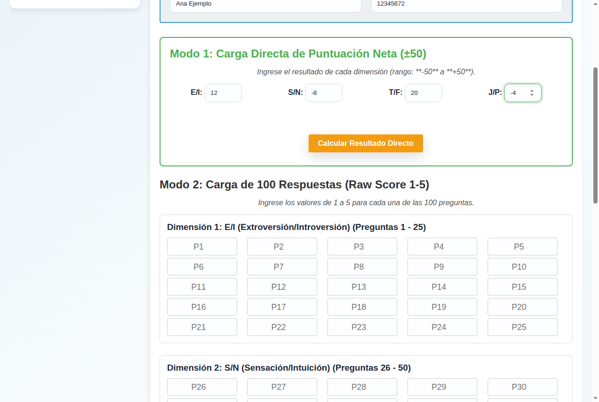

### 6.2 Modo 2: Carga de las 100 respuestas

Escriba la respuesta de cada ítem (de **1 a 5**) en las casillas P1 a P100, agrupadas por dimensión, y presione el botón **Calcular Resultado** de ese modo.

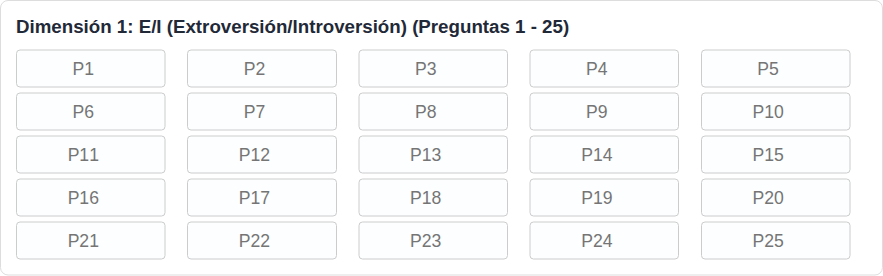

### 6.3 Informe del corrector

El resultado es un **Informe de perfil de personalidad MBTI** con los datos del candidato, una tabla con el puntaje, la letra y la interpretación de cada dimensión, y el **tipo sugerido**. El botón **Imprimir Solo Resultado** imprime únicamente el informe.

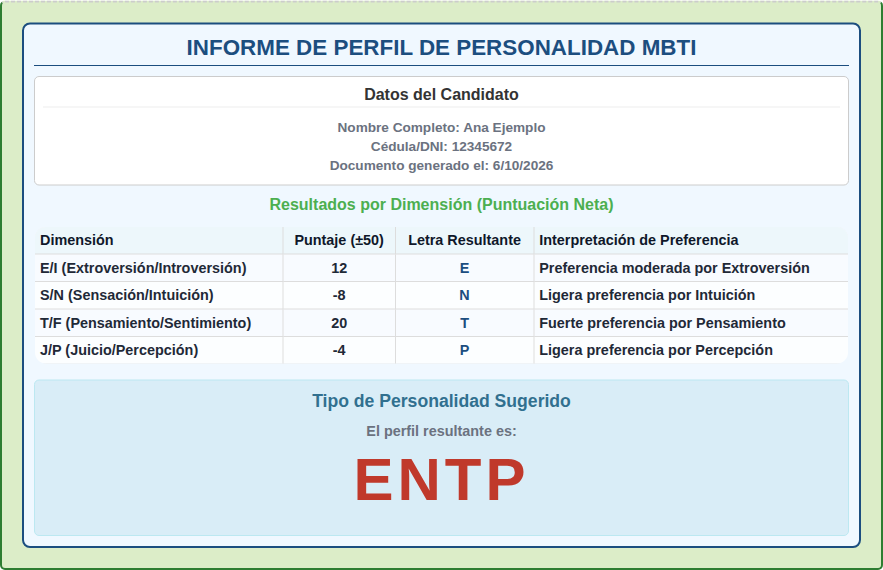

## 7. Bolilleros

Los bolilleros arman **grupos al azar** a partir de un archivo de texto (.txt). Sirven, por ejemplo, para sortear el orden o los grupos de postulantes.

### 7.1 Bolillero por CI

1. Prepare un archivo `.txt` con **una cédula por línea** (puede tener puntos y guion).
2. Presione **Elegir archivo** y seleccione el archivo.
3. Escriba la **Cantidad por grupo**.
4. Presione **Generar**.

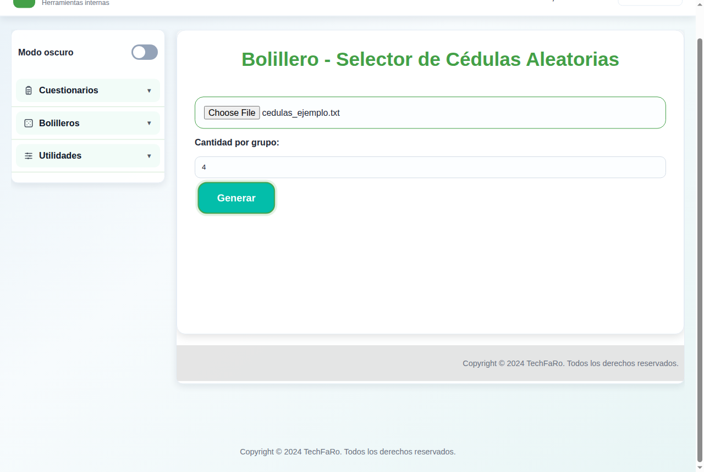

El resultado es una lista "Grupo 1: …, Grupo 2: …". La herramienta:

- **descarta las cédulas no válidas** (verifica el dígito verificador de la cédula uruguaya);
- **no repite** cédulas que aparezcan dos veces en el archivo.

### 7.2 Bolillero Datos Completo

Igual al anterior, pero cada línea del archivo tiene los datos de una persona separados por punto y coma, en este orden:

`cédula;nombre;apellido;móvil;email;dirección`

El resultado es una tabla por grupo con las columnas Grupo, Cédula, Nombre, Apellido, Móvil, Email y Dirección. El botón **Imprimir** imprime los grupos.

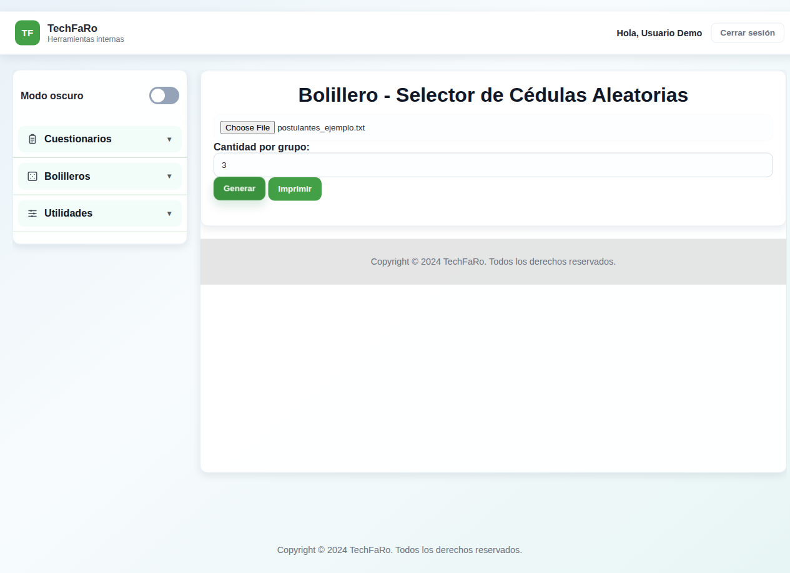

## 8. Hash SHA-256

1. Escriba el texto en **Texto a codificar**.
2. Presione **Generar SHA-256**.
3. El código aparece en **Hash SHA-256**; puede seleccionarlo y copiarlo.

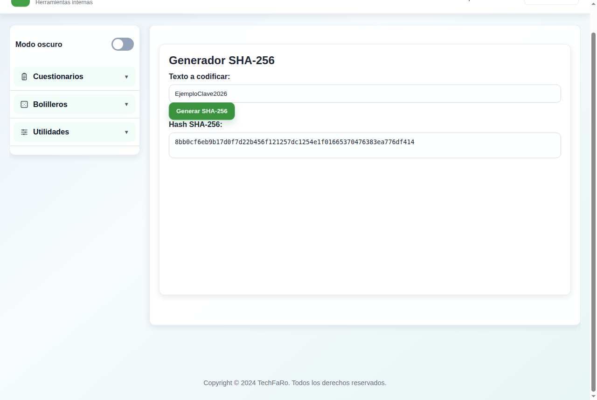

El mismo texto siempre da el mismo código, y no se puede obtener el texto original a partir del código.

## 9. Preguntas frecuentes

**Terminé el OVO y no me deja ver los resultados.**
Revise que estén respondidas las 80 preguntas. Para ver los resultados se necesita el usuario y la contraseña de una persona autorizada.

**El bolillero dejó afuera algunas cédulas.**
Las cédulas con dígito verificador incorrecto o repetidas no se incluyen. Revise el archivo.

**Al presionar Generar en un bolillero no pasa nada.**
Revise que haya elegido el archivo y escrito la cantidad por grupo. Si igual no aparece el resultado, avise al responsable de la aplicación.

**¿Cómo salgo?**
Con **Cerrar sesión**, arriba a la derecha. Si cierra el navegador, la sesión también termina.
