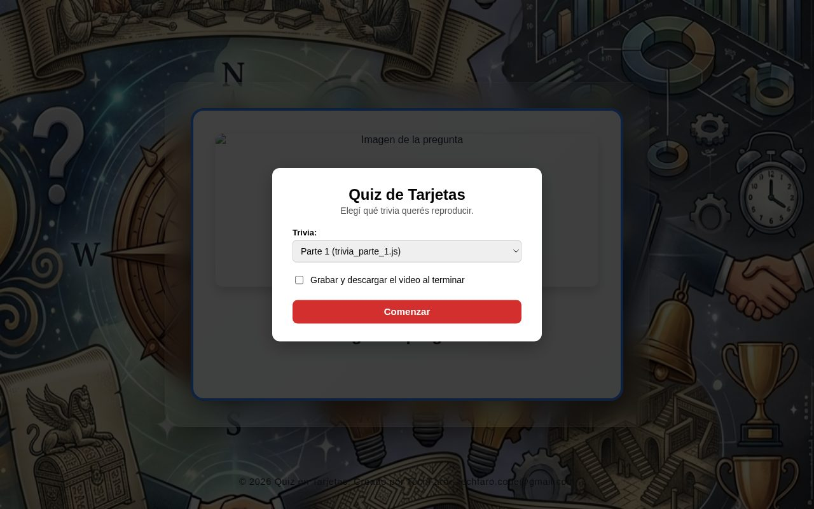
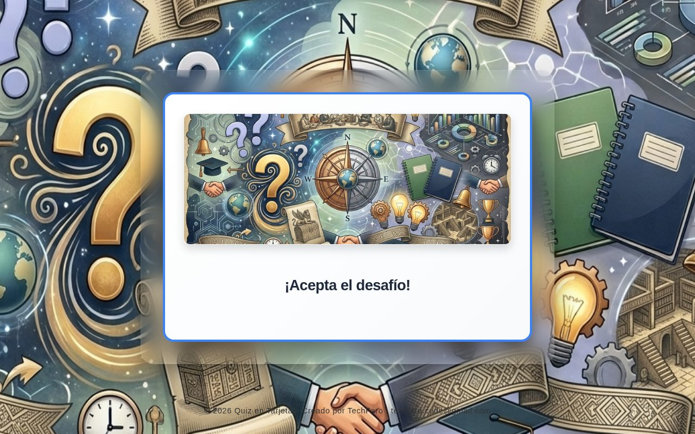
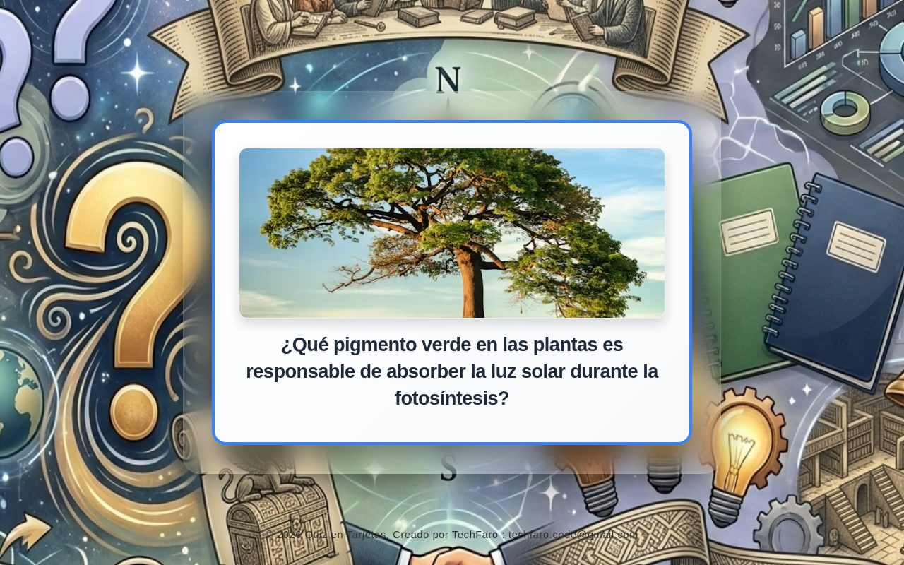
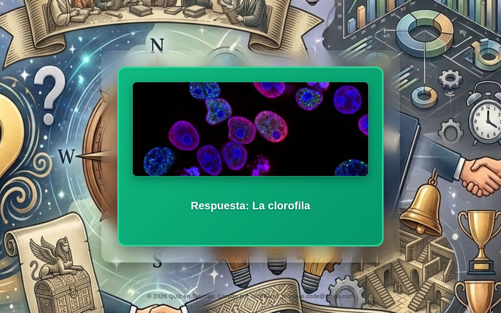
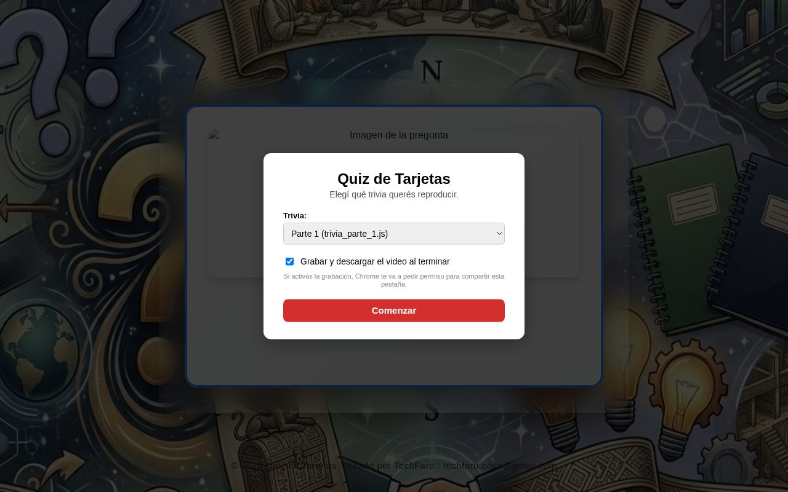

# Manual de Usuario — Quiz de Tarjetas

Guía para reproducir la trivia y grabarla en video.

---

## 1. Introducción

**Quiz de Tarjetas** muestra preguntas de cultura general en una tarjeta que se da vuelta sola para mostrar la respuesta. No hay que tocar nada mientras corre: está pensada para proyectarla en una pantalla, usarla en una actividad grupal o **grabarla como video** para compartir.

Hay **12 partes**, cada una con **28 preguntas** de distintas áreas (Historia, Ciencia, Geografía, etc.).

## 2. Elegir la trivia

Al abrir la página aparece esta ventana:

1. En **Trivia**, elija la parte que quiere reproducir (**Parte 1** a **Parte 12**).
2. Si quiere obtener un video, marque **Grabar y descargar el video al terminar** (ver la sección 5).
3. Toque **Comenzar**.

## 3. Cómo se desarrolla

### 3.1 Cuenta regresiva

Primero aparece la tarjeta de bienvenida **¡Acepta el desafío!** con una cuenta regresiva de 15 segundos (*Comenzamos en... 15*).

### 3.2 Pregunta

Cada pregunta se muestra durante **15 segundos**, con una imagen relacionada con su tema.

### 3.3 Respuesta

La tarjeta gira y muestra la **respuesta** en verde durante **6 segundos**. Después pasa sola a la siguiente pregunta.

### 3.4 Final

Cuando se terminan las 28 preguntas, la tarjeta muestra **¡Has completado todas las preguntas!** y la trivia se detiene. Una parte completa dura unos **10 minutos**.

Para volver a empezar o elegir otra parte, **recargue la página**.

## 4. Consejos para proyectar

- Ponga el navegador en **pantalla completa** (tecla **F11** en la computadora) para que solo se vea la tarjeta.
- Abra la página unos segundos antes, para que las imágenes estén cargadas.
- Durante los 15 segundos de cada pregunta, los participantes pueden anotar o decir su respuesta.

## 5. Grabar la trivia en video

Si marcó **Grabar y descargar el video al terminar**:

1. Al tocar **Comenzar**, el navegador pide permiso para **compartir esta pestaña**. Elija la pestaña de la trivia y acepte.
2. La trivia arranca y se graba mientras corre.
3. Deje correr la trivia completa. **No cierre ni recargue la pestaña** hasta el final.
4. Al terminar, se descarga solo el archivo **trivia_parte_N.webm** (por ejemplo, *trivia_parte_2.webm*) en la carpeta **Descargas**.

Tenga en cuenta:

- La grabación funciona en **Google Chrome** o **Microsoft Edge** de computadora. En el celular normalmente no está disponible.
- Si no da el permiso o lo cancela, la trivia corre igual, pero no se graba.
- El video se puede subir a redes sociales o convertirlo a otro formato con cualquier programa de video.

## 6. Preguntas frecuentes

**¿Puedo pausar la trivia?** No. Corre sola de principio a fin.

**¿Puedo saltar a una pregunta?** No. Las preguntas pasan en orden automáticamente.

**¿Cuántas veces puedo usar una parte?** Las que quiera. Cada vez que recarga la página, puede elegir cualquier parte.

**¿Y si cierro la página en medio de una grabación?** El video no se descarga. Hay que empezar de nuevo.
